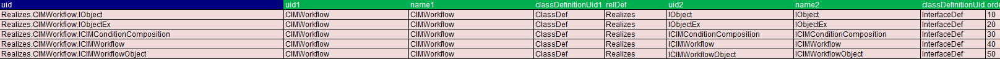
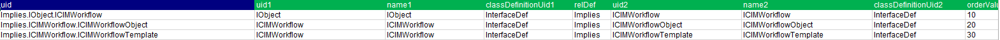
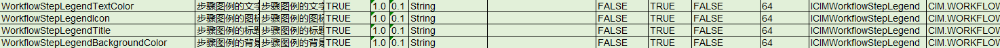
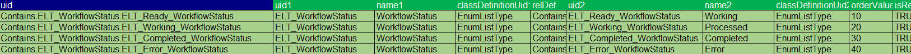
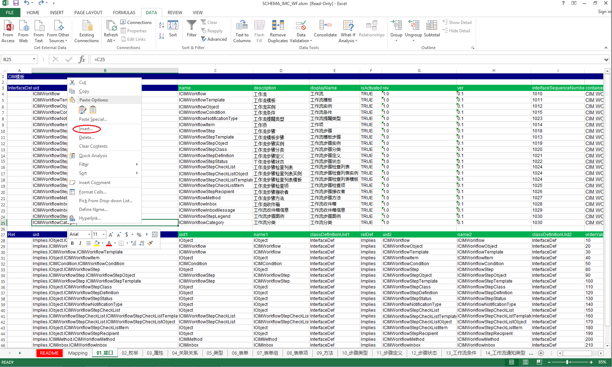
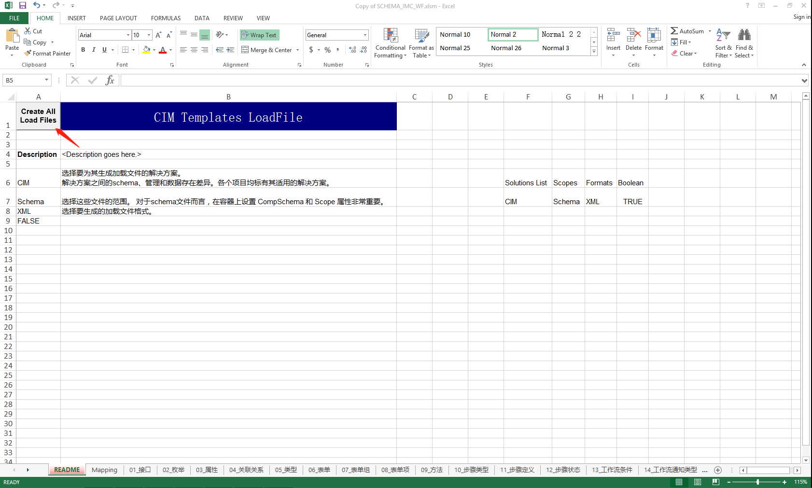
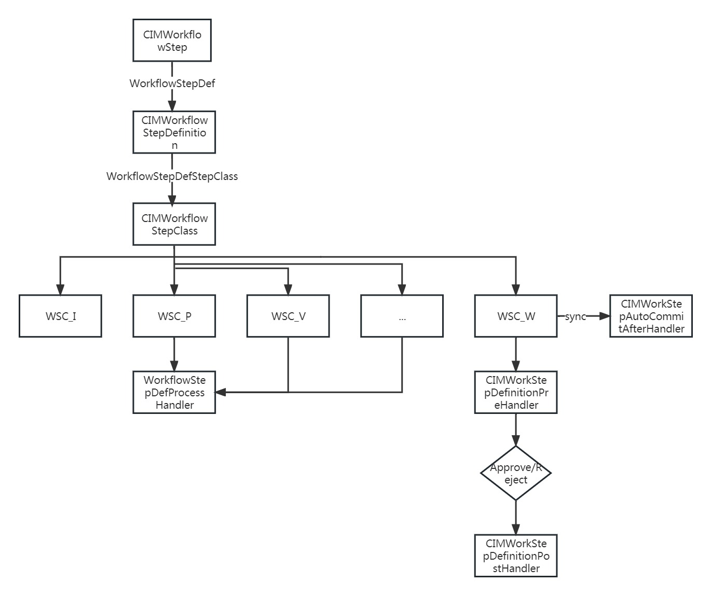

<h1 align="center" style="margin: 30px 0 30px; font-weight: bold;">IMC软件二次开发文档</h1>
<h4 align="center">基于 Vue/Element UI 和 Spring Boot/Spring Cloud & Alibaba 前后端分离的分布式微服务架构</h4>
<p align="center">
    <a href="http://imc.smartsolutions.com.cn/login"></a>
    <a href="http://imc.smartsolutions.com.cn/login"></a>	
</p>


## 目录


* [概述](#1)
* [Schema介绍](#2)
* [Schema概念介绍](#3)
  * [Schema配置介绍](#4)
  
  * [类定义](#5)
    * [接口定义](#6)
    * [属性定义](#7)
  
    * [枚举列表](#8)
  
  * [关联定义](#9)
  
* [Excel操作schema介绍](#10)
  
  * [新增条目](#11)
    * [导出为xml](#12)
    * [导入到IMC](#13)
  
* [Schema操作代码示例](#14)
* [工作流引擎](#15)

  * [Schema](#16)
  * [ServerAPI调用示例](#17)
  * [ProcessStep的调用](#18)
* [检索引擎](#19)
  * [API调用实例](#20)
* [报告&报表引擎](#21)
  * [使用步骤简述](#22)
    * [场景一：IMC框架方法](#28)
    * [场景一：IMC对象支持通用](#29)
    * [场景三：IMC框架条件](#30)
    * [场景四：通用管理](#23)
    * [场景五：指定报表](#24)
  * [API调用示例](#25)
  * [报表设计简述](#26)
* [结论](#27)


<a id = "1"></a>


## 概述

在这份文档中，您将了解如何进行IMC软件的二次开发。IMC是一个软件继承平台，提供了多个引擎用于不同的功能扩展和自定义开发。本文档将重点介绍以下四个主要引擎：

1. **权限引擎**
2. **工作流引擎**
3. **检索引擎**
4. **报告&报表引擎**

<a id = "2"></a>

## Schema介绍

<a id = "3"></a>

### schema概念介绍

数据模型是定义可以在数据库中存储哪些信息以及对象之间可以具有哪些关系的结构。 例如，数据模型定义了哪些属性可以定义标签。 它还描述了文档与其他对象之间的关系。

schema由许多组件组成，这些组件一起工作来定义您的数据，
 包括：

- **类定义** - 对一组扮演类似角色并共享一些相同属性和关系的对象的命名描述。

  例如，作为组织实例的对象可以扮演以下角色中的一个或多个：内部组织、外部组织、供应商、制造商或承包商。

- **接口定义** - 对象可用的属性集合，作为一个整体，代表对象所扮演的角色。 接口定义也是关联关系定义的端点。

  每个角色都由不同的接口定义表示，接口定义暴露特定于该角色的属性同时拥有特定于该角色的关联关系。

- **关联关系定义** - 对象如何相互关联的定义，通过接口互相连接。

  例如，关系定义描述了组织和合同之间可能存在的关系。 关系定义可以包括诸如每个合同可以与多少个组织相关以及删除合同时组织会发生什么等信息。

- **属性定义** - 描述对象的属性。 属性通过接口定义与类定义相关。

- **枚举定义** - 描述了一系列枚举对象的属性

<a id = "4"></a>

### schema配置介绍

<a id = "5"></a>

#### 类定义

**类定义属性**

| 属性               | 描述                   |
| ------------------ | ---------------------- |
| name               | 类的名称               |
| description        | 类的描述               |
| displayName        | 展示名称               |
| isConfigControlled | 表示该类是否受配置控制 |
| uidPattern         |                        |
| rev                |                        |
| ver                |                        |
| containerId        | 所属的container        |
| tableName          | 表名                   |
| cachedInfo         | 缓存信息               |
| isActivated        |                        |

**类定义和接口定义**

类定义提供了软件可以与之交互的不同角色。 类定义通过称为接口定义的抽象实体来公开或实现其角色。

类定义与接口定义具有实现关系，即存在Realizes关系。 这意味着特定类定义的实例支持或实现那些已实现的接口定义。

![SHARED Tip](data:image/png;base64,iVBORw0KGgoAAAANSUhEUgAAACkAAAANCAIAAAC7P9CBAAAAGXRFWHRTb2Z0d2FyZQBBZG9iZSBJbWFnZVJlYWR5ccllPAAAA3ZpVFh0WE1MOmNvbS5hZG9iZS54bXAAAAAAADw/eHBhY2tldCBiZWdpbj0i77u/IiBpZD0iVzVNME1wQ2VoaUh6cmVTek5UY3prYzlkIj8+IDx4OnhtcG1ldGEgeG1sbnM6eD0iYWRvYmU6bnM6bWV0YS8iIHg6eG1wdGs9IkFkb2JlIFhNUCBDb3JlIDUuNi1jMTExIDc5LjE1ODMyNSwgMjAxNS8wOS8xMC0wMToxMDoyMCAgICAgICAgIj4gPHJkZjpSREYgeG1sbnM6cmRmPSJodHRwOi8vd3d3LnczLm9yZy8xOTk5LzAyLzIyLXJkZi1zeW50YXgtbnMjIj4gPHJkZjpEZXNjcmlwdGlvbiByZGY6YWJvdXQ9IiIgeG1sbnM6eG1wTU09Imh0dHA6Ly9ucy5hZG9iZS5jb20veGFwLzEuMC9tbS8iIHhtbG5zOnN0UmVmPSJodHRwOi8vbnMuYWRvYmUuY29tL3hhcC8xLjAvc1R5cGUvUmVzb3VyY2VSZWYjIiB4bWxuczp4bXA9Imh0dHA6Ly9ucy5hZG9iZS5jb20veGFwLzEuMC8iIHhtcE1NOk9yaWdpbmFsRG9jdW1lbnRJRD0ieG1wLmRpZDpkMmJjM2E2OS00YTUyLTdlNDgtODFkYS05ZDFhOTA0N2U3NTIiIHhtcE1NOkRvY3VtZW50SUQ9InhtcC5kaWQ6NDMwMUM5MDgyREM4MTFFNjk3NzY4MjA2NEMwMDc1NzciIHhtcE1NOkluc3RhbmNlSUQ9InhtcC5paWQ6NDMwMUM5MDcyREM4MTFFNjk3NzY4MjA2NEMwMDc1NzciIHhtcDpDcmVhdG9yVG9vbD0iQWRvYmUgUGhvdG9zaG9wIENDIDIwMTUgKFdpbmRvd3MpIj4gPHhtcE1NOkRlcml2ZWRGcm9tIHN0UmVmOmluc3RhbmNlSUQ9InhtcC5paWQ6ODdhMTM4MzYtMjc5MC03YTRiLThmODktODI2NTIxNjQ3N2M4IiBzdFJlZjpkb2N1bWVudElEPSJ4bXAuZGlkOmQyYmMzYTY5LTRhNTItN2U0OC04MWRhLTlkMWE5MDQ3ZTc1MiIvPiA8L3JkZjpEZXNjcmlwdGlvbj4gPC9yZGY6UkRGPiA8L3g6eG1wbWV0YT4gPD94cGFja2V0IGVuZD0iciI/PoAZ1o0AAAEjSURBVHjaYvz//z/DAAEWOOvjL4bKswwzb4LY6eoM7cYM/GwoShmrj+Mx6H+rJVwNhI1Vy+xA5RQTMQibCUL9/c8gtIxh+g2Gf/9BCMgAcv/SIERS19/devM9ir93PgVZiQyAXKCglwy6z5A9hCyCBxxK1bZV4AMy7GdfPfTgk8+iGxCNUH/HHETXIMiGRZA8wMvODGEcTNUGWcnIgBLmmOD9L5qnNajdZ/wwEiETFkEKgUb/BUhsosS3Ei/DLGuGtKMwFzEyTLMECVIFGE65BGezszDtSdJCz2OpaiBEazDFV9FGnhfdbiBYepchGez1udYM0cpUs+98jp6BJDe+sgUIgPZR0Upi0xrc3xyLQAjIoGuZCgSWYgxJqlAGHQBAgAEAhy9Y5GqbRX4AAAAASUVORK5CYII=) 使用 Rel关系上的 IsRequired 标志来指定特定类定义的对象的接口定义是必须的或者是可选的。



如图，类CIMWorkflow实现了5个基本接口，分别是IObject、IObjectEx、ICIMConditionComposition、ICIMWorkflow、ICIMWorkflowObject

<a id = "6"></a>

#### 接口定义

**接口定义属性**

| 属性                    | 描述            |
| ----------------------- | --------------- |
| name                    | 接口名称        |
| description             | 接口描述        |
| displayName             | 展示名称        |
| isActivated             |                 |
| rev                     |                 |
| ver                     |                 |
| interfaceSequenceNumber | 接口序列号      |
| containerId             | 所属的container |

**作为角色的接口定义**

接口定义代表了类定义的角色。 角色定义了对象的属性和关系。 一些接口被定义为携带属性，一些被定义为携带关联关系， 其他的可能仅仅被定义为指示角色。

不同的类定义可以共享相同的接口定义，因此具有相同的角色。 例如：CIMWorkflow和CIMWorkflowTemplate共享IObject接口，这意味着CIMWorkflow和CIMWorkflowTemplate都具有object的角色，它们都具有object name、object description、object identifier以及 IObject 接口公开的任何其他属性定义。

**继承关系**

如果一个接口定义继承了另一个接口定义，即两个接口定义之间存在 Implies 关系，那么任何实现第一个接口定义的类定义也可以实现被继承的接口定义。



如图，ICIMWorkflow继承了IObject，ICIMWorkflowObject和ICIMWorkflowTemplate继承了ICIMWorkflow。 因此，任何实现 ICIMWorkflowObject和ICIMWorkflowTemplate的类定义（例如 CIMWorkflowTemplate）也可以实现IObject和ICIMWorkflow。 

<a id = "7"></a>

#### 属性定义

对象的所有属性定义都是通过其接口定义公开的，而不是直接由对象公开。 应用于特定接口定义的属性定义是由模式中 InterfaceDef 类型的对象和 PropertyDef 类型的对象之间的 Expose 关系定义的。 给定类定义的特定属性定义通常由一个且仅一个接口定义公开。



如上图所示，ICIMWorkflowStepLegend接口定义公开了几个属性定义，包括：

- WorkflowStepLegendTextColor - 步骤图例的文字颜色
- WorkflowStepLegendIcon - 步骤图例的图标
- WorkflowStepLegendTitle - 步骤图例的标题
- WorkflowStepLegendBackgroundColor - 步骤图例的背景色

通过且仅能通过ICIMWorkflowStepLegend接口来配置这些属性

<a id = "8"></a>

##### 枚举列表

在schema中，某些属性定义是枚举列表类型（EnumListType）。 这些属性定义在枚举列表（有时称为“选择列表”或“查找”）中为其定义了可能的字符串属性值列表。 此类型的属性定义的任何值都必须与为该属性类型定义的枚举属性值列表中的条目匹配。

每个枚举列表包含一个或多个枚举条目（EnumEnum）。 每个枚举条目代表该枚举列表范围内的属性的可能值。



如上图所示，WorkflowStatus有4个枚举值，分别为Working、Processed、Completed、Error

<a id = "9"></a>

#### 关联定义

**关联定义属性**

| 属性                                | 描述                                                         |
| ----------------------------------- | ------------------------------------------------------------ |
| name                                | 关联名称                                                     |
| description                         | 关联描述                                                     |
| displayName                         | 展示名称                                                     |
| isActivated                         |                                                              |
| tableName                           | 表名                                                         |
| cachedInfo                          | 缓存信息                                                     |
| interfaceDefUid1 & interfaceDefUid2 | 关联接口的uid                                                |
| min1 & min2                         | 这两个属性决定是否需要关系。 值 0 表示关系是可选的，而值 1 表示关系是必需的。<br>配置为 Min1=1 和 Min2=0 意味着则末端 2 处的对象不能脱离于该关联关系存在，因为它必须对应末端 1 处的至少一个对象。 |
| max1 & max2                         | 这两个属性用于标识可以参与关系每一端的对象的最大数量。 最常见的值为 1 或 *。<br>Max2=1的关系意味着1端的对象只能与2端的单个对象相关。<br>Max1=1的关系意味着2端的对象只能与1端的一个对象相关。 |
| displayName1 & displayName2         | 展示名                                                       |
| optionalInterfaces                  |                                                              |
| rev                                 |                                                              |
| ver                                 |                                                              |
| delete1To2 & delete2To1             | 这两个属性用于控制删除关系两端的对象时发生的情况。删除一端对象时，与该对象的所有关联对象也将被删除<br>将Delete12设置为True表示当删除1端的对象时，2端的对象也必须被删除。 |

关联定义表示了两个接口之间的关联关系

 

如上图，在 WorkflowTemplateNotificationType 关联关系中，将ICIMWorkflowTemplate与ICIMWorkflowNotificationType进行了一个多对一的关联(0..*)--(0..1)，即让一个工作流模板对应一个工作流提醒类型、一个工作流提醒类型可对应多个工作流模板。

<a id = "10"></a>

### Excel操作schema介绍

<a id = "11"></a>

#### 新增条目



在需要新增的地方右键，点击`Insert`插入空白行，填写属性对应值即可

<a id = "12"></a>

#### 导出为xml



在README界面点击箭头所指按钮，自动在文件根目录下生成包含xml文件的文件夹，文件目录结构如下：

```
|--SCHEMA_IMC_WF
|  |--01_接口_CIM.xml
|  |--02_枚举_CIM.xml
|  |--03_属性_CIM.xml
|  |--...
|  |--19_流程分类_CIM.xml
|  |--SCHEMA_IMC_WF_CIM.xmlldr
|--SCHEMA_IMC_WF.xlsm
```

<a id = "13"></a>

#### 导入到IMC


<a id = "14"></a>

### Schema操作代码示例

#### 创建操作代码示例

- 1.创建新对象 

  ```java
  ObjectCollection objectCollection = new ObjectCollection(GeneralUtil.getUsername());
  IObject object = SchemaUtil.newIObject("ClassDefUID", "name", "description", "displayName");
  ```

  - 1.1 属性值填充

    - 1.1.1 属性填充方法1 通过 接口UID 属性UID 属性值 的Map进行属性填充

      ```java
      Map<String, Map<String, String>> interfaceProperties = new HashMap<String, Map<String, String>>();
              Map<String, String> properties = new HashMap<>();
              properties.put("propertyUID1", "value");
              properties.put("propertyUID2", "value");
              properties.put("propertyUID3", "value");
              interfaceProperties.put("InterfaceDefUID", properties);
              object.setProperties(interfaceProperties);
      ```

    - 1.1.2 属性填充方法2 转换为对应接口填充对应接口绑定的属性 IObject只是演示用才作为toInterface的class,实际需要替换为正确的class

      ```java
       IObject interfaceObj = object.toInterface(IObject.class);
       interfaceObj.setName("value");
       interfaceObj.setDescription("value");
      ```

    - 1.1.3 属性填充方法3 new Object()为演示中替代具体值的示例,实际值是Object类型的对象

      ```java
       // 推荐
       object.setValue("InterfaceDefUID", "propertyUID", new Object(), null);
       // 不推荐
       object.setValue(null, "propertyUID", new Object(), null);
      ```

  - 1.2 创建完对象后必须标记创建结束,否则提交事务时无法成功写入数据

    ```java
    object.finishCreate(objectCollection);
    ```

- 2.创建新关联关系 end1和end2可以为新创建的对象或者查询出的对象

  ```java
   IObject end1 = SchemaUtil.newIObject("ClassDefUID", "end1", "description", "displayName");
   end1.finishCreate(objectCollection);
   IObject end2 = SchemaUtil.newIObject("ClassDefUID", "end2", "description", "displayName");
   end2.finishCreate(objectCollection);
  ```

  - 2.1 单个关联关系创建

    ```java
    IRel relationship = SchemaUtil.newRelationship("RelDefUID", end1, end2);
    ```

  - 2.2 创建完关联关系对象后必须标记创建结束,否则提交事务时无法成功写入数据

    ```java
    relationship.finishCreate(objectCollection);
    ```

  - 批量关联关系创建

    ```java
    SchemaUtil.createRelationships1To2("RelDefUID", end1, objectCollection, new ArrayList<>());
    ```

#### 更新操作代码示例

- 更新 更新需要先查询出对应数据再进行操作

  ```java
  IObject toDelete = Context.Instance.getQueryHelper().getObjectByUidAndDefinitionUid("UID", "ClassDefUID", IObject.class);
  // 物理删除 内置直接提交事务
  toDelete.Delete();
  // 物理删除 手动控制提交事务
  toDelete.Delete(objectCollection);
  // 逻辑删除
  toDelete.Terminate(objectCollection);
  ```

![SHARED Tip](data:image/png;base64,iVBORw0KGgoAAAANSUhEUgAAACkAAAANCAIAAAC7P9CBAAAAGXRFWHRTb2Z0d2FyZQBBZG9iZSBJbWFnZVJlYWR5ccllPAAAA3ZpVFh0WE1MOmNvbS5hZG9iZS54bXAAAAAAADw/eHBhY2tldCBiZWdpbj0i77u/IiBpZD0iVzVNME1wQ2VoaUh6cmVTek5UY3prYzlkIj8+IDx4OnhtcG1ldGEgeG1sbnM6eD0iYWRvYmU6bnM6bWV0YS8iIHg6eG1wdGs9IkFkb2JlIFhNUCBDb3JlIDUuNi1jMTExIDc5LjE1ODMyNSwgMjAxNS8wOS8xMC0wMToxMDoyMCAgICAgICAgIj4gPHJkZjpSREYgeG1sbnM6cmRmPSJodHRwOi8vd3d3LnczLm9yZy8xOTk5LzAyLzIyLXJkZi1zeW50YXgtbnMjIj4gPHJkZjpEZXNjcmlwdGlvbiByZGY6YWJvdXQ9IiIgeG1sbnM6eG1wTU09Imh0dHA6Ly9ucy5hZG9iZS5jb20veGFwLzEuMC9tbS8iIHhtbG5zOnN0UmVmPSJodHRwOi8vbnMuYWRvYmUuY29tL3hhcC8xLjAvc1R5cGUvUmVzb3VyY2VSZWYjIiB4bWxuczp4bXA9Imh0dHA6Ly9ucy5hZG9iZS5jb20veGFwLzEuMC8iIHhtcE1NOk9yaWdpbmFsRG9jdW1lbnRJRD0ieG1wLmRpZDpkMmJjM2E2OS00YTUyLTdlNDgtODFkYS05ZDFhOTA0N2U3NTIiIHhtcE1NOkRvY3VtZW50SUQ9InhtcC5kaWQ6NDMwMUM5MDgyREM4MTFFNjk3NzY4MjA2NEMwMDc1NzciIHhtcE1NOkluc3RhbmNlSUQ9InhtcC5paWQ6NDMwMUM5MDcyREM4MTFFNjk3NzY4MjA2NEMwMDc1NzciIHhtcDpDcmVhdG9yVG9vbD0iQWRvYmUgUGhvdG9zaG9wIENDIDIwMTUgKFdpbmRvd3MpIj4gPHhtcE1NOkRlcml2ZWRGcm9tIHN0UmVmOmluc3RhbmNlSUQ9InhtcC5paWQ6ODdhMTM4MzYtMjc5MC03YTRiLThmODktODI2NTIxNjQ3N2M4IiBzdFJlZjpkb2N1bWVudElEPSJ4bXAuZGlkOmQyYmMzYTY5LTRhNTItN2U0OC04MWRhLTlkMWE5MDQ3ZTc1MiIvPiA8L3JkZjpEZXNjcmlwdGlvbj4gPC9yZGY6UkRGPiA8L3g6eG1wbWV0YT4gPD94cGFja2V0IGVuZD0iciI/PoAZ1o0AAAEjSURBVHjaYvz//z/DAAEWOOvjL4bKswwzb4LY6eoM7cYM/GwoShmrj+Mx6H+rJVwNhI1Vy+xA5RQTMQibCUL9/c8gtIxh+g2Gf/9BCMgAcv/SIERS19/devM9ir93PgVZiQyAXKCglwy6z5A9hCyCBxxK1bZV4AMy7GdfPfTgk8+iGxCNUH/HHETXIMiGRZA8wMvODGEcTNUGWcnIgBLmmOD9L5qnNajdZ/wwEiETFkEKgUb/BUhsosS3Ei/DLGuGtKMwFzEyTLMECVIFGE65BGezszDtSdJCz2OpaiBEazDFV9FGnhfdbiBYepchGez1udYM0cpUs+98jp6BJDe+sgUIgPZR0Upi0xrc3xyLQAjIoGuZCgSWYgxJqlAGHQBAgAEAhy9Y5GqbRX4AAAAASUVORK5CYII=) 注意!!! 事务控制对象 所有增删改操作都需要放入ObjectCollection对象,并且在最终使用 commit() 方法提交事务进行对数据库数据的增删改。,否则所有修改无法写入数据库

```java
ResultInfo<IObject> commit = objectCollection.commit();
```

<a id = "15"></a>

## 工作流引擎

在这一部分，我们将介绍如何使用工作流引擎进行二次开发，并提供一些API调用示例和操作步骤。

<a id = "16"></a>

### Schema

#### 接口

| uid                               | name                              | description                          | displayName                          | isActivated | interfaceSequenceNumber | containerId  |
| --------------------------------- | --------------------------------- | ------------------------------------ | ------------------------------------ | ----------- | ----------------------- | ------------ |
| ICIMWorkflowFlowPart              | ICIMWorkflowFlowPart              | 流程中实际的流程组块，用于上下流转的 | 流程中实际的流程组块，用于上下流转的 | TRUE        | 5005                    | CIM.WORKFLOW |
| ICIMWorkflow                      | ICIMWorkflow                      | 工作流                               | 工作流                               | TRUE        | 5010                    | CIM.WORKFLOW |
| ICIMWorkflowTemplate              | ICIMWorkflowTemplate              | 工作流模板                           | 工作流模板                           | TRUE        | 5020                    | CIM.WORKFLOW |
| ICIMWorkflowObject                | ICIMWorkflowObject                | 工作流实例                           | 工作流实例                           | TRUE        | 5030                    | CIM.WORKFLOW |
| ICIMWorkflowCondition             | ICIMWorkflowCondition             | 工作流条件                           | 工作流条件                           | TRUE        | 5040                    | CIM.WORKFLOW |
| ICIMWorkflowNotificationType      | ICIMWorkflowNotificationType      | 工作流提醒类型                       | 工作流提醒类型                       | TRUE        | 5050                    | CIM.WORKFLOW |
| ICIMWorkflowItem                  | ICIMWorkflowItem                  | 工作项                               | 工作项                               | TRUE        | 5060                    | CIM.WORKFLOW |
| ICIMWorkflowStep                  | ICIMWorkflowStep                  | 工作流步骤                           | 工作流步骤                           | TRUE        | 5070                    | CIM.WORKFLOW |
| ICIMWorkflowStepTemplate          | ICIMWorkflowStepTemplate          | 工作流模板步骤                       | 工作流模板步骤                       | TRUE        | 5080                    | CIM.WORKFLOW |
| ICIMWorkflowStepObject            | ICIMWorkflowStepObject            | 工作流步骤实例                       | 工作流步骤实例                       | TRUE        | 5090                    | CIM.WORKFLOW |
| ICIMWorkflowStepClass             | ICIMWorkflowStepClass             | 工作流步骤分类                       | 工作流步骤分类                       | TRUE        | 5100                    | CIM.WORKFLOW |
| ICIMWorkflowStepDefinition        | ICIMWorkflowStepDefinition        | 工作流步骤定义                       | 工作流步骤定义                       | TRUE        | 5110                    | CIM.WORKFLOW |
| ICIMWorkflowStepStatus            | ICIMWorkflowStepStatus            | 工作流步骤状态                       | 工作流步骤状态                       | TRUE        | 5120                    | CIM.WORKFLOW |
| ICIMWorkflowStepCheckList         | ICIMWorkflowStepCheckList         | 工作流步骤检查列表                   | 工作流步骤检查列表                   | TRUE        | 5130                    | CIM.WORKFLOW |
| ICIMWorkflowStepCheckListObject   | ICIMWorkflowStepCheckListObject   | 工作流步骤检查列表实例               | 工作流步骤检查列表实例               | TRUE        | 5140                    | CIM.WORKFLOW |
| ICIMWorkflowStepCheckListTemplate | ICIMWorkflowStepCheckListTemplate | 工作流步骤检查列表模板               | 工作流步骤检查列表模板               | TRUE        | 5150                    | CIM.WORKFLOW |
| ICIMWorkflowStepCheckListItem     | ICIMWorkflowStepCheckListItem     | 工作流步骤检查项                     | 工作流步骤检查项                     | TRUE        | 5160                    | CIM.WORKFLOW |
| ICIMWorkflowStepParticipant       | ICIMWorkflowStepParticipant       | 工作流步骤参与者                     | 工作流步骤参与者                     | TRUE        | 5170                    | CIM.WORKFLOW |
| ICIMWorkflowMethod                | ICIMWorkflowMethod                | 工作流步骤方法                       | 工作流步骤方法                       | TRUE        | 5180                    | CIM.WORKFLOW |
| ICIMWorkflowInbox                 | ICIMWorkflowInbox                 | 工作流收件箱                         | 工作流收件箱                         | TRUE        | 5190                    | CIM.WORKFLOW |
| ICIMWorkflowInboxMessage          | ICIMWorkflowInboxMessage          | 工作流收件箱信息                     | 工作流收件箱信息                     | TRUE        | 5200                    | CIM.WORKFLOW |
| ICIMWorkflowStepLegend            | ICIMWorkflowStepLegend            | 工作流步骤图例                       | 工作流步骤图例                       | TRUE        | 5210                    | CIM.WORKFLOW |
| ICIMWorkflowCategory              | ICIMWorkflowCategory              | 工作流分类                           | 工作流分类                           | TRUE        | 5220                    | CIM.WORKFLOW |
| ICIMWorkflowStepContinuesStepRel  | ICIMWorkflowStepContinuesStepRel  | 工作流步骤的关系                     | 工作流步骤的关系                     | TRUE        | 5230                    | CIM.WORKFLOW |
| ICIMWorkflowStepGroupRecipient    | ICIMWorkflowStepGroupRecipient    | 组心态流程参与者                     | 组心态流程参与者                     | TRUE        | 5240                    | CIM.WORKFLOW |
| ICIMWorkflowStepRecipient         | ICIMWorkflowStepRecipient         | 步骤参与人代理                       | 步骤参与人代理                       | TRUE        | 5500                    | CIM.WORKFLOW |


#### 枚举

| uid                                           | name                      | description                                                | displayName          | ver          | interfaceSequenceNumber | containerId |
| --------------------------------------------- | ------------------------- | ---------------------------------------------------------- | -------------------- | ------------ | ----------------------- | ----------- |
| ELT_WorkflowStatus                            | WorkflowStatus            | 工作流状态                                                 | 工作流状态           | CIM.WORKFLOW | 3000                    | TRUE        |
| ELT_Ready_WorkflowStatus                      | Ready                     | 准备                                                       | 准备                 | CIM.WORKFLOW | 3010                    | TRUE        |
| ELT_Working_WorkflowStatus                    | Working                   | 流程中                                                     | 流程中               | CIM.WORKFLOW | 3020                    | TRUE        |
| ELT_Completed_WorkflowStatus                  | Completed                 | 完成                                                       | 完成                 | CIM.WORKFLOW | 3030                    | TRUE        |
| ELT_Error_WorkflowStatus                      | Error                     | 错误                                                       | 错误                 | CIM.WORKFLOW | 3040                    | TRUE        |
| ELT_NotificationType                          | NotificationType          | 提醒类型                                                   | 提醒类型             | CIM.WORKFLOW | 4000                    | TRUE        |
| ELT_All_NotificationType                      | All                       | 所有类型                                                   | 所有类型             | CIM.WORKFLOW | 4001                    | TRUE        |
| ELT_E-mail_NotificationType                   | E-mail                    | 邮件                                                       | 邮件                 | CIM.WORKFLOW | 4002                    | TRUE        |
| ELT_Message_NotificationType                  | Message                   | 短信通知                                                   | 短信通知             | CIM.WORKFLOW | 4003                    | TRUE        |
| ELT_Mail_NotificationType                     | Mail                      | 站内信                                                     | 站内信               | CIM.WORKFLOW | 4004                    | TRUE        |
| ELT_WorkflowStepStatus                        | WorkflowStepStatus        | 工作流步骤状态                                             | 工作流步骤状态       | CIM.WORKFLOW | 5000                    | TRUE        |
| ELT_UnReady_WorkflowStepStatus                | UnReady                   | 未准备                                                     | 未准备               | CIM.WORKFLOW | 5001                    | TRUE        |
| ELT_Ready_WorkflowStepStatus                  | Ready                     | 处理中                                                     | 处理中               | CIM.WORKFLOW | 5002                    | TRUE        |
| ELT_Reject_WorkflowStepStatus                 | Reject                    | 驳回                                                       | 驳回                 | CIM.WORKFLOW | 5003                    | TRUE        |
| ELT_Pass_WorkflowStepStatus                   | Pass                      | 通过                                                       | 通过                 | CIM.WORKFLOW | 5004                    | TRUE        |
| ELT_Skip_WorkflowStepStatus                   | Skip                      | 跳过（系统自动处理）                                       | 跳过（系统自动处理） | CIM.WORKFLOW | 5005                    | TRUE        |
| ELT_WorkflowImportance                        | WorkflowImportance        | 流程等级                                                   | 流程等级             | CIM.WORKFLOW | 5100                    | TRUE        |
| ELT_General_WorkflowImportance                | General                   | 一般                                                       | 一般                 | CIM.WORKFLOW | 5101                    | TRUE        |
| ELT_Important_WorkflowImportance              | Important                 | 重要                                                       | 重要                 | CIM.WORKFLOW | 5102                    | TRUE        |
| ELT_Urgent_WorkflowImportance                 | Urgent                    | 紧急                                                       | 紧急                 | CIM.WORKFLOW | 5103                    | TRUE        |
| ELT_WorkflowStepOperationMode                 | WorkflowStepOperationMode | 步骤认领模式                                               | 步骤认领模式         | CIM.WORKFLOW | 5200                    | TRUE        |
| ELT_oneUserPerRole_WorkflowStepOperationMode  | oneUserPerRole            | 每个角色仅需一人处理，多个角色存在则必须多个角色都需要处理 | 每个角色仅需一人处理 | CIM.WORKFLOW | 5201                    | TRUE        |
| ELT_anyoneUser_WorkflowStepOperationMode      | anyoneUser                | 任意一个人处理即可                                         | 任意一个人处理即可   | CIM.WORKFLOW | 5202                    | TRUE        |
| ELT_oneUserPerGroup_WorkflowStepOperationMode | oneUserPerGroup           | 每个分组仅需一人处理，多个组存在则必须多个组都需要处理     | 每个分组仅需一人处理 | CIM.WORKFLOW | 5203                    | TRUE        |
| ELT_allUsers_WorkflowStepOperationMode        | allUsers                  | 所有人都必须处理                                           | 任意一个人处理即可   | CIM.WORKFLOW | 5204                    | TRUE        |
| ELT_StepClassOperationMode                    | StepClassOperationMode    | 步骤类型的处理方式                                         | 步骤类型的处理方式   | CIM.WORKFLOW | 5300                    | TRUE        |
| ELT_Manually_StepClassOperationMode           | Manually                  | 人工处理                                                   | 人工处理             | CIM.WORKFLOW | 5301                    | TRUE        |
| ELT_Automatically_StepClassOperationMode      | Automatically             | 自动处理                                                   | 自动处理             | CIM.WORKFLOW | 5302                    | TRUE        |

#### 属性

| uid                                    | name                                   | description              | displayName              | isActivated | propertyValueType | propertyValueTypeDetails      | isMandatory | isDbField | HistoryRetained | fieldLength | exposedInterfaceDefUid           | containerId  |
| -------------------------------------- | -------------------------------------- | ------------------------ | ------------------------ | ----------- | ----------------- | ----------------------------- | ----------- | --------- | --------------- | ----------- | -------------------------------- | ------------ |
| WorkflowStepDuration                   | WorkflowStepDuration                   | 计划持续时间             | 计划持续时间             | TRUE        | Integer           |                               | FALSE       | TRUE      | FALSE           |             | ICIMWorkflowStep                 | CIM.WORKFLOW |
| WorkflowStepWarningTime                | WorkflowStepWarningTime                | 预警时间                 | 预警时间                 | TRUE        | Double            |                               | FALSE       | TRUE      | FALSE           |             | ICIMWorkflowStep                 | CIM.WORKFLOW |
| WorkflowStepPrincipalPrescription      | WorkflowStepPrincipalPrescription      | 委托人权限时效           | 委托人权限时效           | TRUE        | Double            |                               | FALSE       | TRUE      | FALSE           |             | ICIMWorkflowStep                 | CIM.WORKFLOW |
| WorkflowStepOperationMode              | WorkflowStepOperationMode              | 步骤处理模式             | 步骤处理模式             | TRUE        | EnumList          | ELT_WorkflowStepOperationMode | FALSE       | TRUE      | FALSE           |             | ICIMWorkflowStep                 | CIM.WORKFLOW |
| WorkflowProportion                     | WorkflowProportion                     | 步骤权重                 | 委托人权限时效           | TRUE        | Double            |                               | FALSE       | TRUE      | FALSE           |             | ICIMWorkflowStep                 | CIM.WORKFLOW |
| WorkflowStepRemark                     | WorkflowStepRemark                     | 备注说明                 | 步骤处理模式             | TRUE        | String            |                               | FALSE       | TRUE      | FALSE           | 256         | ICIMWorkflowStep                 | CIM.WORKFLOW |
| WorkflowStepStartDate                  | WorkflowStepStartDate                  | 开始日期                 | 开始日期                 | TRUE        | DateTime          |                               | FALSE       | TRUE      | FALSE           |             | ICIMWorkflowStepObject           | CIM.WORKFLOW |
| WorkflowStepEndDate                    | WorkflowStepEndDate                    | 结束日期                 | 结束日期                 | TRUE        | DateTime          |                               | FALSE       | TRUE      | FALSE           |             | ICIMWorkflowStepObject           | CIM.WORKFLOW |
| WorkflowStepActualDuration             | WorkflowStepActualDuration             | 实际持续时间             | 实际持续时间             | TRUE        | Double            |                               | FALSE       | TRUE      | FALSE           |             | ICIMWorkflowStepObject           | CIM.WORKFLOW |
| WorkflowStepStatus                     | WorkflowStepStatus                     | 状态                     | 状态                     | TRUE        | EnumList          | ELT_WorkflowStepStatus        | FALSE       | TRUE      | FALSE           | 64          | ICIMWorkflowStepObject           | CIM.WORKFLOW |
| WorkflowStepDefProcessHandler          | WorkflowStepDefProcessHandler          | 处理器                   | 处理器                   | TRUE        | String            |                               | TRUE        | TRUE      | FALSE           |             | ICIMWorkflowStepDefinition       | CIM.WORKFLOW |
| WorkflowStepDefMaxAllowLine            | WorkflowStepDefMaxAllowLine            | 步骤定义允许的最大连接线 | 步骤定义允许的最大连接线 | TRUE        | Integer           |                               | TRUE        | TRUE      | FALSE           |             | ICIMWorkflowStepDefinition       | CIM.WORKFLOW |
| WorkflowItemStatus                     | WorkflowItemStatus                     | 工作流状态               | 工作流状态               | TRUE        | String            |                               | FALSE       | TRUE      | FALSE           | 128         | ICIMWorkflowItem                 | CIM.WORKFLOW |
| WorkflowItemActiveWorkflowCount        | WorkflowItemActiveWorkflowCount        | 活动工作流的个数         | 活动工作流的个数         | TRUE        | Integer           |                               | FALSE       | TRUE      | FALSE           |             | ICIMWorkflowItem                 | CIM.WORKFLOW |
| WorkflowItemWorkflowTotalCount         | WorkflowItemWorkflowTotalCount         | 工作流总数               | 工作流总数               | TRUE        | Integer           |                               | FALSE       | TRUE      | FALSE           |             | ICIMWorkflowItem                 | CIM.WORKFLOW |
| WorkflowStatus                         | WorkflowStatus                         | 状态                     | 状态                     | TRUE        | EnumList          | ELT_WorkflowStatus            | FALSE       | TRUE      | FALSE           | 64          | ICIMWorkflowObject               | CIM.WORKFLOW |
| WorkflowMessage                        | WorkflowMessage                        | 过程信息                 | 过程信息                 | TRUE        | String            |                               | FALSE       | TRUE      | FALSE           | 1024        | ICIMWorkflowObject               | CIM.WORKFLOW |
| WorkflowRemark                         | WorkflowRemark                         | 备注信息                 | 备注信息                 | TRUE        | String            |                               | FALSE       | TRUE      | FALSE           | 1024        | ICIMWorkflowObject               | CIM.WORKFLOW |
| WorkflowErrorMsg                       | WorkflowErrorMsg                       | 错误信息                 | 错误信息                 | TRUE        | String            |                               | FALSE       | TRUE      | FALSE           | 1024        | ICIMWorkflowObject               | CIM.WORKFLOW |
| WorkflowDetailStatus                   | WorkflowDetailStatus                   | 详细状态                 | 详细状态                 | TRUE        | String            |                               | FALSE       | TRUE      | FALSE           | 1024        | ICIMWorkflowObject               | CIM.WORKFLOW |
| TemplateFrontInfo                      | TemplateFrontInfo                      | 前端模板信息             | 前端模板信息             | TRUE        | LongText          |                               | TRUE        | TRUE      | FALSE           |             | ICIMWorkflowTemplate             | CIM.WORKFLOW |
| EffectiveInterface                     | EffectiveInterface                     | 生效的接口信息           | 生效的接口信息           | TRUE        | String            |                               | FALSE       | TRUE      | FALSE           | 512         | ICIMWorkflowTemplate             | CIM.WORKFLOW |
| FrontStepId                            | FrontStepId                            | 前端步骤id               | 前端步骤id               | TRUE        | String            |                               | TRUE        | TRUE      | FALSE           | 64          | ICIMWorkflowStepTemplate         | CIM.WORKFLOW |
| WorkflowStepMsgFromPreviousStep        | WorkflowStepMsgFromPreviousStep        | 上一步消息               | 上一步消息               | TRUE        | String            |                               | FALSE       | TRUE      | FALSE           | 1024        | ICIMWorkflowStepObject           | CIM.WORKFLOW |
| WorkflowStepMsgToNextStep              | WorkflowStepMsgToNextStep              | 给下一步的消息           | 给下一步的消息           | TRUE        | String            |                               | FALSE       | TRUE      | FALSE           | 1024        | ICIMWorkflowStepObject           | CIM.WORKFLOW |
| WorkflowStepComments                   | WorkflowStepComments                   | 评论                     | 评论                     | TRUE        | RichText          |                               | FALSE       | TRUE      | FALSE           | 1024        | ICIMWorkflowStep                 | CIM.WORKFLOW |
| WorkflowStepClaimedInd                 | WorkflowStepClaimedInd                 | 是否认领                 | 是否认领                 | TRUE        | Boolean           |                               | FALSE       | TRUE      | FALSE           |             | ICIMWorkflowStepObject           | CIM.WORKFLOW |
| WorkflowStepGroupAssignInd             | WorkflowStepGroupAssignInd             | 组参与标识               | 组参与标识               | TRUE        | String            |                               | FALSE       | TRUE      | FALSE           | 64          | ICIMWorkflowStep                 | CIM.WORKFLOW |
| WorkflowStepParallelExpansionInd       | WorkflowStepParallelExpansionInd       | 并行标识                 | 并行标识                 | TRUE        | Boolean           |                               | FALSE       | TRUE      | FALSE           |             | ICIMWorkflowStep                 | CIM.WORKFLOW |
| WorkflowOnHoldInd                      | WorkflowOnHoldInd                      | 暂停标识                 | 暂停标识                 | TRUE        | Boolean           |                               | FALSE       | TRUE      | FALSE           |             | ICIMWorkflowObject               | CIM.WORKFLOW |
| WorkflowRev                            | WorkflowRev                            | 工作流版本               | 工作流版本               | TRUE        | Integer           |                               | FALSE       | TRUE      | FALSE           |             | ICIMWorkflowObject               | CIM.WORKFLOW |
| WorkflowImportance                     | WorkflowImportance                     | 流程等级                 | 流程等级                 | TRUE        | EnumList          | ELT_WorkflowImportance        | TRUE        | TRUE      | FALSE           | 64          | ICIMWorkflow                     | CIM.WORKFLOW |
| WorkflowStepLegendTextColor            | WorkflowStepLegendTextColor            | 步骤图例的文字颜色       | 步骤图例的文字颜色       | TRUE        | String            |                               | FALSE       | TRUE      | FALSE           | 64          | ICIMWorkflowStepLegend           | CIM.WORKFLOW |
| WorkflowStepLegendIcon                 | WorkflowStepLegendIcon                 | 步骤图例的图标           | 步骤图例的图标           | TRUE        | String            |                               | FALSE       | TRUE      | FALSE           | 64          | ICIMWorkflowStepLegend           | CIM.WORKFLOW |
| WorkflowStepLegendTitle                | WorkflowStepLegendTitle                | 步骤图例的标题           | 步骤图例的标题           | TRUE        | String            |                               | FALSE       | TRUE      | FALSE           | 64          | ICIMWorkflowStepLegend           | CIM.WORKFLOW |
| WorkflowStepLegendBackgroundColor      | WorkflowStepLegendBackgroundColor      | 步骤图例的背景色         | 步骤图例的背景色         | TRUE        | String            |                               | FALSE       | TRUE      | FALSE           | 64          | ICIMWorkflowStepLegend           | CIM.WORKFLOW |
| WorkflowStepAcceptPercentage           | WorkflowStepAcceptPercentage           | 步骤通过百分比           | 步骤通过百分比           | TRUE        | Double            |                               | FALSE       | TRUE      | FALSE           |             | ICIMWorkflowStep                 | CIM.WORKFLOW |
| WorkflowStepRejectPercentage           | WorkflowStepRejectPercentage           | 步骤拒绝百分比           | 步骤拒绝百分比           | TRUE        | Double            |                               | FALSE       | TRUE      | FALSE           |             | ICIMWorkflowStep                 | CIM.WORKFLOW |
| WorkflowPercentage                     | WorkflowPercentage                     | 工作流完成百分比         | 工作流完成百分比         | TRUE        | Integer           |                               | FALSE       | TRUE      | FALSE           |             | ICIMWorkflowObject               | CIM.WORKFLOW |
| End1WorkflowObjectStepStatus           | End1WorkflowObjectStepStatus           | 工作流步骤处理状态       | 工作流步骤处理状态       | TRUE        | EnumList          | ELT_WorkflowStepStatus        | FALSE       | TRUE      | FALSE           |             | ICIMWorkflowStepContinuesStepRel | CIM.WORKFLOW |
| WorkflowStepParallelMode               | WorkflowStepParallelMode               | 并行步骤的模式           | 并行步骤的模式           | TRUE        | String            |                               | FALSE       | TRUE      | FALSE           | 128         | ICIMWorkflowStep                 | CIM.WORKFLOW |
| WorkflowStepOnHoldInd                  | WorkflowStepOnHoldInd                  | 工作步骤挂起标识         | 工作步骤挂起标识         | TRUE        | Boolean           |                               | FALSE       | TRUE      | FALSE           |             | ICIMWorkflowStepObject           | CIM.WORKFLOW |
| WorkflowRecipientGroupInd              | WorkflowRecipientGroupInd              | 参与人组标识             | 参与人组标识             | TRUE        | String            |                               | FALSE       | TRUE      | FALSE           | 256         | ICIMWorkflowStepRecipient        | CIM.WORKFLOW |
| WorkflowRecipientEffectParticipantInfo | WorkflowRecipientEffectParticipantInfo | 当前生效的参与人信息     | 当前生效的参与人信息     | TRUE        | String            |                               | FALSE       | TRUE      | FALSE           | 512         | ICIMWorkflowStepRecipient        | CIM.WORKFLOW |
| WorkflowStepCurrentParticipantInfo     | WorkflowStepCurrentParticipantInfo     | 流程步骤当前的参与人信息 | 流程步骤当前的参与人信息 | TRUE        | String            |                               | FALSE       | TRUE      | FALSE           | 128         | ICIMWorkflowStepObject           | CIM.WORKFLOW |
| WorkflowPartGroupInd                   | WorkflowPartGroupInd                   | 流程块所属组信息         | 流程块所属组信息         | TRUE        | String            |                               | FALSE       | TRUE      | FALSE           | 256         | ICIMWorkflowFlowPart             | CIM.WORKFLOW |
| StepClassExecutionMode                 | StepClassExecutionMode                 | 步骤定义的执行方式       | 步骤定义的执行方式       | TRUE        | EnumList          | ELT_StepClassOperationMode    | FALSE       | TRUE      | FALSE           | 128         | ICIMWorkflowStepClass            | CIM.WORKFLOW |


#### 关联关系

| uid                                      | name                                     | description                | displayName                | isActivated | tableName               | cachedInfo | interfaceDefUid1               | interfaceDefUid2              | min1 | min2 | max1 | max2 | displayName1     | displayName2     | optionalInterfaces               | delete1To2 | delete2To1 |
| ---------------------------------------- | ---------------------------------------- | -------------------------- | -------------------------- | ----------- | ----------------------- | ---------- | ------------------------------ | ----------------------------- | ---- | ---- | ---- | ---- | ---------------- | ---------------- | -------------------------------- | ---------- | ---------- |
| WorkflowNotificationType                 | WorkflowNotificationType                 | 通知类型                   | 通知类型                   | TRUE        | cim_rel_wft             | Not        | ICIMWorkflow                   | ICIMWorkflowNotificationType  | 0    | 0    | *    | 1    | 工作流模板       | 工作流提醒类型   |                                  |            |            |
| WorkflowConditionCompositions            | WorkflowConditionCompositions            | 模板条件                   | 模板条件                   | TRUE        | cim_rel_wft             | Not        | ICIMWorkflowCondition          | ICIMConditionComposition      | 0    | 0    | 1    | *    | 工作流条件       | 工作流模板       |                                  |            |            |
| WorkflowSteps                            | WorkflowSteps                            | 模板步骤                   | 模板步骤                   | TRUE        | cim_rel_wfs             | Not        | ICIMWorkflow                   | ICIMWorkflowFlowPart          | 0    | 0    | 1    | *    | 工作流           | 流程块           |                                  | TRUE       |            |
| WorkflowStepChecklist                    | WorkflowStepChecklist                    | 步骤检查列表               | 步骤检查列表               | TRUE        | cim_rel_wfs_check       | Not        | ICIMWorkflowStep               | ICIMWorkflowStepCheckList     | 0    | 0    | *    | 1    | 工作流步骤       | 工作流检查列表   |                                  |            |            |
| WorkflowStepChecklistItems               | WorkflowStepChecklistItems               | 检查具体项                 | 检查具体项                 | TRUE        | cim_rel_wfs_check       | Not        | ICIMWorkflowStepCheckList      | ICIMWorkflowStepCheckListItem | 0    | 0    | 1    | *    | 检查事项         | 具体事项条目     |                                  | TRUE       |            |
| WorkflowStepStepRecipients               | WorkflowStepStepRecipients               | 步骤参与人                 | 步骤参与人                 | TRUE        | cim_rel_wfs_recipient   | Not        | ICIMWorkflowStep               | ICIMWorkflowStepRecipient     | 0    | 0    | 1    | *    | 工作流步骤       | 工作流步骤接受者 |                                  | TRUE       |            |
| WorkflowStepStepDef                      | WorkflowStepStepDef                      | 步骤使用的定义             | 步骤使用的定义             | TRUE        | cim_rel_wfs             | Not        | ICIMWorkflowStep               | ICIMWorkflowStepDefinition    | 0    | 0    | *    | 1    | 工作流步骤       | 步骤定义         |                                  |            |            |
| WorkflowStepDefStepClass                 | WorkflowStepDefStepClass                 | 步骤类型                   | 步骤类型                   | TRUE        | cim_rel_wfs_def_class   | Not        | ICIMWorkflowStepDefinition     | ICIMWorkflowStepClass         | 0    | 0    | 1    | *    | 步骤定义         | 步骤类型         |                                  |            |            |
| WorkflowStepSuccessStep                  | WorkflowStepSuccessStep                  | 同意步骤                   | 同意步骤                   | TRUE        | cim_rel_wfs             | Not        | ICIMWorkflowFlowPart           | ICIMWorkflowFlowPart          | 0    | 0    | *    | *    | 工作流步骤       | 工作流步骤       |                                  |            |            |
| WorkflowStepFailureStep                  | WorkflowStepFailureStep                  | 拒绝步骤                   | 拒绝步骤                   | TRUE        | cim_rel_wfs             | Not        | ICIMWorkflowFlowPart           | ICIMWorkflowFlowPart          | 0    | 0    | *    | *    | 工作流步骤       | 工作流步骤       |                                  |            |            |
| WorkflowStepSuccessStatus                | WorkflowStepSuccessStatus                | 步骤执行成功状态           | 步骤执行成功状态           | TRUE        | cim_rel_wfs_status      | Not        | ICIMWorkflowStep               | ICIMWorkflowStepStatus        | 0    | 0    | *    | 1    | 工作流步骤       | 步骤状态         |                                  |            |            |
| WorkflowStepFailureStatus                | WorkflowStepFailureStatus                | 步骤执行失败状态           | 步骤执行失败状态           | TRUE        | cim_rel_wfs_status      | Not        | ICIMWorkflowStep               | ICIMWorkflowStepStatus        | 0    | 0    | *    | 1    | 工作流步骤       | 步骤状态         |                                  |            |            |
| WorkflowWorkflowTemplate                 | WorkflowWorkflowTemplate                 | 工作流实例依托的模板       | 工作流实例依托的模板       | TRUE        | cim_rel_obj_wf          | Not        | ICIMWorkflowObject             | ICIMWorkflowTemplate          | 0    | 1    | *    | 1    | 工作流实例       | 工作流模板       |                                  |            |            |
| WorkflowFirstStep                        | WorkflowFirstStep                        | 第一个步骤                 | 第一个步骤                 | TRUE        | cim_rel_wf              | Not        | ICIMWorkflow                   | ICIMWorkflowFlowPart          | 0    | 0    | 1    | 1    | 工作流           | 工作流步骤       |                                  |            |            |
| WorkflowStepDefMethod                    | WorkflowStepDefMethod                    | 步骤定义方法               | 步骤定义方法               | TRUE        | cim_rel_wfs_def_method  | Not        | ICIMWorkflowStepDefinition     | ICIMWorkflowMethod            | 0    | 0    | 1    | *    | 步骤定义         | 方法             |                                  |            |            |
| WorkflowItemWorkflow                     | WorkflowItemWorkflow                     | 工作项获取工作流对象       | 工作项获取工作流对象       | TRUE        | cim_rel_wf_item         | Not        | ICIMWorkflowItem               | ICIMWorkflowObject            | 0    | 0    | 1    | *    | 工作项           | 工作流实例       |                                  | TRUE       |            |
| WorkflowStepExpandedParallelStep         | WorkflowStepExpandedParallelStep         | 工作流步骤实例并行步骤     | 工作流步骤实例并行步骤     | TRUE        | cim_rel_obj_wfs         | Not        | ICIMWorkflowStepObject         | ICIMWorkflowStepObject        | 0    | 0    | 1    | *    | 工作流步骤实例   | 工作流步骤实例   |                                  |            |            |
| WorkflowStepCompletedBy                  | WorkflowStepCompletedBy                  | 工作流步骤完成者           | 工作流步骤完成者           | TRUE        | cim_rel_obj_wfs         | Not        | ICIMWorkflowStepObject         | ICIMUser                      | 0    | 0    | 1    | 1    | 工作流步骤实例   | 用户             |                                  |            |            |
| WorkflowStepOriginalStepRecipient        | WorkflowStepOriginalStepRecipient        | 工作流步骤原来接收者       | 工作流步骤原来接收者       | TRUE        | cim_rel_obj_wfs         | Not        | ICIMWorkflowStepObject         | ICIMWorkflowStepRecipient     | 0    | 0    | 1    | *    | 工作流步骤       | 工作流步骤接受者 |                                  |            |            |
| WorkflowDefaultSubmitter                 | WorkflowDefaultSubmitter                 | 工作流提交者               | 工作流提交者               | TRUE        | cim_rel_obj_wf          | Not        | ICIMWorkflow                   | ICIMUser                      | 0    | 0    | 1    | 1    | 工作流           | 用户             |                                  |            |            |
| WorkflowStepEarlyWarningMode             | WorkflowStepEarlyWarningMode             | 工作步骤超时预警方式       | 工作步骤超时预警方式       | TRUE        | cim_rel_wfs             | Not        | ICIMWorkflowStep               | ICIMWorkflowNotificationType  | 0    | 0    | 1    | 1    | 工作流步骤       | 提醒类型         |                                  |            |            |
| WorkflowStepOvertimePrincipal            | WorkflowStepOvertimePrincipal            | 步骤超时委托人             | 步骤超时委托人             | TRUE        | cim_rel_wfs             | Not        | ICIMWorkflowStep               | ICIMUser                      | 0    | 0    | *    | 1    | 工作流步骤       | 临时委托人       |                                  |            |            |
| WorkflowStepContinuesStep                | WorkflowStepContinuesStep                | 实际运转的上下游步骤       | 实际运转的上下游步骤       | TRUE        | cim_rel_obj_wfs         | Not        | ICIMWorkflowStepObject         | ICIMWorkflowStepObject        | 0    | 0    | *    | *    | 工作流步骤       | 工作流步骤       | ICIMWorkflowStepContinuesStepRel |            |            |
| WorkflowCategory                         | WorkflowCategory                         | 工作流分类                 | 工作流分类                 | TRUE        | cim_rel_wft             | Not        | ICIMWorkflow                   | ICIMWorkflowCategory          | 0    | 0    | *    | 1    | 工作流           | 工作流程分类     |                                  |            |            |
| WorkflowReassignToParticipant            | WorkflowReassignToParticipant            | 默认的重新分配的参与人     | 默认的重新分配的参与人     | TRUE        | cim_rel_wft             | Not        | ICIMWorkflow                   | ICIMParticipant               | 0    | 1    | *    | 1    | 工作流           | 步骤参与者       |                                  |            |            |
| WorkflowObjectContinues                  | WorkflowObjectContinues                  | 工作流实例接续的工作流实例 | 工作流实例接续的工作流实例 | TRUE        | cim_rel_obj_wf          | Not        | ICIMWorkflowFlowPart           | ICIMWorkflowFlowPart          | 0    | 0    | 1    | *    | 工作流           | 工作流           |                                  |            |            |
| WorkflowStepOriginalOvertimePrincipals   | WorkflowStepOriginalOvertimePrincipals   | 原始的临时委托人           | 原始的临时委托人           | TRUE        | cim_rel_obj_wfs         | Not        | ICIMWorkflowStep               | ICIMUser                      | 0    | 0    | *    | *    | 工作流步骤       | 临时委托人       |                                  |            |            |
| WorkflowStepGroupRecipient2Participants  | WorkflowStepGroupRecipient2Participants  | 组参与人和具体的参与人     | 组参与人和具体的参与人     | TRUE        | cim_rel_wfs             | Not        | ICIMWorkflowStepGroupRecipient | ICIMParticipant               | 0    | 0    | *    | *    | 工作流步骤接受者 | 工作流步骤接受者 |                                  |            |            |
| WorkflowStepObjectInstantiatedBy         | WorkflowStepObjectInstantiatedBy         | 根据模板实例化             | 根据模板实例化             | TRUE        | cim_rel_obj_wfs         | Not        | ICIMWorkflowStepObject         | ICIMWorkflowStepTemplate      | 0    | 1    | *    | 1    | 工作流步骤       | 步骤模板         |                                  |            |            |
| WorkflowStepRecipientHistoryParticipants | WorkflowStepRecipientHistoryParticipants | 参与人的链接关系           | 参与人的链接关系           | TRUE        | cim_rel_wfs_participant | Not        | ICIMWorkflowStepRecipient      | ICIMWorkflowStepRecipient     | 0    | 1    | *    | 1    | 工作流步骤接受者 | 工作流步骤接受者 |                                  |            |            |
| WorkflowStepRecipientParticipants        | WorkflowStepRecipientParticipants        | 接受者对应的参与者         | 接受者对应的参与者         | TRUE        | cim_rel_wfs_participant | Not        | ICIMWorkflowStepRecipient      | ICIMParticipant               | 0    | 1    | *    | 1    | 工作流步骤接受者 | 工作流步骤接受者 |                                  |            |            |


#### 类型

| uid                              | name                             | description | displayName | isConfigControlled | uidPattern                 | uniqueKeyPattern | containerId | tableName                 | cachedInfo | isActivated |
| -------------------------------- | -------------------------------- | ----------- | ----------- | ------------------ | -------------------------- | ---------------- | ----------- | ------------------------- | ---------- | ----------- |
| CIMWorkflow                      | CIMWorkflow                      | 工作流         | 工作流         | TRUE               |                            |                  | CIM.SCHEMA  | cim_wf                    | Not        | TRUE        |
| CIMWorkflowTemplate              | CIMWorkflowTemplate              | 工作流模板       | 工作流模板       | TRUE               |                            |                  | CIM.SCHEMA  | cim_wf_template           | Redis      | TRUE        |
| CIMWorkflowStep                  | CIMWorkflowStep                  | 工作流步骤       | 工作流步骤       | TRUE               |                            |                  | CIM.SCHEMA  | cim_wfs                   | Not        | TRUE        |
| CIMWorkflowStepTemplate          | CIMWorkflowStepTemplate          | 工作流步骤模板     | 工作流步骤模板     | TRUE               |                            |                  | CIM.SCHEMA  | cim_wfs_template          | Redis      | TRUE        |
| CIMWorkflowNotificationType      | CIMWorkflowNotificationType      | 工作流提醒类型     | 工作流提醒类型     | TRUE               | WFNT,name                  |                  | CIM.SCHEMA  | cim_wf_notification_type  | Redis      | TRUE        |
| CIMWorkflowStepCheckList         | CIMWorkflowStepCheckList         | 工作流检查列表     | 工作流检查列表     | TRUE               |                            |                  | CIM.SCHEMA  | cim_wf_checkList          | Not        | TRUE        |
| CIMWorkflowStepCheckListTemplate | CIMWorkflowStepCheckListTemplate | 工作流检查列表模板   | 工作流检查列表模板   | TRUE               | WFSCHSLT,name              |                  | CIM.SCHEMA  | cim_wf_checkList_template | Not        | TRUE        |
| CIMWorkflowStepCheckListItem     | CIMWorkflowStepCheckListItem     | 工作流检查列表项    | 工作流检查列表项    | TRUE               |                            |                  | CIM.SCHEMA  | cim_wf_checkList_item     | Not        | TRUE        |
| CIMWorkflowCondition             | CIMWorkflowCondition             | 工作流条件       | 工作流条件       | TRUE               | WFCOND,name                |                  | CIM.SCHEMA  | cim_wf_condition          | Not        | TRUE        |
| CIMWorkflowStepDefinition        | CIMWorkflowStepDefinition        | 工作流步骤定义     | 工作流步骤定义     | TRUE               | WSD,name                   |                  | CIM.SCHEMA  | cim_wfs_def               | Not        | TRUE        |
| CIMWorkflowStepClass             | CIMWorkflowStepClass             | 工作流步骤分类     | 工作流步骤分类     | TRUE               | WSC,name                   |                  | CIM.SCHEMA  | cim_wfs_class             | Not        | TRUE        |
| CIMWorkflowStepStatus            | CIMWorkflowStepStatus            | 工作流步骤状态     | 工作流步骤状态     | TRUE               | WSS,name                   |                  | CIM.SCHEMA  | cim_wfs_status            | Redis      | TRUE        |
| CIMWorkflowStepRecipient         | CIMWorkflowStepRecipient         | 步骤接受者       | 步骤接受者       | TRUE               |                            |                  | CIM.SCHEMA  | cim_wfs_recipient         | Redis      | TRUE        |
| CIMWorkflowCategory              | CIMWorkflowCategory              | 流程分类        | 流程分类        | TRUE               | CIMLevel,name,CIMParentUid |                  | CIM.SCHEMA  | cim_wf_category           | Redis      | TRUE        |

#### 步骤类型

| uid   | name | description       | displayName | containerId  |
| ----- | ---- | ----------------- | ----------- | ------------ |
| WSC_P | P    | auto-process step | 自动处理        | CIM.WORKFLOW |
| WSC_I | I    | notification step | 信息通知        | CIM.WORKFLOW |
| WSC_W | W    | work step         | 人工处理        | CIM.WORKFLOW |

#### 步骤状态

| uid         | name    | description | displayName | containerId  |
| ----------- | ------- | ----------- | ----------- | ------------ |
| WSS_C       | C       | 完成          | 完成          | CIM.WORKFLOW |
| WSS_RS      | RS      | 准备就绪        | 准备就绪        | CIM.WORKFLOW |
| WSS_SignOff | SignOff | 已签署         | 已签署         | CIM.WORKFLOW |
| WSS_RJ      | RJ      | 驳回          | 驳回          | CIM.WORKFLOW |

<a id = "17"></a>

### ServerAPI调用示例

```java
//api参数entity
WFHandleDTO handleDTO;
//调用ServerApi
R<Object> execute = Context.Instance.getDynamicApiEngine().execute(handleDTO);在这里，我们将展示一些常用的工作流引擎API调用示例，包括：
```

- **AttachWorkflow**
  
  用于附加item到工作流
  
  * API传参：
  
  | 参数名称           | 参数类型                 | 参数描述  |
  | -------------- | -------------------- | ----- |
  | contextObj     | ICIMWorkflowTemplate | 工作流模板 |
  | contextObjs(0) | ICIMWorkflowItem     | 工作流对象 |
  
  * 返回值：
    `null`

- **Approve**
  
  用于批准工作流
  
  * API传参：
  
  | 参数名称                   | 参数类型                   | 参数描述      |
  | ---------------------- | ---------------------- | --------- |
  | requestParam：handleMsg | String                 | 审批消息      |
  | requestParam：toNextMsg | String                 | 下一步消息     |
  | contextObj             | ICIMWorkflowStepObject | 工作流步骤实例对象 |
  
  * 返回值：
    `null`

- **Reject**
  
  用于拒绝工作流
  
  * API传参：
  
  | 参数名称                   | 参数类型                   | 参数描述      |
  | ---------------------- | ---------------------- | --------- |
  | requestParam：handleMsg | String                 | 审批消息      |
  | requestParam：toNextMsg | String                 | 下一步消息     |
  | contextObj             | ICIMWorkflowStepObject | 工作流步骤实例对象 |
  
  * 返回值：
    `null`

- **Claim**
  
  用于申领工作流
  
  * API传参：
  
  | 参数名称                   | 参数类型                   | 参数描述      |
  | ---------------------- | ---------------------- | --------- |
  | requestParam：handleMsg | String                 | 审批消息      |
  | contextObj             | ICIMWorkflowStepObject | 工作流步骤实例对象 |
  
  * 返回值：
    `null`

- **Assign**
  
  用于分配工作流负责人
  
  * API传参：
  
  | 参数名称           | 参数类型                   | 参数描述      |
  | -------------- | ---------------------- | --------- |
  | contextObjs(0) | IObject                | 人员或角色     |
  | contextObj     | ICIMWorkflowStepObject | 工作流步骤实例对象 |
  
  * 返回值：
    `null`

- **Reassign**
  
  用于重新分配工作流负责人
  
  * API传参：
  
  | 参数名称           | 参数类型                   | 参数描述      |
  | -------------- | ---------------------- | --------- |
  | contextObjs(0) | IObject                | 人员或角色     |
  | contextObj     | ICIMWorkflowStepObject | 工作流步骤实例对象 |
  
  * 返回值：
    `null`

<a id = "18"></a>

### ProcessStep的调用

在这一部分，我们将指导您如何进行工作流引擎的ProcessStep二次开发操作，

可以通过`ICIMWorkflowStepDefinition`接口的以下属性，来运行自定义Handler

| 接口                         | 属性                                | 描述               |
| -------------------------- | --------------------------------- | ---------------- |
| ICIMWorkflowStepDefinition | CIMWorkStepDefinitionPostHandler  | 后处理Hander        |
| ICIMWorkflowStepDefinition | CIMWorkStepDefinitionPreHandler   | 预处理      Handler |
| ICIMWorkflowStepDefinition | CIMWorkStepAutoCommitAfterHandler | 自动异步处理Handler    |

**步骤流转示意图：**



**自定义Handler示例：**

```java
package com.imc.modules.workflow.procesStepHandler;

import com.imc.framework.collections.impl.ObjectCollection;
import com.imc.framework.handlers.wf.impl.WorkflowProcessStepHandlerBase;
import com.imc.modules.workflow.args.ProcessStepArgs;
import com.imc.modules.workflow.enums.WorkflowStepStatus;
import com.imc.schema.interfaces.ICIMWorkflowStep;
import com.imc.schema.interfaces.ICIMWorkflowStepObject;
import com.imc.schema.interfaces.IObject;
import org.springframework.stereotype.Service;

import java.util.List;

@Service
public class Processhandler extends WorkflowProcessStepHandlerBase {
    @Override
    public String getHandlerId() {
        return "Processhandler";
    }
    @Override
    public boolean isSupported(String s){
        return s.equals(getHandlerId());
    }

    @Override
    public ObjectCollection execute(ObjectCollection objectCollection, IObject pobjStep, Object o) {
        try {
            ProcessStepArgs processStepArgs = (ProcessStepArgs)o;
            ICIMWorkflowStep lobjISPFWorkflowStep = pobjStep.toInterface(ICIMWorkflowStepObject.class).toInterface(ICIMWorkflowStep.class);
            Integer lintAcceptPercentage = lobjISPFWorkflowStep.getStepAcceptPercentage();
            if (lintAcceptPercentage == 0) {
                lintAcceptPercentage = 100;
            }
            double ldblAcceptPercentage = (double) lintAcceptPercentage / 100.0;
            List<ICIMWorkflowStep> lobjPreviousSteps = lobjISPFWorkflowStep.getPreviousDependentSuccessfulSteps();
            int lintApprovedSteps = 0;
            int lintTotalSteps = 0;
            if (lobjPreviousSteps!=null) {
                for (ICIMWorkflowStep stepObject : lobjPreviousSteps) {
                    ICIMWorkflowStepObject lobjICIMWorkflowStepObject = stepObject.toInterface(ICIMWorkflowStepObject.class);
                    if (lobjICIMWorkflowStepObject.getStepClaimedInd())//(lobjICIMWorkflowStepObject.getStepComments() == null )//|| lobjICIMWorkflowStepObject.getStepComments().IndexOf(SPFResources.get_GetDisplayAs(11001L)) < 0)
                    {
                        lintTotalSteps++;
                        if (lobjICIMWorkflowStepObject.getStepStatus().equals(WorkflowStepStatus.ELT_Pass_WorkflowStepStatus.name())) {
                            lintApprovedSteps++;
                        }
                    }
                }
            }
            double ldblActualPercent = (double) lintApprovedSteps / (double) lintTotalSteps;
            if (ldblActualPercent == 0.0) {
                processStepArgs.setRejectStep(true);
            } else if (ldblActualPercent < ldblAcceptPercentage) {
                processStepArgs.setRejectStep(true);
            }
        } catch (Exception e) {
            throw new RuntimeException(e);
        }
        return null;
    }
}
```

<a id = "19"></a>

## 检索引擎

这一部分将介绍如何使用分析引擎进行二次开发，并提供一些API调用示例和操作步骤。

<a id = "20"></a>

### API调用示例

通用查询的接口直接和前端集成

- 1.根据 UID ClassDefUID ClassDef实现的对应接口class查询到相关数据： 

  ```java
  IObject objectByUidAndDefinitionUid = Context.Instance.getQueryHelper().getObjectByUidAndDefinitionUid("UID", "ClassDefUID", IObject.class);
  ```

- 2.根据 UID集合 ClassDefUID ClassDef实现的对应接口class批量查询到相关数据

  ``` java 
  List<IObject> objectsByUIDsAndClassDefinitionUID = Context.Instance.getQueryHelper().getObjectsByUIDsAndClassDefinitionUID(new ArrayList<>(), "ClassDefUID", IObject.class);
  ```

- 3.自定义条件查询

  ```java
  QueryRequest queryRequest = new QueryRequest();
  queryRequest.addClassDefForQuery("ClassDefUID");
  ```

  - 3.1 根据关联关系查询条件演示1,ClassDefUID为二端时,添加一端对象属性条件

    ```java
    queryRequest.addQueryCriteria(RelDirection.From2To1.getPrefix() + "RelDefUID", PropertyDefinitions.name1.toString(), SqlKeyword.EQ, "Not Empty Value");
    ```

  - 3.2 根据关联关系查询条件演示2,ClassDefUID为一端时,添加二端对象属性条件

    ```java
    queryRequest.addQueryCriteria(RelDirection.From1To2.getPrefix() + "RelDefUID", PropertyDefinitions.name2.toString(), SqlKeyword.EQ, "Not Empty Value");
    ```

  - 3.3 模糊查询条件演示

    ```java
    queryRequest.addQueryCriteria(null, PropertyDefinitions.name.toString(), SqlKeyword.LIKE, "*Not Empty Value*");
    ```

  - 3.4 IN/NOT IN 查询条件演示,可以使用String.join()方法使用Splitters.T_COMMA.getMsg()拼接集合

    ```java
    ArrayList<String> objects = new ArrayList<>();
            objects.add("a");
            objects.add("b");
            objects.add("c");
            objects.add("d");
            queryRequest.addQueryCriteria(null, PropertyDefinitions.name.toString(), SqlKeyword.IN, String.join(Splitters.T_COMMA.getMsg(), objects));
    ```

  - 3.5 IS NULL/IS NOT NULL 查询条件演示

    ```java
    List<IObject> iObjects = Context.Instance.getQueryHelper().query(queryRequest, IObject.class);
    ```

  - 3.6 自定义条件实际查询操作

    ```java
    List<IObject> iObjects = Context.Instance.getQueryHelper().query(queryRequest, IObject.class);
    ```

<a id = "21"></a>

## 报表引擎

在这一部分，我们将介绍如何使用报表引擎，并提供一些API调用示例和操作步骤。

<a id = "22"></a>

### 使用步骤简述

<a id = "28"></a>

#### 场景一：IMC框架方法

1. 进入【报表管理】->【报表设计】完成自定义报表模板设计，并保存。
2. 在Schema文件的"方法"sheet也添加方法名，及入参（入参种可配置模板分类，或指定模板id）。
3. 前端引用UI组件，即可实现当前数据的报表功能。
4. 选中数据，点击报表按钮后，会跳转到配置的模板列表页面，选择需要的报表输入参数即可生成报表。

<a id = "29"></a>

#### 场景二：IMC对象支持通用

1. 进入【报表管理】->【报表设计】完成自定义报表模板的设计，并保存。
2. 在Schema文件中配置类实现ICIMReportTemplateDocument
3. 前端引用UI组件，即可实现当前数据的报表功能。
4. 选中数据，点击报表按钮后，会跳转报表模板列表页面，选择需要的报表输入参数即可生成报表。

<a id = "30"></a>

#### 场景三：IMC框架条件

1. 在Schema文件中配置报表模板支持的筛选条件。
2. 进入【报表管理】->【报表设计】完成自定义报表模板的设计，选择支持的条件对象，并保存。
3. 在Schema文件中配置对象的条件字段。
4. 前端引用UI组件，即可实现当前数据的报表功能。
5. 选中数据，点击报表按钮后，会跳转到满足筛选条件的报表模板列表页面，选择需要的报表输入参数即可生成报表。

<a id = "23"></a>

#### 场景四：通用管理

1. 进入【报表管理】->【报表设计】完成自定义报表的设计，并保存。

2. 前端项目中需要使用报表的地方添加如下代码:
   
   ```js
   import { useReport } from '../src/hooks';
   const report = useReport();
   const onClick = () => {
     report.create({});
   };
   ```

3. 至此运行项目，当点击报表按钮后，会跳转到统一报表列表页面，选择需要的报表输入参数即可生成。

<a id = "24"></a>

#### 场景五：指定报表

1. 进入【报表管理】->【报表设计】完成自定义报表的设计，并保存。

2. 进入【报表管理】->【报表模版管理】查看需要的模版ID。

3. 前端项目中需要使用此报表的地方添加如下代码:
   
   ```js
   import { useReport } from '../src/hooks';
   const report = useReport();
   const onClick = () => {
     report.create({
       uid: '步骤二中获得的模版ID',
       onPreview: (res: any) => {
         console.log('onPreview', res);
       },
     });
   };
   ```

4. 至此运行项目，当点击报表按钮后，会弹出参数输入框，提供预览和生成报表功能。

<a id = "25"></a>

### 常用API调用

在这里，我们将展示一些常用的报表引擎API调用示例，包括：

- **获取报表参数列表**
  
  获取指定报表生成时，需要输入的参数列表
  
  * API传参：
  
  | 参数名称 | 参数类型   | 参数描述   |
  | ---- | ------ | ------ |
  | uid  | String | 报表模板ID |
  
  * 返回值：
  
  ```json
  [
    {
      "name": "IMC内置数据源",
      "datasets": [
        {
          "name": "数据集A",
          "sql": "select * from cim_user where uid=:uid",
          "parameters": [
            {
              "id": "TMPJNHHGCD1123",
              "label": "UserId:",
              "name": "uid",
              "type": "String",
              "defaultValue": "USR.sauser"
            }
          ]
        }
      ],
      "type": "buildin"
    }
  ]
  ```

- **生成报表**
  
  生成指定格式报表文件下载
  
  * API传参：
  
  | 参数名称 | 参数类型                   | 参数描述                 |
  | ---- | ---------------------- | -------------------- |
  | uid  | String                 | 报表模版ID               |
  | type | String                 | 文档格式（pdf,word,excel） |
  | data | List&lt;JSONObject&gt; | 参数列表                 |
  
  * 返回值：
    `文件流`

<a id = "26"></a>

### 报表设计简述

* 添加数据源
  
  * 包括外部数据源，内置数据源，引擎数据源，适配数据源。
* 添加数据集
  
  * 包括SQL数据集，方法数据集
* 报表格式设计（操作类同excel表格操作）
* 选中单元格，双击数据集中字段即可将数据填充到该位置。
* 选中单元格，在属性框中设置依赖，聚合，分组等操作。
* 保存或另存报表模板

<a id = "27"></a>

## 结论

本文档提供了IMC软件中工作流引擎、检索引擎和报告&报表引擎二次开发示例和操作指南。通过按照文档中的步骤进行操作，您可以扩展和自定义IMC软件以满足特定的业务需求。

请注意，以上仅为一个大体框架示例，您可以根据具体的需求和文档内容进行调整和扩展。希望这可以帮助您开始编写IMC软件的Markdown文档！如有任何进一步的问题，请随时向我提问。
