<h1 align="center" style="margin: 30px 0 30px; font-weight: bold;">基座引擎组件库</h1>
<h4 align="center">基于 Vue/Element UI 和 Spring Boot/Spring Cloud & Alibaba 前后端分离的分布式微服务架构</h4>
<p align="center">
    <a href="http://imc.smartsolutions.com.cn/login"></a>
    <a href="http://imc.smartsolutions.com.cn/login"></a>	
</p>

## 按钮使用示例

### 颜色


```html
<template>
  <div class="space-y-2">
    <div class="flex gap-2 flex-wrap">
      <imc-button>default</imc-button>
      <imc-button disabled>disabled</imc-button>
      <imc-button color="neutral">neutral</imc-button>
      <imc-button color="primary">primary</imc-button>
      <imc-button color="secondary">secondary</imc-button>
      <imc-button color="accent">accent</imc-button>
      <imc-button color="info">info</imc-button>
      <imc-button color="success">success</imc-button>
      <imc-button color="warning">warning</imc-button>
      <imc-button color="error">error</imc-button>
      <imc-button ghost>ghost</imc-button>
      <imc-button link>link</imc-button>
      <imc-button color="neutral" light>neutral</imc-button>
      <imc-button color="primary" light>primary</imc-button>
      <imc-button color="secondary" light>secondary</imc-button>
      <imc-button color="accent" light>accent</imc-button>
      <imc-button color="info" light>info</imc-button>
      <imc-button color="success" light>success</imc-button>
      <imc-button color="warning" light>warning</imc-button>
      <imc-button color="error" light>error</imc-button>
    </div>
    <div class="flex justify-center p-2 bg-primary rounded-box">
      <imc-button glass>glass</imc-button>
    </div>
  </div>
</template>
```

### 尺寸

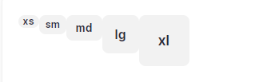

```html
<template>
  <div class="flex gap-2 flex-wrap">
    <imc-button size="xs">xs</imc-button>
    <imc-button size="sm">sm</imc-button>
    <imc-button>md</imc-button>
    <imc-button size="lg">lg</imc-button>
    <imc-button size="xl">xl</imc-button>
  </div>
</template>
```

### 形状

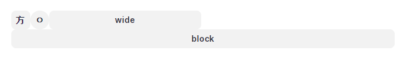

```html
<template>
  <div class="flex gap-2 flex-wrap">
    <imc-button square>方</imc-button>
    <imc-button circle>⚪</imc-button>
    <imc-button wide>wide</imc-button>
    <imc-button block>block</imc-button>
  </div>
</template>
```

### 按钮内图标

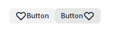

```html
<template>
  <div class="flex gap-2 flex-wrap">
    <imc-button>
      <svg xmlns="http://www.w3.org/2000/svg" class="h-6 w-6" fill="none" viewBox="0 0 24 24" stroke="currentColor">
        <path
          stroke-linecap="round"
          stroke-linejoin="round"
          stroke-width="2"
          d="M4.318 6.318a4.5 4.5 0 000 6.364L12 20.364l7.682-7.682a4.5 4.5 0 00-6.364-6.364L12 7.636l-1.318-1.318a4.5 4.5 0 00-6.364 0z"
        />
      </svg>
      Button
    </imc-button>
    <imc-button>
      Button
      <svg xmlns="http://www.w3.org/2000/svg" class="h-6 w-6" fill="none" viewBox="0 0 24 24" stroke="currentColor">
        <path
          stroke-linecap="round"
          stroke-linejoin="round"
          stroke-width="2"
          d="M4.318 6.318a4.5 4.5 0 000 6.364L12 20.364l7.682-7.682a4.5 4.5 0 00-6.364-6.364L12 7.636l-1.318-1.318a4.5 4.5 0 00-6.364 0z"
        />
      </svg>
    </imc-button>
  </div>
</template>
```

### 加载中

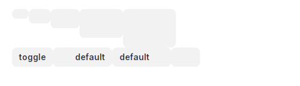

```html
<template>
  <div class="flex gap-1">
    <imc-button size="xs" loading></imc-button>
    <imc-button size="sm" loading></imc-button>
    <imc-button size="md" loading></imc-button>
    <imc-button size="lg" loading></imc-button>
    <imc-button size="xl" loading></imc-button>
  </div>
  <div class="flex gap-1">
    <imc-button @click="isLoading = !isLoading"> toggle </imc-button>
    <imc-button :loading="isLoading">default</imc-button>
    <imc-button :loading="isLoading" loading-placement="right">default</imc-button>
    <imc-button :loading="isLoading" icon-only-when-loading>
      <svg xmlns="http://www.w3.org/2000/svg" class="h-6 w-6" fill="none" viewBox="0 0 24 24" stroke="currentColor">
        <path
          stroke-linecap="round"
          stroke-linejoin="round"
          stroke-width="2"
          d="M4.318 6.318a4.5 4.5 0 000 6.364L12 20.364l7.682-7.682a4.5 4.5 0 00-6.364-6.364L12 7.636l-1.318-1.318a4.5 4.5 0 00-6.364 0z"
        />
      </svg>
    </imc-button>
  </div>
</template>
<script setup lang="ts">
import { ref } from 'vue';
const isLoading = ref(true);
</script>
```

## 标签页使用示例

### 在同一块区域内切换内容

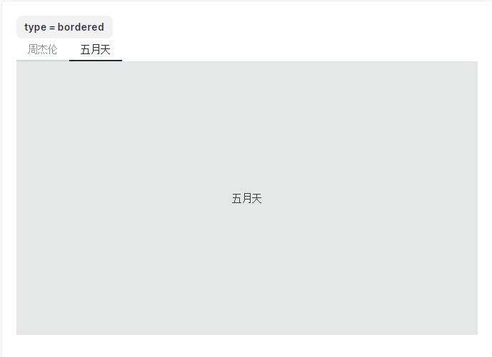

```html
<template>
  <imc-button @click="onToggle">type = {{ type }}</imc-button>
  <imc-tabs v-model="active" :type="type">
    <imc-tab-pane v-for="item of list" :key="item.name" :name="item.name" :tab="item.title">
      <div class="bg-base-300 flex items-center justify-center h-96">
        {{ item.title }}
      </div>
    </imc-tab-pane>
  </imc-tabs>
</template>
<script setup lang="ts">
import { ref } from 'vue';

const list = [
  {
    name: 'Jay',
    title: '周杰伦',
  },
  {
    name: 'MayDay',
    title: '五月天',
  },
];

const active = ref(list[0].name);
const type = ref<'lifted' | 'bordered' | undefined>(undefined);
const typeList: [undefined, 'bordered', 'lifted'] = [undefined, 'bordered', 'lifted'];
const onToggle = () => {
  const index = typeList.findIndex((x) => type.value === x);
  const newIndex = (index + 1) % 3;
  type.value = typeList[newIndex];
};
</script>
```

## 模态框

### 打开与关闭

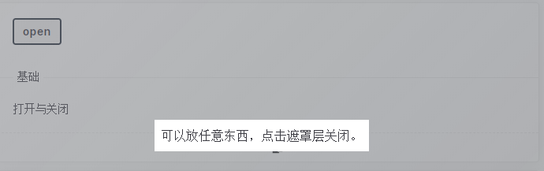

```html
<template>
  <imc-button @click="show = true"> open </imc-button>
  <imc-modal v-model:show="show">
    <div class="p-2 bg-base-100">可以放任意东西，点击遮罩层关闭。</div>
  </imc-modal>
</template>
<script setup lang="ts">
import { ref } from 'vue';
const show = ref(false);
</script>
```

### 打开对话框和抽屉

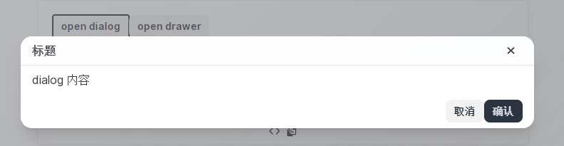

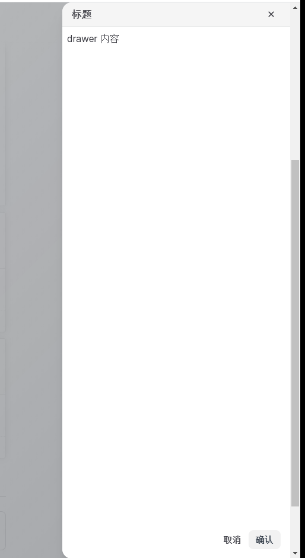

```html
<template>
  <imc-button @click="dialogShow = true"> open dialog </imc-button>
  <imc-button @click="drawerShow = true"> open drawer </imc-button>
  <imc-modal v-model:show="dialogShow">
    <template #default="{ onClose }">
      <imc-dialog title="标题" class="w-[720px]" @negative-click="onClose">
        <div>dialog 内容</div>
      </imc-dialog>
    </template>
  </imc-modal>
  <imc-modal v-model:show="drawerShow" role="drawer" placement="right">
    <template #default="{ onClose }">
      <imc-drawer title="标题" class="w-96" @negative-click="onClose">
        <div>drawer 内容</div>
      </imc-drawer>
    </template>
  </imc-modal>
</template>
<script setup lang="ts">
import { ref } from 'vue';
const dialogShow = ref(false);
const drawerShow = ref(false);
</script>
```

### 命令式调用

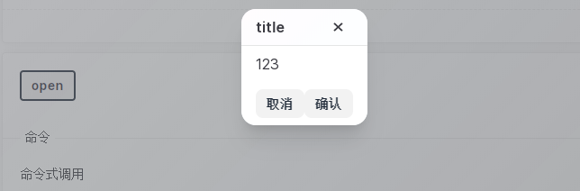

```html
<template>
  <imc-button @click="onClick"> open </imc-button>
</template>
<script setup lang="ts">
import { useModal } from '../../';
const modal = useModal();
const onClick = () => {
  modal.create({
    title: 'title',
    content: '123',
  });
};
</script>
```

## 信息

### 信息样式

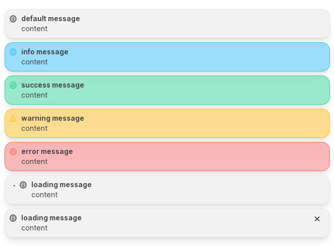

```html
<template>
  <div class="space-y-2">
    <imc-message title="default message" content="content"></imc-message>
    <imc-message type="info" title="info message" content="content"></imc-message>
    <imc-message type="success" title="success message" content="content"></imc-message>
    <imc-message type="warning" title="warning message" content="content"></imc-message>
    <imc-message type="error" title="error message" content="content"></imc-message>
    <imc-message loading title="loading message" content="content"></imc-message>
    <imc-message title="loading message" content="content" closable></imc-message>
  </div>
</template>
```

### 调用信息

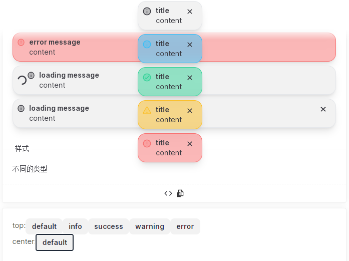

```html
<template>
  <div class="flex flex-col gap-2">
    <div class="flex gap-1">
      <div>top:</div>
      <imc-button @click="onAddTopMessage(undefined)"> default </imc-button>
      <imc-button @click="onAddTopMessage('info')"> info </imc-button>
      <imc-button @click="onAddTopMessage('success')"> success </imc-button>
      <imc-button @click="onAddTopMessage('warning')"> warning </imc-button>
      <imc-button @click="onAddTopMessage('error')"> error </imc-button>
    </div>
    <div class="flex gap-1">
      <div>center:</div>
      <imc-button @click="onAddCenterMessage('default')"> default </imc-button>
    </div>
  </div>
</template>
<script setup lang="ts">
import { useMessage } from '../../index';
const message = useMessage();
const onAddTopMessage = (type?: string) => {
  message.create({
    type,
    title: 'title',
    content: 'content',
    duration: 0,
    closable: true,
  });
};
const onAddCenterMessage = (type: string) => {
  message.create({
    type,
    title: 'a message',
    position: 'center',
    content: 'content',
  });
};
</script>
```

