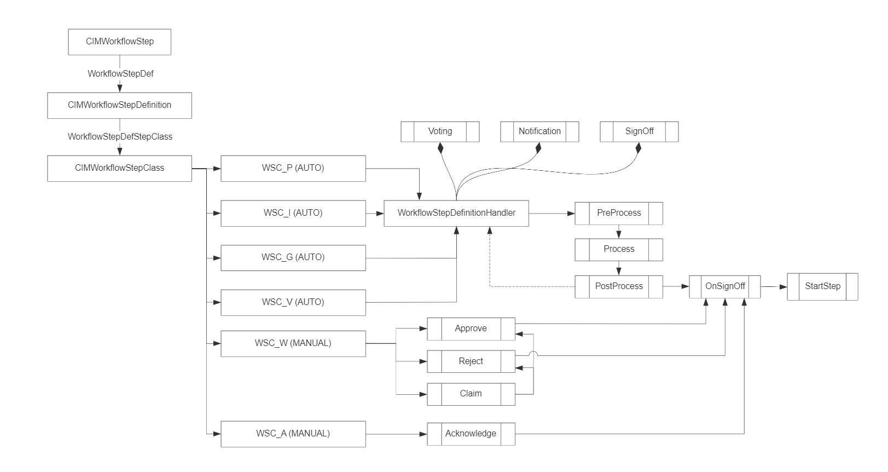

<h1 align="center" style="margin: 30px 0 30px; font-weight: bold;">工作流二次开发手册</h1>
<h4 align="center">基于 Vue/Element UI 和 Spring Boot/Spring Cloud & Alibaba 前后端分离的分布式微服务架构</h4>
<p align="center">
    <a href="http://imc.smartsolutions.com.cn/login"></a>
    <a href="http://imc.smartsolutions.com.cn/login"></a>	
</p>
[TOC]

## Schema

### 接口

| uid                               | name                              | description                          | displayName                          | isActivated | interfaceSequenceNumber | containerId  |
| --------------------------------- | --------------------------------- | ------------------------------------ | ------------------------------------ | ----------- | ----------------------- | ------------ |
| ICIMWorkflowFlowPart              | ICIMWorkflowFlowPart              | 流程中实际的流程组块，用于上下流转的 | 流程中实际的流程组块，用于上下流转的 | TRUE        | 5005                    | CIM.WORKFLOW |
| ICIMWorkflow                      | ICIMWorkflow                      | 工作流                               | 工作流                               | TRUE        | 5010                    | CIM.WORKFLOW |
| ICIMWorkflowTemplate              | ICIMWorkflowTemplate              | 工作流模板                           | 工作流模板                           | TRUE        | 5020                    | CIM.WORKFLOW |
| ICIMWorkflowObject                | ICIMWorkflowObject                | 工作流实例                           | 工作流实例                           | TRUE        | 5030                    | CIM.WORKFLOW |
| ICIMWorkflowCondition             | ICIMWorkflowCondition             | 工作流条件                           | 工作流条件                           | TRUE        | 5040                    | CIM.WORKFLOW |
| ICIMWorkflowNotificationType      | ICIMWorkflowNotificationType      | 工作流提醒类型                       | 工作流提醒类型                       | TRUE        | 5050                    | CIM.WORKFLOW |
| ICIMWorkflowItem                  | ICIMWorkflowItem                  | 工作项                               | 工作项                               | TRUE        | 5060                    | CIM.WORKFLOW |
| ICIMWorkflowStep                  | ICIMWorkflowStep                  | 工作流步骤                           | 工作流步骤                           | TRUE        | 5070                    | CIM.WORKFLOW |
| ICIMWorkflowStepTemplate          | ICIMWorkflowStepTemplate          | 工作流模板步骤                       | 工作流模板步骤                       | TRUE        | 5080                    | CIM.WORKFLOW |
| ICIMWorkflowStepObject            | ICIMWorkflowStepObject            | 工作流步骤实例                       | 工作流步骤实例                       | TRUE        | 5090                    | CIM.WORKFLOW |
| ICIMWorkflowStepClass             | ICIMWorkflowStepClass             | 工作流步骤分类                       | 工作流步骤分类                       | TRUE        | 5100                    | CIM.WORKFLOW |
| ICIMWorkflowStepDefinition        | ICIMWorkflowStepDefinition        | 工作流步骤定义                       | 工作流步骤定义                       | TRUE        | 5110                    | CIM.WORKFLOW |
| ICIMWorkflowStepStatus            | ICIMWorkflowStepStatus            | 工作流步骤状态                       | 工作流步骤状态                       | TRUE        | 5120                    | CIM.WORKFLOW |
| ICIMWorkflowStepCheckList         | ICIMWorkflowStepCheckList         | 工作流步骤检查列表                   | 工作流步骤检查列表                   | TRUE        | 5130                    | CIM.WORKFLOW |
| ICIMWorkflowStepCheckListObject   | ICIMWorkflowStepCheckListObject   | 工作流步骤检查列表实例               | 工作流步骤检查列表实例               | TRUE        | 5140                    | CIM.WORKFLOW |
| ICIMWorkflowStepCheckListTemplate | ICIMWorkflowStepCheckListTemplate | 工作流步骤检查列表模板               | 工作流步骤检查列表模板               | TRUE        | 5150                    | CIM.WORKFLOW |
| ICIMWorkflowStepCheckListItem     | ICIMWorkflowStepCheckListItem     | 工作流步骤检查项                     | 工作流步骤检查项                     | TRUE        | 5160                    | CIM.WORKFLOW |
| ICIMWorkflowStepParticipant       | ICIMWorkflowStepParticipant       | 工作流步骤参与者                     | 工作流步骤参与者                     | TRUE        | 5170                    | CIM.WORKFLOW |
| ICIMWorkflowMethod                | ICIMWorkflowMethod                | 工作流步骤方法                       | 工作流步骤方法                       | TRUE        | 5180                    | CIM.WORKFLOW |
| ICIMWorkflowInbox                 | ICIMWorkflowInbox                 | 工作流收件箱                         | 工作流收件箱                         | TRUE        | 5190                    | CIM.WORKFLOW |
| ICIMWorkflowInboxMessage          | ICIMWorkflowInboxMessage          | 工作流收件箱信息                     | 工作流收件箱信息                     | TRUE        | 5200                    | CIM.WORKFLOW |
| ICIMWorkflowStepLegend            | ICIMWorkflowStepLegend            | 工作流步骤图例                       | 工作流步骤图例                       | TRUE        | 5210                    | CIM.WORKFLOW |
| ICIMWorkflowCategory              | ICIMWorkflowCategory              | 工作流分类                           | 工作流分类                           | TRUE        | 5220                    | CIM.WORKFLOW |
| ICIMWorkflowStepContinuesStepRel  | ICIMWorkflowStepContinuesStepRel  | 工作流步骤的关系                     | 工作流步骤的关系                     | TRUE        | 5230                    | CIM.WORKFLOW |
| ICIMWorkflowStepGroupRecipient    | ICIMWorkflowStepGroupRecipient    | 组心态流程参与者                     | 组心态流程参与者                     | TRUE        | 5240                    | CIM.WORKFLOW |
| ICIMWorkflowStepRecipient         | ICIMWorkflowStepRecipient         | 步骤参与人代理                       | 步骤参与人代理                       | TRUE        | 5500                    | CIM.WORKFLOW |


### 枚举

| uid                                           | name                      | description                                                | displayName          | ver          | interfaceSequenceNumber | containerId |
| --------------------------------------------- | ------------------------- | ---------------------------------------------------------- | -------------------- | ------------ | ----------------------- | ----------- |
| ELT_WorkflowStatus                            | WorkflowStatus            | 工作流状态                                                 | 工作流状态           | CIM.WORKFLOW | 3000                    | TRUE        |
| ELT_Ready_WorkflowStatus                      | Ready                     | 准备                                                       | 准备                 | CIM.WORKFLOW | 3010                    | TRUE        |
| ELT_Working_WorkflowStatus                    | Working                   | 流程中                                                     | 流程中               | CIM.WORKFLOW | 3020                    | TRUE        |
| ELT_Completed_WorkflowStatus                  | Completed                 | 完成                                                       | 完成                 | CIM.WORKFLOW | 3030                    | TRUE        |
| ELT_Error_WorkflowStatus                      | Error                     | 错误                                                       | 错误                 | CIM.WORKFLOW | 3040                    | TRUE        |
| ELT_NotificationType                          | NotificationType          | 提醒类型                                                   | 提醒类型             | CIM.WORKFLOW | 4000                    | TRUE        |
| ELT_All_NotificationType                      | All                       | 所有类型                                                   | 所有类型             | CIM.WORKFLOW | 4001                    | TRUE        |
| ELT_E-mail_NotificationType                   | E-mail                    | 邮件                                                       | 邮件                 | CIM.WORKFLOW | 4002                    | TRUE        |
| ELT_Message_NotificationType                  | Message                   | 短信通知                                                   | 短信通知             | CIM.WORKFLOW | 4003                    | TRUE        |
| ELT_Mail_NotificationType                     | Mail                      | 站内信                                                     | 站内信               | CIM.WORKFLOW | 4004                    | TRUE        |
| ELT_WorkflowStepStatus                        | WorkflowStepStatus        | 工作流步骤状态                                             | 工作流步骤状态       | CIM.WORKFLOW | 5000                    | TRUE        |
| ELT_UnReady_WorkflowStepStatus                | UnReady                   | 未准备                                                     | 未准备               | CIM.WORKFLOW | 5001                    | TRUE        |
| ELT_Ready_WorkflowStepStatus                  | Ready                     | 处理中                                                     | 处理中               | CIM.WORKFLOW | 5002                    | TRUE        |
| ELT_Reject_WorkflowStepStatus                 | Reject                    | 驳回                                                       | 驳回                 | CIM.WORKFLOW | 5003                    | TRUE        |
| ELT_Pass_WorkflowStepStatus                   | Pass                      | 通过                                                       | 通过                 | CIM.WORKFLOW | 5004                    | TRUE        |
| ELT_Skip_WorkflowStepStatus                   | Skip                      | 跳过（系统自动处理）                                       | 跳过（系统自动处理） | CIM.WORKFLOW | 5005                    | TRUE        |
| ELT_WorkflowImportance                        | WorkflowImportance        | 流程等级                                                   | 流程等级             | CIM.WORKFLOW | 5100                    | TRUE        |
| ELT_General_WorkflowImportance                | General                   | 一般                                                       | 一般                 | CIM.WORKFLOW | 5101                    | TRUE        |
| ELT_Important_WorkflowImportance              | Important                 | 重要                                                       | 重要                 | CIM.WORKFLOW | 5102                    | TRUE        |
| ELT_Urgent_WorkflowImportance                 | Urgent                    | 紧急                                                       | 紧急                 | CIM.WORKFLOW | 5103                    | TRUE        |
| ELT_WorkflowStepOperationMode                 | WorkflowStepOperationMode | 步骤认领模式                                               | 步骤认领模式         | CIM.WORKFLOW | 5200                    | TRUE        |
| ELT_oneUserPerRole_WorkflowStepOperationMode  | oneUserPerRole            | 每个角色仅需一人处理，多个角色存在则必须多个角色都需要处理 | 每个角色仅需一人处理 | CIM.WORKFLOW | 5201                    | TRUE        |
| ELT_anyoneUser_WorkflowStepOperationMode      | anyoneUser                | 任意一个人处理即可                                         | 任意一个人处理即可   | CIM.WORKFLOW | 5202                    | TRUE        |
| ELT_oneUserPerGroup_WorkflowStepOperationMode | oneUserPerGroup           | 每个分组仅需一人处理，多个组存在则必须多个组都需要处理     | 每个分组仅需一人处理 | CIM.WORKFLOW | 5203                    | TRUE        |
| ELT_allUsers_WorkflowStepOperationMode        | allUsers                  | 所有人都必须处理                                           | 任意一个人处理即可   | CIM.WORKFLOW | 5204                    | TRUE        |
| ELT_StepClassOperationMode                    | StepClassOperationMode    | 步骤类型的处理方式                                         | 步骤类型的处理方式   | CIM.WORKFLOW | 5300                    | TRUE        |
| ELT_Manually_StepClassOperationMode           | Manually                  | 人工处理                                                   | 人工处理             | CIM.WORKFLOW | 5301                    | TRUE        |
| ELT_Automatically_StepClassOperationMode      | Automatically             | 自动处理                                                   | 自动处理             | CIM.WORKFLOW | 5302                    | TRUE        |

### 属性

| uid                                    | name                                   | description              | displayName              | isActivated | propertyValueType | propertyValueTypeDetails      | isMandatory | isDbField | HistoryRetained | fieldLength | exposedInterfaceDefUid           | containerId  |
| -------------------------------------- | -------------------------------------- | ------------------------ | ------------------------ | ----------- | ----------------- | ----------------------------- | ----------- | --------- | --------------- | ----------- | -------------------------------- | ------------ |
| WorkflowStepDuration                   | WorkflowStepDuration                   | 计划持续时间             | 计划持续时间             | TRUE        | Integer           |                               | FALSE       | TRUE      | FALSE           |             | ICIMWorkflowStep                 | CIM.WORKFLOW |
| WorkflowStepWarningTime                | WorkflowStepWarningTime                | 预警时间                 | 预警时间                 | TRUE        | Double            |                               | FALSE       | TRUE      | FALSE           |             | ICIMWorkflowStep                 | CIM.WORKFLOW |
| WorkflowStepPrincipalPrescription      | WorkflowStepPrincipalPrescription      | 委托人权限时效           | 委托人权限时效           | TRUE        | Double            |                               | FALSE       | TRUE      | FALSE           |             | ICIMWorkflowStep                 | CIM.WORKFLOW |
| WorkflowStepOperationMode              | WorkflowStepOperationMode              | 步骤处理模式             | 步骤处理模式             | TRUE        | EnumList          | ELT_WorkflowStepOperationMode | FALSE       | TRUE      | FALSE           |             | ICIMWorkflowStep                 | CIM.WORKFLOW |
| WorkflowProportion                     | WorkflowProportion                     | 步骤权重                 | 委托人权限时效           | TRUE        | Double            |                               | FALSE       | TRUE      | FALSE           |             | ICIMWorkflowStep                 | CIM.WORKFLOW |
| WorkflowStepRemark                     | WorkflowStepRemark                     | 备注说明                 | 步骤处理模式             | TRUE        | String            |                               | FALSE       | TRUE      | FALSE           | 256         | ICIMWorkflowStep                 | CIM.WORKFLOW |
| WorkflowStepStartDate                  | WorkflowStepStartDate                  | 开始日期                 | 开始日期                 | TRUE        | DateTime          |                               | FALSE       | TRUE      | FALSE           |             | ICIMWorkflowStepObject           | CIM.WORKFLOW |
| WorkflowStepEndDate                    | WorkflowStepEndDate                    | 结束日期                 | 结束日期                 | TRUE        | DateTime          |                               | FALSE       | TRUE      | FALSE           |             | ICIMWorkflowStepObject           | CIM.WORKFLOW |
| WorkflowStepActualDuration             | WorkflowStepActualDuration             | 实际持续时间             | 实际持续时间             | TRUE        | Double            |                               | FALSE       | TRUE      | FALSE           |             | ICIMWorkflowStepObject           | CIM.WORKFLOW |
| WorkflowStepStatus                     | WorkflowStepStatus                     | 状态                     | 状态                     | TRUE        | EnumList          | ELT_WorkflowStepStatus        | FALSE       | TRUE      | FALSE           | 64          | ICIMWorkflowStepObject           | CIM.WORKFLOW |
| WorkflowStepDefProcessHandler          | WorkflowStepDefProcessHandler          | 处理器                   | 处理器                   | TRUE        | String            |                               | TRUE        | TRUE      | FALSE           |             | ICIMWorkflowStepDefinition       | CIM.WORKFLOW |
| WorkflowStepDefMaxAllowLine            | WorkflowStepDefMaxAllowLine            | 步骤定义允许的最大连接线 | 步骤定义允许的最大连接线 | TRUE        | Integer           |                               | TRUE        | TRUE      | FALSE           |             | ICIMWorkflowStepDefinition       | CIM.WORKFLOW |
| WorkflowItemStatus                     | WorkflowItemStatus                     | 工作流状态               | 工作流状态               | TRUE        | String            |                               | FALSE       | TRUE      | FALSE           | 128         | ICIMWorkflowItem                 | CIM.WORKFLOW |
| WorkflowItemActiveWorkflowCount        | WorkflowItemActiveWorkflowCount        | 活动工作流的个数         | 活动工作流的个数         | TRUE        | Integer           |                               | FALSE       | TRUE      | FALSE           |             | ICIMWorkflowItem                 | CIM.WORKFLOW |
| WorkflowItemWorkflowTotalCount         | WorkflowItemWorkflowTotalCount         | 工作流总数               | 工作流总数               | TRUE        | Integer           |                               | FALSE       | TRUE      | FALSE           |             | ICIMWorkflowItem                 | CIM.WORKFLOW |
| WorkflowStatus                         | WorkflowStatus                         | 状态                     | 状态                     | TRUE        | EnumList          | ELT_WorkflowStatus            | FALSE       | TRUE      | FALSE           | 64          | ICIMWorkflowObject               | CIM.WORKFLOW |
| WorkflowMessage                        | WorkflowMessage                        | 过程信息                 | 过程信息                 | TRUE        | String            |                               | FALSE       | TRUE      | FALSE           | 1024        | ICIMWorkflowObject               | CIM.WORKFLOW |
| WorkflowRemark                         | WorkflowRemark                         | 备注信息                 | 备注信息                 | TRUE        | String            |                               | FALSE       | TRUE      | FALSE           | 1024        | ICIMWorkflowObject               | CIM.WORKFLOW |
| WorkflowErrorMsg                       | WorkflowErrorMsg                       | 错误信息                 | 错误信息                 | TRUE        | String            |                               | FALSE       | TRUE      | FALSE           | 1024        | ICIMWorkflowObject               | CIM.WORKFLOW |
| WorkflowDetailStatus                   | WorkflowDetailStatus                   | 详细状态                 | 详细状态                 | TRUE        | String            |                               | FALSE       | TRUE      | FALSE           | 1024        | ICIMWorkflowObject               | CIM.WORKFLOW |
| TemplateFrontInfo                      | TemplateFrontInfo                      | 前端模板信息             | 前端模板信息             | TRUE        | LongText          |                               | TRUE        | TRUE      | FALSE           |             | ICIMWorkflowTemplate             | CIM.WORKFLOW |
| EffectiveInterface                     | EffectiveInterface                     | 生效的接口信息           | 生效的接口信息           | TRUE        | String            |                               | FALSE       | TRUE      | FALSE           | 512         | ICIMWorkflowTemplate             | CIM.WORKFLOW |
| FrontStepId                            | FrontStepId                            | 前端步骤id               | 前端步骤id               | TRUE        | String            |                               | TRUE        | TRUE      | FALSE           | 64          | ICIMWorkflowStepTemplate         | CIM.WORKFLOW |
| WorkflowStepMsgFromPreviousStep        | WorkflowStepMsgFromPreviousStep        | 上一步消息               | 上一步消息               | TRUE        | String            |                               | FALSE       | TRUE      | FALSE           | 1024        | ICIMWorkflowStepObject           | CIM.WORKFLOW |
| WorkflowStepMsgToNextStep              | WorkflowStepMsgToNextStep              | 给下一步的消息           | 给下一步的消息           | TRUE        | String            |                               | FALSE       | TRUE      | FALSE           | 1024        | ICIMWorkflowStepObject           | CIM.WORKFLOW |
| WorkflowStepComments                   | WorkflowStepComments                   | 评论                     | 评论                     | TRUE        | RichText          |                               | FALSE       | TRUE      | FALSE           | 1024        | ICIMWorkflowStep                 | CIM.WORKFLOW |
| WorkflowStepClaimedInd                 | WorkflowStepClaimedInd                 | 是否认领                 | 是否认领                 | TRUE        | Boolean           |                               | FALSE       | TRUE      | FALSE           |             | ICIMWorkflowStepObject           | CIM.WORKFLOW |
| WorkflowStepGroupAssignInd             | WorkflowStepGroupAssignInd             | 组参与标识               | 组参与标识               | TRUE        | String            |                               | FALSE       | TRUE      | FALSE           | 64          | ICIMWorkflowStep                 | CIM.WORKFLOW |
| WorkflowStepParallelExpansionInd       | WorkflowStepParallelExpansionInd       | 并行标识                 | 并行标识                 | TRUE        | Boolean           |                               | FALSE       | TRUE      | FALSE           |             | ICIMWorkflowStep                 | CIM.WORKFLOW |
| WorkflowOnHoldInd                      | WorkflowOnHoldInd                      | 暂停标识                 | 暂停标识                 | TRUE        | Boolean           |                               | FALSE       | TRUE      | FALSE           |             | ICIMWorkflowObject               | CIM.WORKFLOW |
| WorkflowRev                            | WorkflowRev                            | 工作流版本               | 工作流版本               | TRUE        | Integer           |                               | FALSE       | TRUE      | FALSE           |             | ICIMWorkflowObject               | CIM.WORKFLOW |
| WorkflowImportance                     | WorkflowImportance                     | 流程等级                 | 流程等级                 | TRUE        | EnumList          | ELT_WorkflowImportance        | TRUE        | TRUE      | FALSE           | 64          | ICIMWorkflow                     | CIM.WORKFLOW |
| WorkflowStepLegendTextColor            | WorkflowStepLegendTextColor            | 步骤图例的文字颜色       | 步骤图例的文字颜色       | TRUE        | String            |                               | FALSE       | TRUE      | FALSE           | 64          | ICIMWorkflowStepLegend           | CIM.WORKFLOW |
| WorkflowStepLegendIcon                 | WorkflowStepLegendIcon                 | 步骤图例的图标           | 步骤图例的图标           | TRUE        | String            |                               | FALSE       | TRUE      | FALSE           | 64          | ICIMWorkflowStepLegend           | CIM.WORKFLOW |
| WorkflowStepLegendTitle                | WorkflowStepLegendTitle                | 步骤图例的标题           | 步骤图例的标题           | TRUE        | String            |                               | FALSE       | TRUE      | FALSE           | 64          | ICIMWorkflowStepLegend           | CIM.WORKFLOW |
| WorkflowStepLegendBackgroundColor      | WorkflowStepLegendBackgroundColor      | 步骤图例的背景色         | 步骤图例的背景色         | TRUE        | String            |                               | FALSE       | TRUE      | FALSE           | 64          | ICIMWorkflowStepLegend           | CIM.WORKFLOW |
| WorkflowStepAcceptPercentage           | WorkflowStepAcceptPercentage           | 步骤通过百分比           | 步骤通过百分比           | TRUE        | Double            |                               | FALSE       | TRUE      | FALSE           |             | ICIMWorkflowStep                 | CIM.WORKFLOW |
| WorkflowStepRejectPercentage           | WorkflowStepRejectPercentage           | 步骤拒绝百分比           | 步骤拒绝百分比           | TRUE        | Double            |                               | FALSE       | TRUE      | FALSE           |             | ICIMWorkflowStep                 | CIM.WORKFLOW |
| WorkflowPercentage                     | WorkflowPercentage                     | 工作流完成百分比         | 工作流完成百分比         | TRUE        | Integer           |                               | FALSE       | TRUE      | FALSE           |             | ICIMWorkflowObject               | CIM.WORKFLOW |
| End1WorkflowObjectStepStatus           | End1WorkflowObjectStepStatus           | 工作流步骤处理状态       | 工作流步骤处理状态       | TRUE        | EnumList          | ELT_WorkflowStepStatus        | FALSE       | TRUE      | FALSE           |             | ICIMWorkflowStepContinuesStepRel | CIM.WORKFLOW |
| WorkflowStepParallelMode               | WorkflowStepParallelMode               | 并行步骤的模式           | 并行步骤的模式           | TRUE        | String            |                               | FALSE       | TRUE      | FALSE           | 128         | ICIMWorkflowStep                 | CIM.WORKFLOW |
| WorkflowStepOnHoldInd                  | WorkflowStepOnHoldInd                  | 工作步骤挂起标识         | 工作步骤挂起标识         | TRUE        | Boolean           |                               | FALSE       | TRUE      | FALSE           |             | ICIMWorkflowStepObject           | CIM.WORKFLOW |
| WorkflowRecipientGroupInd              | WorkflowRecipientGroupInd              | 参与人组标识             | 参与人组标识             | TRUE        | String            |                               | FALSE       | TRUE      | FALSE           | 256         | ICIMWorkflowStepRecipient        | CIM.WORKFLOW |
| WorkflowRecipientEffectParticipantInfo | WorkflowRecipientEffectParticipantInfo | 当前生效的参与人信息     | 当前生效的参与人信息     | TRUE        | String            |                               | FALSE       | TRUE      | FALSE           | 512         | ICIMWorkflowStepRecipient        | CIM.WORKFLOW |
| WorkflowStepCurrentParticipantInfo     | WorkflowStepCurrentParticipantInfo     | 流程步骤当前的参与人信息 | 流程步骤当前的参与人信息 | TRUE        | String            |                               | FALSE       | TRUE      | FALSE           | 128         | ICIMWorkflowStepObject           | CIM.WORKFLOW |
| WorkflowPartGroupInd                   | WorkflowPartGroupInd                   | 流程块所属组信息         | 流程块所属组信息         | TRUE        | String            |                               | FALSE       | TRUE      | FALSE           | 256         | ICIMWorkflowFlowPart             | CIM.WORKFLOW |
| StepClassExecutionMode                 | StepClassExecutionMode                 | 步骤定义的执行方式       | 步骤定义的执行方式       | TRUE        | EnumList          | ELT_StepClassOperationMode    | FALSE       | TRUE      | FALSE           | 128         | ICIMWorkflowStepClass            | CIM.WORKFLOW |


### 关联关系

| uid                                      | name                                     | description                | displayName                | isActivated | tableName               | cachedInfo | interfaceDefUid1               | interfaceDefUid2              | min1 | min2 | max1 | max2 | displayName1     | displayName2     | optionalInterfaces               | delete1To2 | delete2To1 |
| ---------------------------------------- | ---------------------------------------- | -------------------------- | -------------------------- | ----------- | ----------------------- | ---------- | ------------------------------ | ----------------------------- | ---- | ---- | ---- | ---- | ---------------- | ---------------- | -------------------------------- | ---------- | ---------- |
| WorkflowNotificationType                 | WorkflowNotificationType                 | 通知类型                   | 通知类型                   | TRUE        | cim_rel_wft             | Not        | ICIMWorkflow                   | ICIMWorkflowNotificationType  | 0    | 0    | *    | 1    | 工作流模板       | 工作流提醒类型   |                                  |            |            |
| WorkflowConditionCompositions            | WorkflowConditionCompositions            | 模板条件                   | 模板条件                   | TRUE        | cim_rel_wft             | Not        | ICIMWorkflowCondition          | ICIMConditionComposition      | 0    | 0    | 1    | *    | 工作流条件       | 工作流模板       |                                  |            |            |
| WorkflowSteps                            | WorkflowSteps                            | 模板步骤                   | 模板步骤                   | TRUE        | cim_rel_wfs             | Not        | ICIMWorkflow                   | ICIMWorkflowFlowPart          | 0    | 0    | 1    | *    | 工作流           | 流程块           |                                  | TRUE       |            |
| WorkflowStepChecklist                    | WorkflowStepChecklist                    | 步骤检查列表               | 步骤检查列表               | TRUE        | cim_rel_wfs_check       | Not        | ICIMWorkflowStep               | ICIMWorkflowStepCheckList     | 0    | 0    | *    | 1    | 工作流步骤       | 工作流检查列表   |                                  |            |            |
| WorkflowStepChecklistItems               | WorkflowStepChecklistItems               | 检查具体项                 | 检查具体项                 | TRUE        | cim_rel_wfs_check       | Not        | ICIMWorkflowStepCheckList      | ICIMWorkflowStepCheckListItem | 0    | 0    | 1    | *    | 检查事项         | 具体事项条目     |                                  | TRUE       |            |
| WorkflowStepStepRecipients               | WorkflowStepStepRecipients               | 步骤参与人                 | 步骤参与人                 | TRUE        | cim_rel_wfs_recipient   | Not        | ICIMWorkflowStep               | ICIMWorkflowStepRecipient     | 0    | 0    | 1    | *    | 工作流步骤       | 工作流步骤接受者 |                                  | TRUE       |            |
| WorkflowStepStepDef                      | WorkflowStepStepDef                      | 步骤使用的定义             | 步骤使用的定义             | TRUE        | cim_rel_wfs             | Not        | ICIMWorkflowStep               | ICIMWorkflowStepDefinition    | 0    | 0    | *    | 1    | 工作流步骤       | 步骤定义         |                                  |            |            |
| WorkflowStepDefStepClass                 | WorkflowStepDefStepClass                 | 步骤类型                   | 步骤类型                   | TRUE        | cim_rel_wfs_def_class   | Not        | ICIMWorkflowStepDefinition     | ICIMWorkflowStepClass         | 0    | 0    | 1    | *    | 步骤定义         | 步骤类型         |                                  |            |            |
| WorkflowStepSuccessStep                  | WorkflowStepSuccessStep                  | 同意步骤                   | 同意步骤                   | TRUE        | cim_rel_wfs             | Not        | ICIMWorkflowFlowPart           | ICIMWorkflowFlowPart          | 0    | 0    | *    | *    | 工作流步骤       | 工作流步骤       |                                  |            |            |
| WorkflowStepFailureStep                  | WorkflowStepFailureStep                  | 拒绝步骤                   | 拒绝步骤                   | TRUE        | cim_rel_wfs             | Not        | ICIMWorkflowFlowPart           | ICIMWorkflowFlowPart          | 0    | 0    | *    | *    | 工作流步骤       | 工作流步骤       |                                  |            |            |
| WorkflowStepSuccessStatus                | WorkflowStepSuccessStatus                | 步骤执行成功状态           | 步骤执行成功状态           | TRUE        | cim_rel_wfs_status      | Not        | ICIMWorkflowStep               | ICIMWorkflowStepStatus        | 0    | 0    | *    | 1    | 工作流步骤       | 步骤状态         |                                  |            |            |
| WorkflowStepFailureStatus                | WorkflowStepFailureStatus                | 步骤执行失败状态           | 步骤执行失败状态           | TRUE        | cim_rel_wfs_status      | Not        | ICIMWorkflowStep               | ICIMWorkflowStepStatus        | 0    | 0    | *    | 1    | 工作流步骤       | 步骤状态         |                                  |            |            |
| WorkflowWorkflowTemplate                 | WorkflowWorkflowTemplate                 | 工作流实例依托的模板       | 工作流实例依托的模板       | TRUE        | cim_rel_obj_wf          | Not        | ICIMWorkflowObject             | ICIMWorkflowTemplate          | 0    | 1    | *    | 1    | 工作流实例       | 工作流模板       |                                  |            |            |
| WorkflowFirstStep                        | WorkflowFirstStep                        | 第一个步骤                 | 第一个步骤                 | TRUE        | cim_rel_wf              | Not        | ICIMWorkflow                   | ICIMWorkflowFlowPart          | 0    | 0    | 1    | 1    | 工作流           | 工作流步骤       |                                  |            |            |
| WorkflowStepDefMethod                    | WorkflowStepDefMethod                    | 步骤定义方法               | 步骤定义方法               | TRUE        | cim_rel_wfs_def_method  | Not        | ICIMWorkflowStepDefinition     | ICIMWorkflowMethod            | 0    | 0    | 1    | *    | 步骤定义         | 方法             |                                  |            |            |
| WorkflowItemWorkflow                     | WorkflowItemWorkflow                     | 工作项获取工作流对象       | 工作项获取工作流对象       | TRUE        | cim_rel_wf_item         | Not        | ICIMWorkflowItem               | ICIMWorkflowObject            | 0    | 0    | 1    | *    | 工作项           | 工作流实例       |                                  | TRUE       |            |
| WorkflowStepExpandedParallelStep         | WorkflowStepExpandedParallelStep         | 工作流步骤实例并行步骤     | 工作流步骤实例并行步骤     | TRUE        | cim_rel_obj_wfs         | Not        | ICIMWorkflowStepObject         | ICIMWorkflowStepObject        | 0    | 0    | 1    | *    | 工作流步骤实例   | 工作流步骤实例   |                                  |            |            |
| WorkflowStepCompletedBy                  | WorkflowStepCompletedBy                  | 工作流步骤完成者           | 工作流步骤完成者           | TRUE        | cim_rel_obj_wfs         | Not        | ICIMWorkflowStepObject         | ICIMUser                      | 0    | 0    | 1    | 1    | 工作流步骤实例   | 用户             |                                  |            |            |
| WorkflowStepOriginalStepRecipient        | WorkflowStepOriginalStepRecipient        | 工作流步骤原来接收者       | 工作流步骤原来接收者       | TRUE        | cim_rel_obj_wfs         | Not        | ICIMWorkflowStepObject         | ICIMWorkflowStepRecipient     | 0    | 0    | 1    | *    | 工作流步骤       | 工作流步骤接受者 |                                  |            |            |
| WorkflowDefaultSubmitter                 | WorkflowDefaultSubmitter                 | 工作流提交者               | 工作流提交者               | TRUE        | cim_rel_obj_wf          | Not        | ICIMWorkflow                   | ICIMUser                      | 0    | 0    | 1    | 1    | 工作流           | 用户             |                                  |            |            |
| WorkflowStepEarlyWarningMode             | WorkflowStepEarlyWarningMode             | 工作步骤超时预警方式       | 工作步骤超时预警方式       | TRUE        | cim_rel_wfs             | Not        | ICIMWorkflowStep               | ICIMWorkflowNotificationType  | 0    | 0    | 1    | 1    | 工作流步骤       | 提醒类型         |                                  |            |            |
| WorkflowStepOvertimePrincipal            | WorkflowStepOvertimePrincipal            | 步骤超时委托人             | 步骤超时委托人             | TRUE        | cim_rel_wfs             | Not        | ICIMWorkflowStep               | ICIMUser                      | 0    | 0    | *    | 1    | 工作流步骤       | 临时委托人       |                                  |            |            |
| WorkflowStepContinuesStep                | WorkflowStepContinuesStep                | 实际运转的上下游步骤       | 实际运转的上下游步骤       | TRUE        | cim_rel_obj_wfs         | Not        | ICIMWorkflowStepObject         | ICIMWorkflowStepObject        | 0    | 0    | *    | *    | 工作流步骤       | 工作流步骤       | ICIMWorkflowStepContinuesStepRel |            |            |
| WorkflowCategory                         | WorkflowCategory                         | 工作流分类                 | 工作流分类                 | TRUE        | cim_rel_wft             | Not        | ICIMWorkflow                   | ICIMWorkflowCategory          | 0    | 0    | *    | 1    | 工作流           | 工作流程分类     |                                  |            |            |
| WorkflowReassignToParticipant            | WorkflowReassignToParticipant            | 默认的重新分配的参与人     | 默认的重新分配的参与人     | TRUE        | cim_rel_wft             | Not        | ICIMWorkflow                   | ICIMParticipant               | 0    | 1    | *    | 1    | 工作流           | 步骤参与者       |                                  |            |            |
| WorkflowObjectContinues                  | WorkflowObjectContinues                  | 工作流实例接续的工作流实例 | 工作流实例接续的工作流实例 | TRUE        | cim_rel_obj_wf          | Not        | ICIMWorkflowFlowPart           | ICIMWorkflowFlowPart          | 0    | 0    | 1    | *    | 工作流           | 工作流           |                                  |            |            |
| WorkflowStepOriginalOvertimePrincipals   | WorkflowStepOriginalOvertimePrincipals   | 原始的临时委托人           | 原始的临时委托人           | TRUE        | cim_rel_obj_wfs         | Not        | ICIMWorkflowStep               | ICIMUser                      | 0    | 0    | *    | *    | 工作流步骤       | 临时委托人       |                                  |            |            |
| WorkflowStepGroupRecipient2Participants  | WorkflowStepGroupRecipient2Participants  | 组参与人和具体的参与人     | 组参与人和具体的参与人     | TRUE        | cim_rel_wfs             | Not        | ICIMWorkflowStepGroupRecipient | ICIMParticipant               | 0    | 0    | *    | *    | 工作流步骤接受者 | 工作流步骤接受者 |                                  |            |            |
| WorkflowStepObjectInstantiatedBy         | WorkflowStepObjectInstantiatedBy         | 根据模板实例化             | 根据模板实例化             | TRUE        | cim_rel_obj_wfs         | Not        | ICIMWorkflowStepObject         | ICIMWorkflowStepTemplate      | 0    | 1    | *    | 1    | 工作流步骤       | 步骤模板         |                                  |            |            |
| WorkflowStepRecipientHistoryParticipants | WorkflowStepRecipientHistoryParticipants | 参与人的链接关系           | 参与人的链接关系           | TRUE        | cim_rel_wfs_participant | Not        | ICIMWorkflowStepRecipient      | ICIMWorkflowStepRecipient     | 0    | 1    | *    | 1    | 工作流步骤接受者 | 工作流步骤接受者 |                                  |            |            |
| WorkflowStepRecipientParticipants        | WorkflowStepRecipientParticipants        | 接受者对应的参与者         | 接受者对应的参与者         | TRUE        | cim_rel_wfs_participant | Not        | ICIMWorkflowStepRecipient      | ICIMParticipant               | 0    | 1    | *    | 1    | 工作流步骤接受者 | 工作流步骤接受者 |                                  |            |            |


### 类型

| uid                              | name                             | description        | displayName        | isConfigControlled | uidPattern                 | uniqueKeyPattern | containerId | tableName                 | cachedInfo | isActivated |
| -------------------------------- | -------------------------------- | ------------------ | ------------------ | ------------------ | -------------------------- | ---------------- | ----------- | ------------------------- | ---------- | ----------- |
| CIMWorkflow                      | CIMWorkflow                      | 工作流             | 工作流             | TRUE               |                            |                  | CIM.SCHEMA  | cim_wf                    | Not        | TRUE        |
| CIMWorkflowTemplate              | CIMWorkflowTemplate              | 工作流模板         | 工作流模板         | TRUE               |                            |                  | CIM.SCHEMA  | cim_wf_template           | Redis      | TRUE        |
| CIMWorkflowStep                  | CIMWorkflowStep                  | 工作流步骤         | 工作流步骤         | TRUE               |                            |                  | CIM.SCHEMA  | cim_wfs                   | Not        | TRUE        |
| CIMWorkflowStepTemplate          | CIMWorkflowStepTemplate          | 工作流步骤模板     | 工作流步骤模板     | TRUE               |                            |                  | CIM.SCHEMA  | cim_wfs_template          | Redis      | TRUE        |
| CIMWorkflowNotificationType      | CIMWorkflowNotificationType      | 工作流提醒类型     | 工作流提醒类型     | TRUE               | WFNT,name                  |                  | CIM.SCHEMA  | cim_wf_notification_type  | Redis      | TRUE        |
| CIMWorkflowStepCheckList         | CIMWorkflowStepCheckList         | 工作流检查列表     | 工作流检查列表     | TRUE               |                            |                  | CIM.SCHEMA  | cim_wf_checkList          | Not        | TRUE        |
| CIMWorkflowStepCheckListTemplate | CIMWorkflowStepCheckListTemplate | 工作流检查列表模板 | 工作流检查列表模板 | TRUE               | WFSCHSLT,name              |                  | CIM.SCHEMA  | cim_wf_checkList_template | Not        | TRUE        |
| CIMWorkflowStepCheckListItem     | CIMWorkflowStepCheckListItem     | 工作流检查列表项   | 工作流检查列表项   | TRUE               |                            |                  | CIM.SCHEMA  | cim_wf_checkList_item     | Not        | TRUE        |
| CIMWorkflowCondition             | CIMWorkflowCondition             | 工作流条件         | 工作流条件         | TRUE               | WFCOND,name                |                  | CIM.SCHEMA  | cim_wf_condition          | Not        | TRUE        |
| CIMWorkflowStepDefinition        | CIMWorkflowStepDefinition        | 工作流步骤定义     | 工作流步骤定义     | TRUE               | WSD,name                   |                  | CIM.SCHEMA  | cim_wfs_def               | Not        | TRUE        |
| CIMWorkflowStepClass             | CIMWorkflowStepClass             | 工作流步骤分类     | 工作流步骤分类     | TRUE               | WSC,name                   |                  | CIM.SCHEMA  | cim_wfs_class             | Not        | TRUE        |
| CIMWorkflowStepStatus            | CIMWorkflowStepStatus            | 工作流步骤状态     | 工作流步骤状态     | TRUE               | WSS,name                   |                  | CIM.SCHEMA  | cim_wfs_status            | Redis      | TRUE        |
| CIMWorkflowStepRecipient         | CIMWorkflowStepRecipient         | 步骤接受者         | 步骤接受者         | TRUE               |                            |                  | CIM.SCHEMA  | cim_wfs_recipient         | Redis      | TRUE        |
| CIMWorkflowCategory              | CIMWorkflowCategory              | 流程分类           | 流程分类           | TRUE               | CIMLevel,name,CIMParentUid |                  | CIM.SCHEMA  | cim_wf_category           | Redis      | TRUE        |

### 步骤类型

| uid   | name | description       | displayName | containerId  |
| ----- | ---- | ----------------- | ----------- | ------------ |
| WSC_P | P    | auto-process step | 自动处理    | CIM.WORKFLOW |
| WSC_I | I    | notification step | 信息通知    | CIM.WORKFLOW |
| WSC_W | W    | work step         | 人工处理    | CIM.WORKFLOW |

### 步骤状态

| uid         | name    | description | displayName | containerId  |
| ----------- | ------- | ----------- | ----------- | ------------ |
| WSS_C       | C       | 完成        | 完成        | CIM.WORKFLOW |
| WSS_RS      | RS      | 准备就绪    | 准备就绪    | CIM.WORKFLOW |
| WSS_SignOff | SignOff | 已签署      | 已签署      | CIM.WORKFLOW |
| WSS_RJ      | RJ      | 驳回        | 驳回        | CIM.WORKFLOW |

## ProcessStep的调用

在这一部分，我们将指导您如何进行工作流引擎的ProcessStep二次开发操作，

可以通过`ICIMWorkflowStepDefinition`接口的以下属性，来运行自定义Handler

| 接口                       | 属性                              | 描述                |
| -------------------------- | --------------------------------- | ------------------- |
| ICIMWorkflowStepDefinition | CIMWorkStepDefinitionPostHandler  | 后处理Hander        |
| ICIMWorkflowStepDefinition | CIMWorkStepDefinitionPreHandler   | 预处理      Handler |
| ICIMWorkflowStepDefinition | CIMWorkStepAutoCommitAfterHandler | 自动异步处理Handler |

**步骤流转示意图：**



**自定义Handler示例：**

```java
package com.imc.modules.workflow.procesStepHandler;

import com.imc.framework.collections.impl.ObjectCollection;
import com.imc.framework.handlers.wf.impl.WorkflowProcessStepHandlerBase;
import com.imc.modules.workflow.args.ProcessStepArgs;
import com.imc.modules.workflow.enums.WorkflowStepStatus;
import com.imc.schema.interfaces.ICIMWorkflowStep;
import com.imc.schema.interfaces.ICIMWorkflowStepObject;
import com.imc.schema.interfaces.IObject;
import org.springframework.stereotype.Service;

import java.util.List;

@Service
public class Processhandler extends WorkflowProcessStepHandlerBase {
    @Override
    public String getHandlerId() {
        return "Processhandler";
    }
    @Override
    public boolean isSupported(String s){
        return s.equals(getHandlerId());
    }

    @Override
    public ObjectCollection execute(ObjectCollection objectCollection, IObject pobjStep, Object o) {
        try {
            ProcessStepArgs processStepArgs = (ProcessStepArgs)o;
            ICIMWorkflowStep lobjISPFWorkflowStep = pobjStep.toInterface(ICIMWorkflowStepObject.class).toInterface(ICIMWorkflowStep.class);
            Integer lintAcceptPercentage = lobjISPFWorkflowStep.getStepAcceptPercentage();
            if (lintAcceptPercentage == 0) {
                lintAcceptPercentage = 100;
            }
            double ldblAcceptPercentage = (double) lintAcceptPercentage / 100.0;
            List<ICIMWorkflowStep> lobjPreviousSteps = lobjISPFWorkflowStep.getPreviousDependentSuccessfulSteps();
            int lintApprovedSteps = 0;
            int lintTotalSteps = 0;
            if (lobjPreviousSteps!=null) {
                for (ICIMWorkflowStep stepObject : lobjPreviousSteps) {
                    ICIMWorkflowStepObject lobjICIMWorkflowStepObject = stepObject.toInterface(ICIMWorkflowStepObject.class);
                    if (lobjICIMWorkflowStepObject.getStepClaimedInd())//(lobjICIMWorkflowStepObject.getStepComments() == null )//|| lobjICIMWorkflowStepObject.getStepComments().IndexOf(SPFResources.get_GetDisplayAs(11001L)) < 0)
                    {
                        lintTotalSteps++;
                        if (lobjICIMWorkflowStepObject.getStepStatus().equals(WorkflowStepStatus.ELT_Pass_WorkflowStepStatus.name())) {
                            lintApprovedSteps++;
                        }
                    }
                }
            }
            double ldblActualPercent = (double) lintApprovedSteps / (double) lintTotalSteps;
            if (ldblActualPercent == 0.0) {
                processStepArgs.setRejectStep(true);
            } else if (ldblActualPercent < ldblAcceptPercentage) {
                processStepArgs.setRejectStep(true);
            }
        } catch (Exception e) {
            throw new RuntimeException(e);
        }
        return null;
    }
}
```

