<h1 align="center" style="margin: 30px 0 30px; font-weight: bold;">工作流操作手册</h1>
<h4 align="center">基于 Vue/Element UI 和 Spring Boot/Spring Cloud & Alibaba 前后端分离的分布式微服务架构</h4>

    
    	

## 管理员

### 模板创建

- 点击上图箭头所指位置`流程模板`来到流程模板界面

- 点击流程模板界面左上方蓝色按钮`新建分类`以新建流程模板

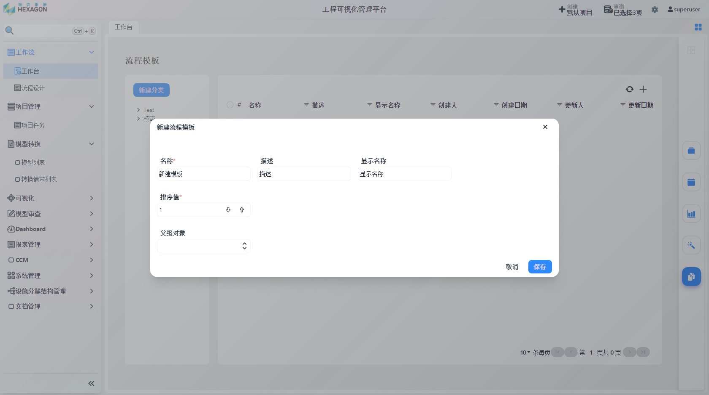

- 填写`名称`、`描述`、`显示名称`、`排序值`、`父级对象`之后保存，结果如下图

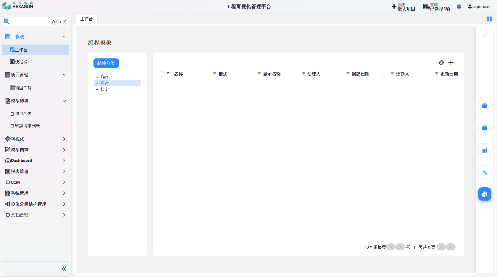

- 点击需要创建模板的分类，点击右上角`+`图标新建流程进入流程编辑界面

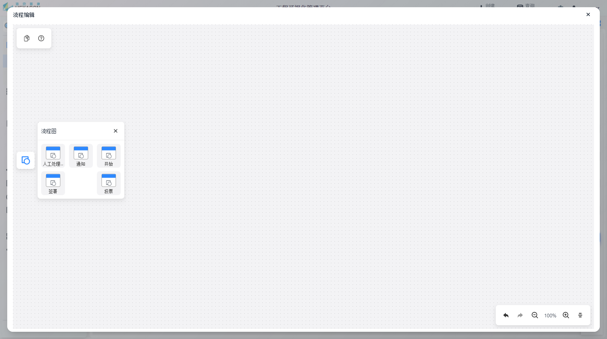

- 点击上图中左侧蓝色图标唤出流程图组件，可通过鼠标拖曳的方式添加到图中

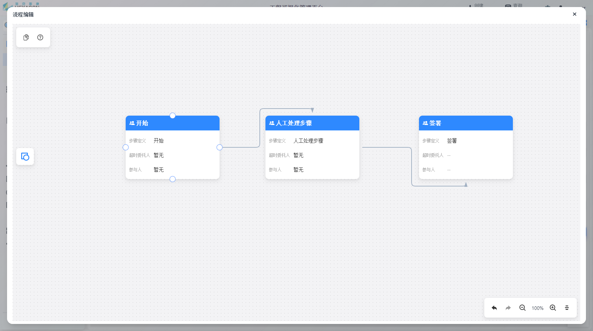

- 将指针移动到流程上方，唤出四个连接点，可以通过鼠标将连接点有向连接以表示流程之间的次序

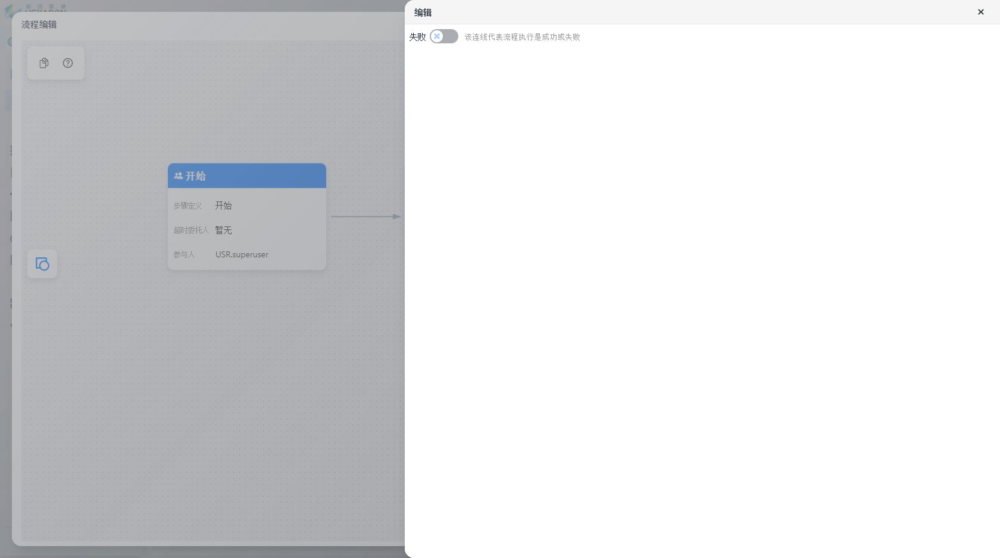

- 双击连线可修改连线代表流程执行是成功或失败

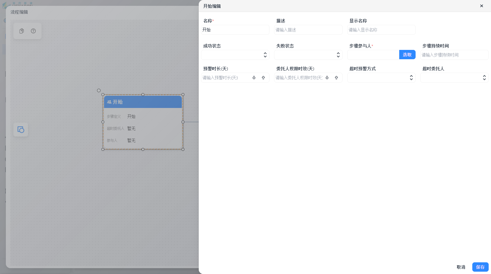

- 双击流程以编辑该流程的信息，如上图所示

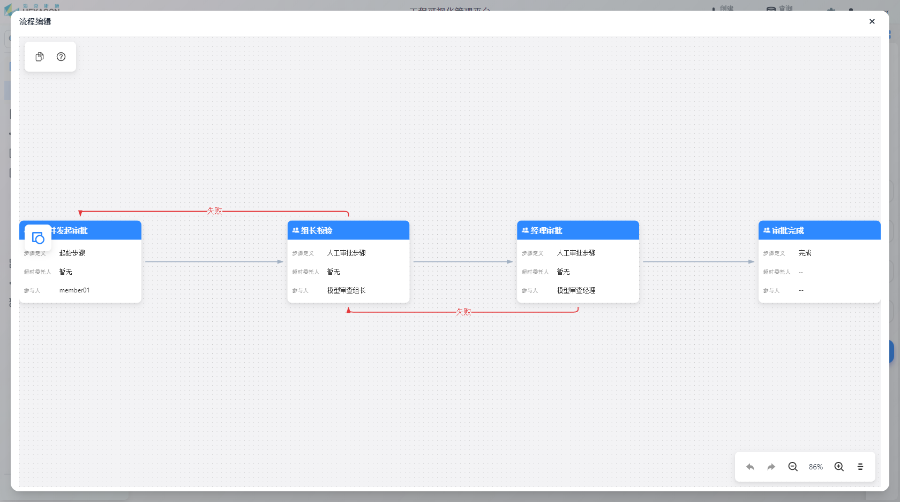

* 上图为一个模板的示例，意为：发起审批后组长进行校验，如果不通过则驳回到发起审批阶段，如果通过则进行下一步经理审批；经历审批不通过则驳回到组长校验阶段，如果通过则审批完成

- 正确连接流程之后点击左上角`保存`按钮以保存流程

## 普通用户

### 流程执行

1.对象附加工作流操作和解释

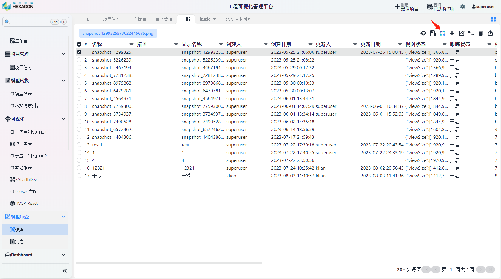

* 来到`模型审查`-`快照`页面，选中要附加工作流的快照，点击箭头所指的`加载工作流`按钮，选择工作流模板后确认即可。待处理的工作流可在步骤执行人的`工作台`界面进行查看

2.步骤执行的解释

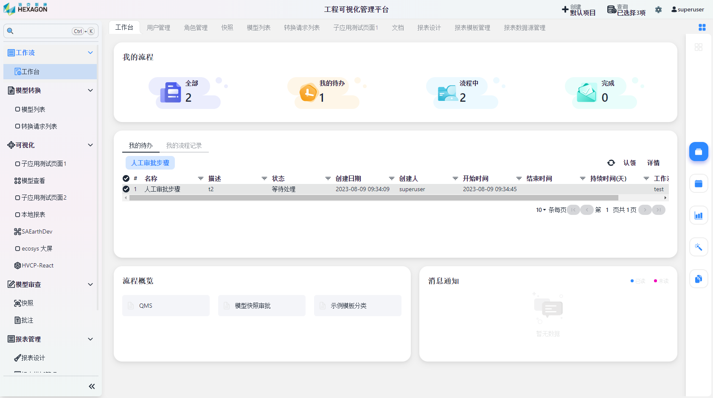

* 待处理的工作流在每一阶段需要步骤参与人先认领

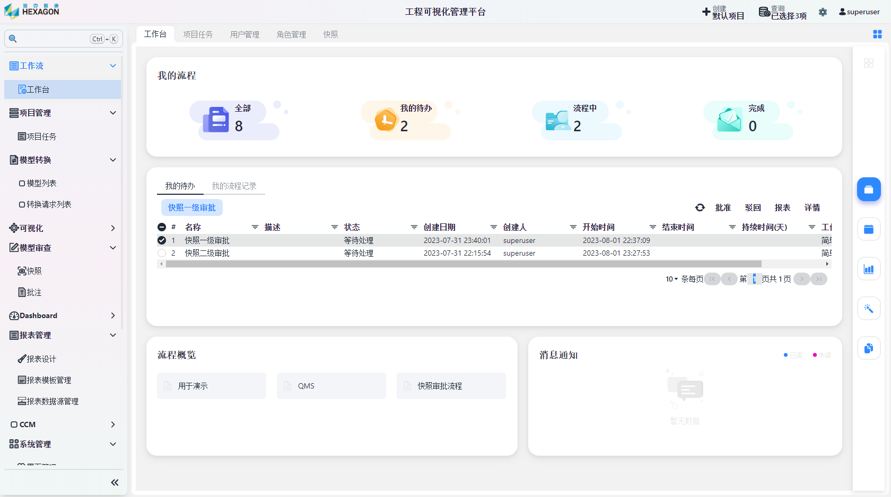

* 点击待处理的步骤，右上方有4个选项：`批准`、`驳回`、`报表`、`详情`

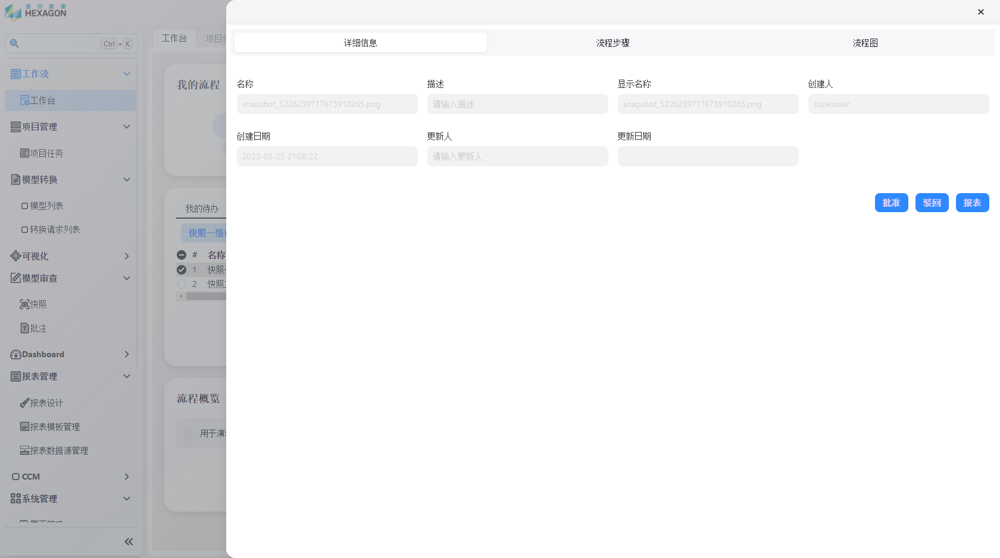

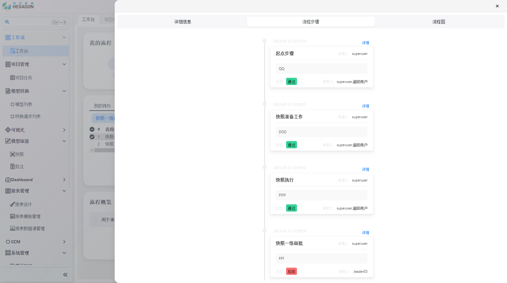

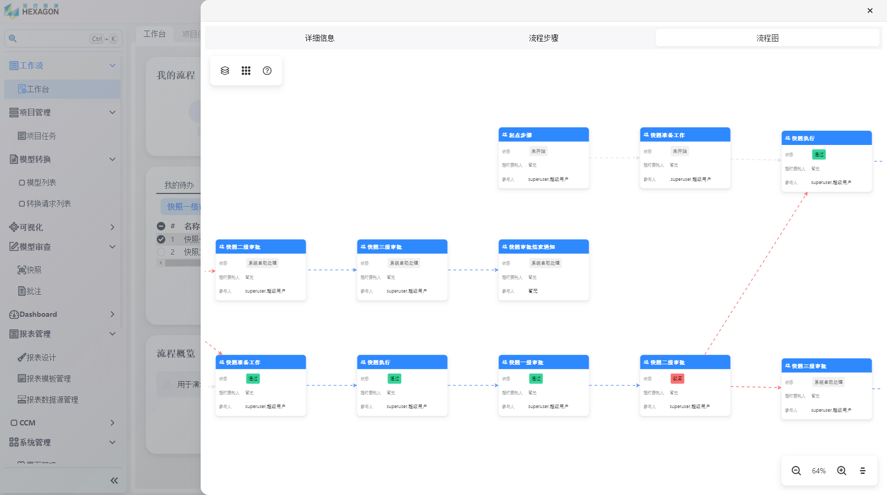

* 点击`详情`可以查看该流程每个阶段的处理结果

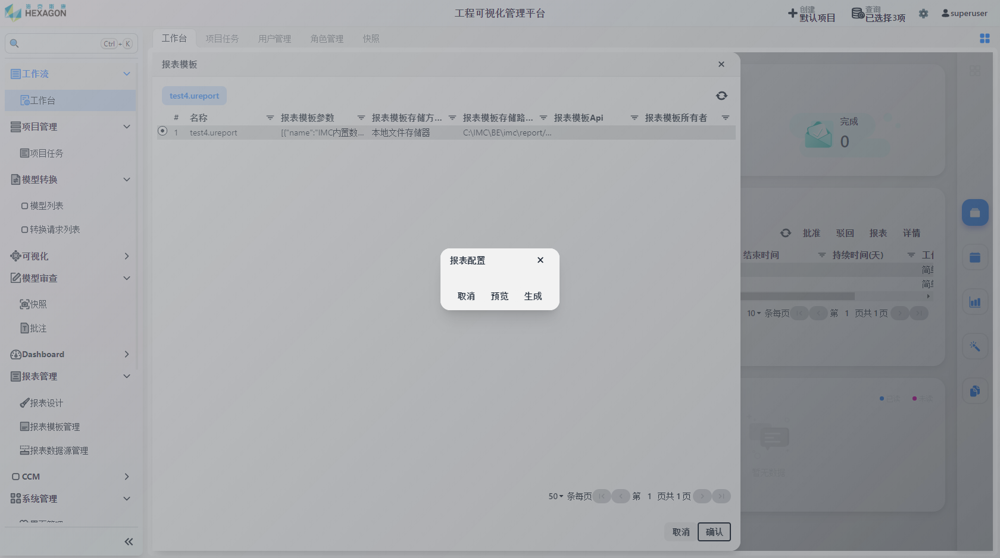

* 点击`报表`，选择报表模板后确认可生成报表

* 点击`批准`、`驳回`，填写备注后保存即可生效
