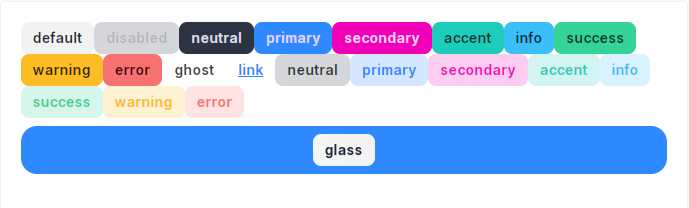

<h1 align="center" style="margin: 30px 0 30px; font-weight: bold;">微基座引擎组件库</h1>
<h4 align="center">基于 Vue/Element UI 和 Spring Boot/Spring Cloud & Alibaba 前后端分离的分布式微服务架构</h4>
<p align="center">
    <a href="http://imc.smartsolutions.com.cn/login"></a>
    <a href="http://imc.smartsolutions.com.cn/login"></a>	
</p>

## 按钮

### 颜色



```html
<template>
  <div class="space-y-2">
    <div class="flex gap-2 flex-wrap">
      <imc-button>default</imc-button>
      <imc-button disabled>disabled</imc-button>
      <imc-button color="neutral">neutral</imc-button>
      <imc-button color="primary">primary</imc-button>
      <imc-button color="secondary">secondary</imc-button>
      <imc-button color="accent">accent</imc-button>
      <imc-button color="info">info</imc-button>
      <imc-button color="success">success</imc-button>
      <imc-button color="warning">warning</imc-button>
      <imc-button color="error">error</imc-button>
      <imc-button ghost>ghost</imc-button>
      <imc-button link>link</imc-button>
      <imc-button color="neutral" light>neutral</imc-button>
      <imc-button color="primary" light>primary</imc-button>
      <imc-button color="secondary" light>secondary</imc-button>
      <imc-button color="accent" light>accent</imc-button>
      <imc-button color="info" light>info</imc-button>
      <imc-button color="success" light>success</imc-button>
      <imc-button color="warning" light>warning</imc-button>
      <imc-button color="error" light>error</imc-button>
    </div>
    <div class="flex justify-center p-2 bg-primary rounded-box">
      <imc-button glass>glass</imc-button>
    </div>
  </div>
</template>
```

### 尺寸

