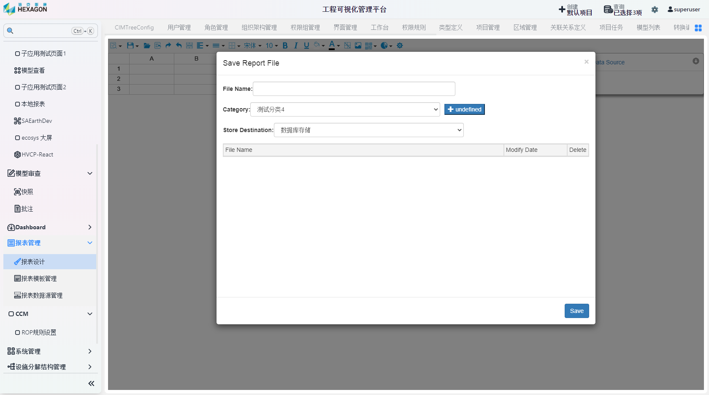

<h1 align="center" style="margin: 30px 0 30px; font-weight: bold;">报告&报表操作手册</h1>
<h4 align="center">基于 Vue/Element UI 和 Spring Boot/Spring Cloud & Alibaba 前后端分离的分布式微服务架构</h4>

    
    	

## 报表管理模块

### 报表设计

点击`报表管理`-`报表设计`

完成后点击左上角保存按钮，填写保存信息

### 报表模板管理

保存的报表设计在此处进行管理，左键打开查看，右键编辑或删除

### 报表数据源管理

共有4个数据源：外部数据源、内部数据源、引擎数据源和适配数据源，右键数据源以新增数据集，右键数据集以新建字段或删除数据集，右键字段可选删除字段。