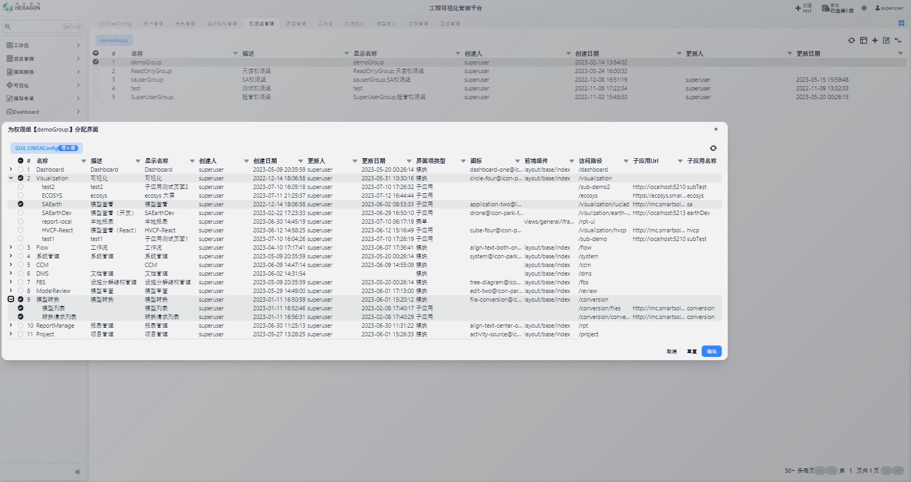
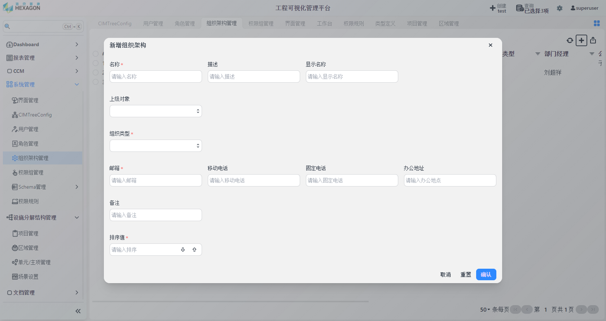
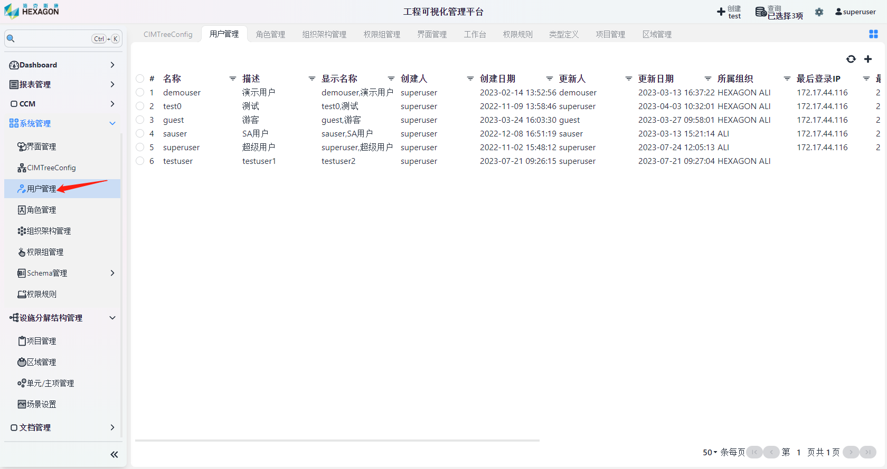
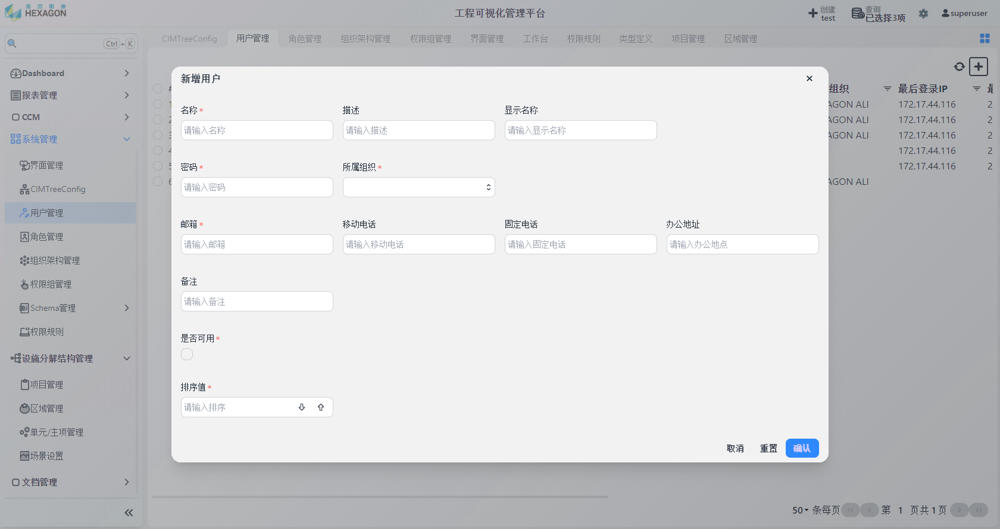
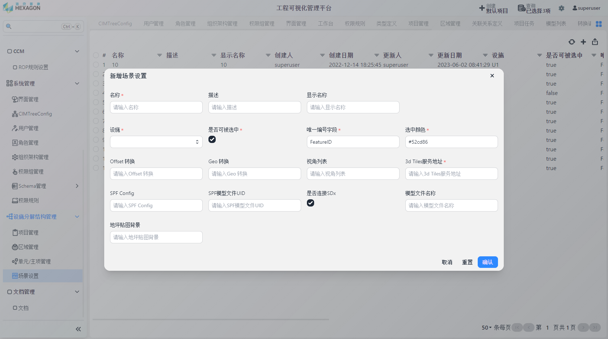

<h1 align="center" style="margin: 30px 0 30px; font-weight: bold;">权限引擎操作手册</h1>
<h4 align="center">基于 Vue/Element UI 和 Spring Boot/Spring Cloud & Alibaba 前后端分离的分布式微服务架构</h4>

    
    	

[TOC]

## 系统管理模块

权限模型关系图：

### 管理权限组

点击`系统管理`-`权限组管理`

点击右上角`新增`按钮，填写 `名称`、`描述`、`显示名称` 后保存

左键点击待分配的权限组，点击右上角`分配界面`按钮

为权限组分配可访问的模块，之后确认即可。tips:点击左侧箭头可展开二级菜单

### 管理角色

点击`系统管理`-`角色管理`

点击右上角`新增`按钮，填写 `名称`、`描述`、`显示名称`、`备注`、`排序值` 后保存

左键点击待分配的角色，点击右上角`分配权限组`按钮

为角色分配角色组，之后确认即可。

### 管理组织架构

点击`系统管理`-`组织架构管理`

点击右上角`新增`按钮，填写对应内容后保存即可

### 管理用户

点击`系统管理`-`用户管理`

点击右上角`新增`按钮，填写对应内容后保存

左键点击待分配的用户，点击右上角`分配角色`按钮

项目和角色呈多对多关联关系，上图即为：用户demouser在test项目下有demoRole和sauser的角色

### 权限规则

点击`系统管理`-`权限规则`，进入规则管理界面。

可以通过配置权限规则表达式来限制账号可以访问的数据

## 设施分解结构管理模块

设施内关联关系

### 管理项目

点击`设施分解结构管理`-`项目管理`

点击右上角`新增`按钮，填写 `名称`、`描述`、`显示名称`、`经度`、`纬度` 、`高度`后保存    

### 管理区域

点击`设施分解结构管理`-`区域管理`

点击右上角`新增`按钮，填写 `名称`、`描述`、`显示名称`、`工厂/项目`后保存

### 管理单元/主项

点击`设施分解结构管理`-`单元管理`

点击右上角`新增`按钮，填写 `名称`、`描述`、`显示名称`、`区域`后保存

### 设置场景

点击`设施分解结构管理`-`场景管理`

点击右上角`新增`按钮，填写相应内容后保存，其中`3D Tiles服务地址`填写模型转换后的服务地址。之后该模型即可在`可视化`界面进行查看

tips：点击左侧箭头可展开子选项