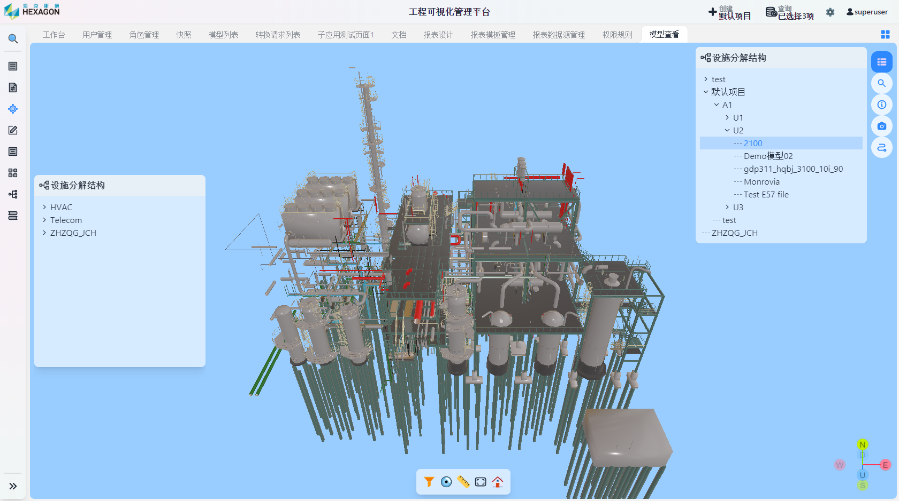
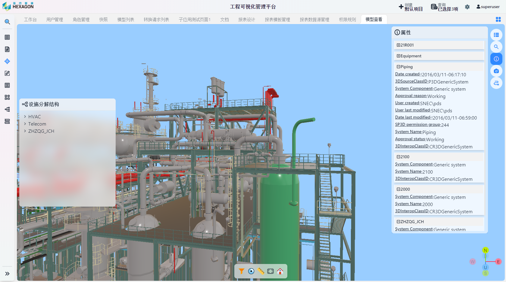
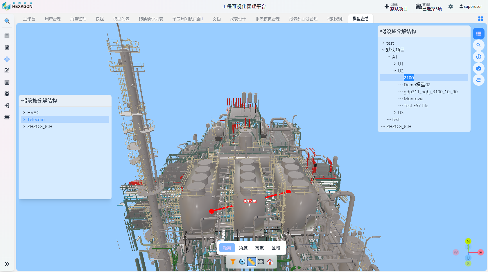
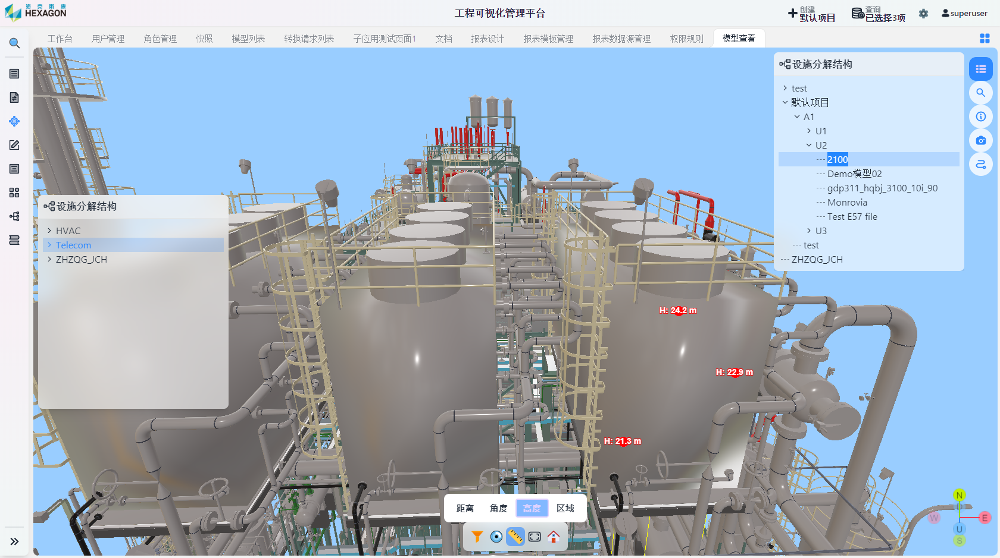
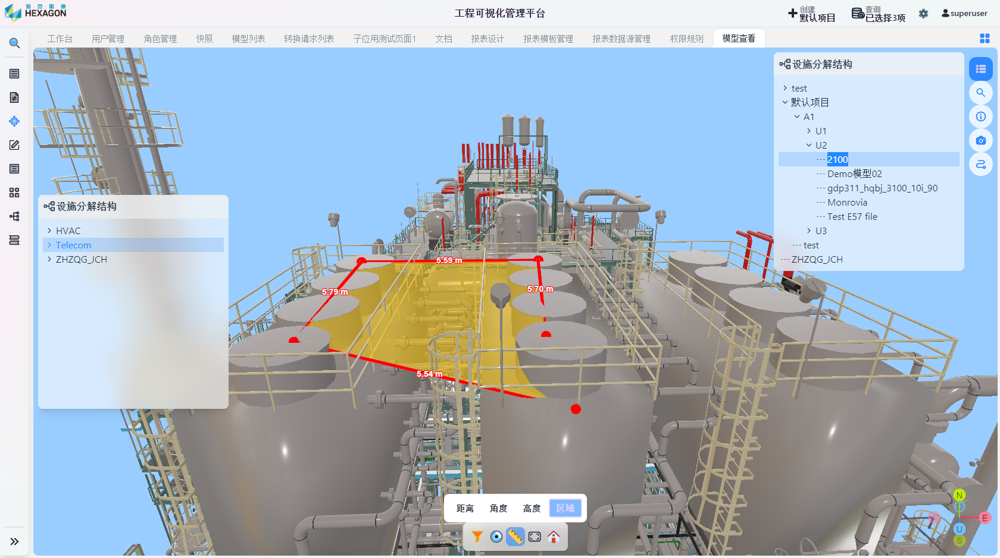

<h1 align="center" style="margin: 30px 0 30px; font-weight: bold;">可视化模块用户手册</h1>
<h4 align="center">基于 Vue/Element UI 和 Spring Boot/Spring Cloud & Alibaba 前后端分离的分布式微服务架构</h4>

    
    	

## 模型查看

点击`可视化`-`模型查看`

界面右上角`设施分解结构`中点击目标模型

选中对象可查看该对象的属性，属性是分级别显示的

底部工具栏从左到右分别为：状态过滤、动态观察、测量

点击状态过滤可查看该模型的施工状态，如果正在施工则会用不同颜色来体现施工的状态

点击动态观察后，可在图中设置一个中心旋转的位置，之后鼠标拖曳将使模型围绕该位置旋转

点击测量，选择需要的测量方式后测量即可
