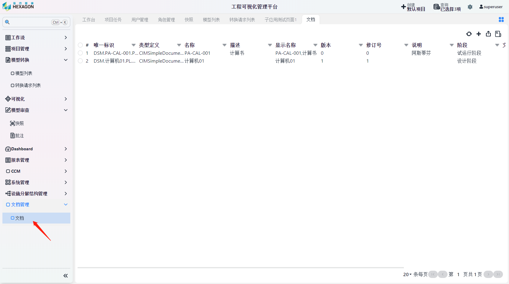
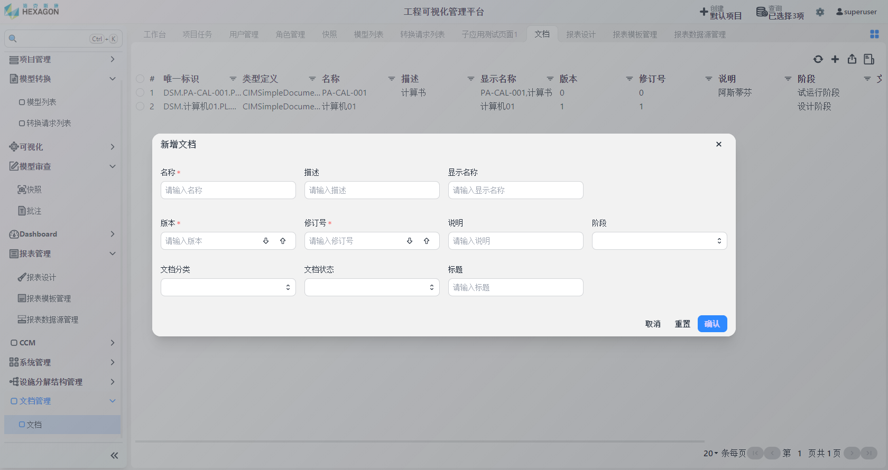
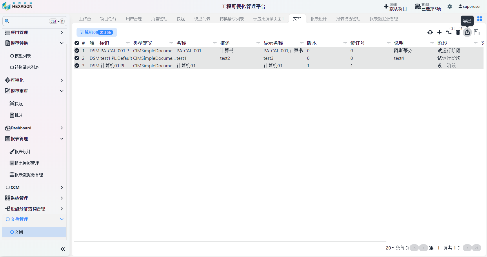

<h1 align="center" style="margin: 30px 0 30px; font-weight: bold;">文档管理操作手册</h1>
<h4 align="center">基于 Vue/Element UI 和 Spring Boot/Spring Cloud & Alibaba 前后端分离的分布式微服务架构</h4>

    
    	

[TOC]

## 文档管理模块

### 新增文档

* 点击箭头所指按钮进入文档界面

* 点击右上角`新增`按钮可新增文档

* 填写相应内容后保存即可

### 导出文档

* 选择要导出的项目，点击右上角`导出`按钮即可导出成excel文档

