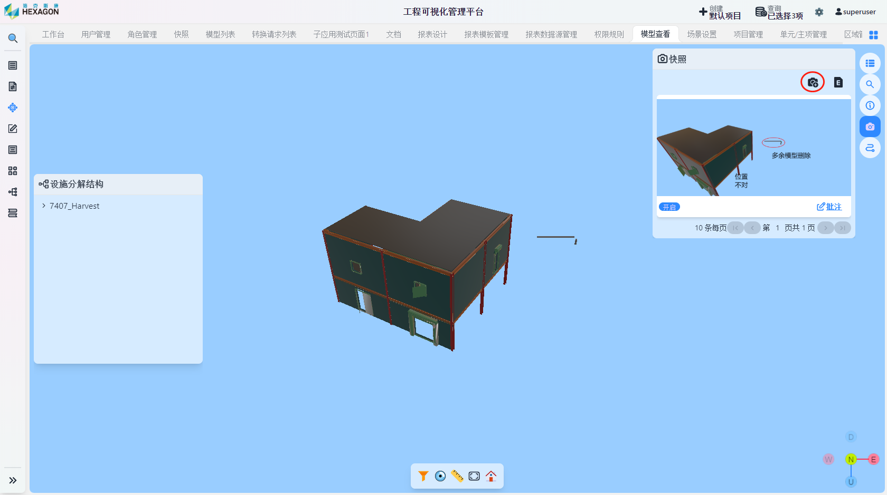
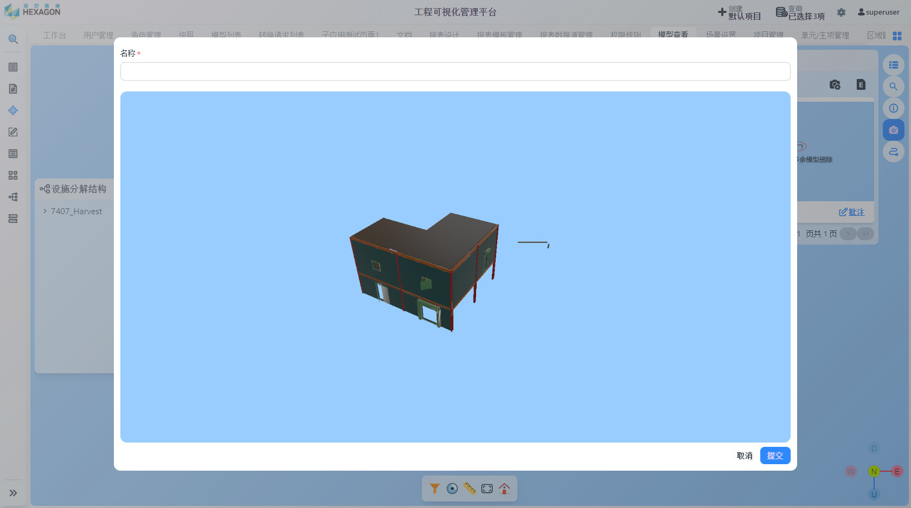
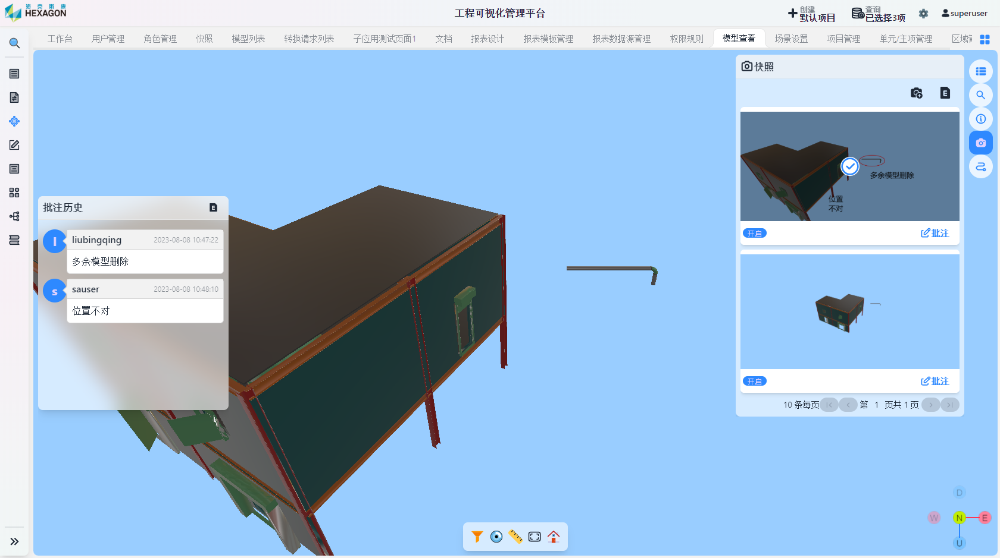

<h1 align="center" style="margin: 30px 0 30px; font-weight: bold;">模型审查用户手册</h1>
<h4 align="center">基于 Vue/Element UI 和 Spring Boot/Spring Cloud & Alibaba 前后端分离的分布式微服务架构</h4>

    
    	

[TOC]

## 模型审查

点击右侧工具栏`快照`按钮，点击红圈所在图标

填写名称后提交

点击批注进入编辑页面

完成批注后保存即可，之后可继续对改快照进行批注

点击快照可查看批注历史

点击红圈所在按钮可讲批注历史进行导出

导出结果如上图所示

## 模型审查管理

在此界面可进行批注的检索和快照跨模型的批量导出

