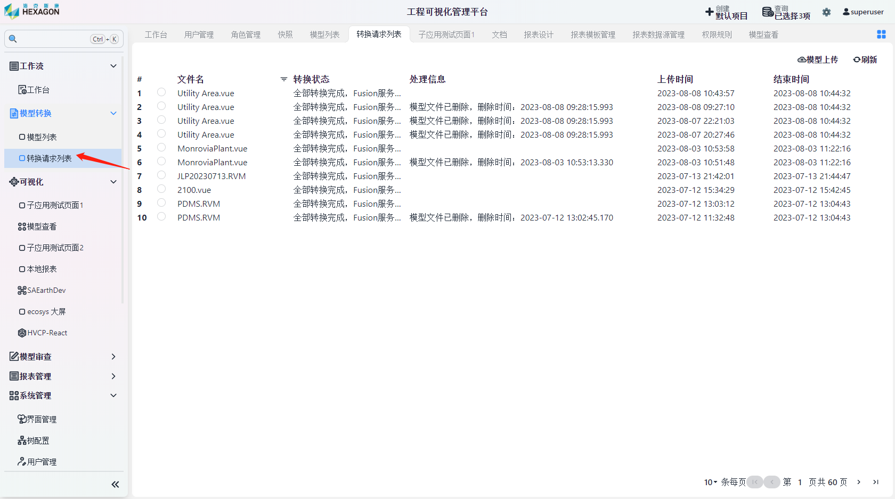
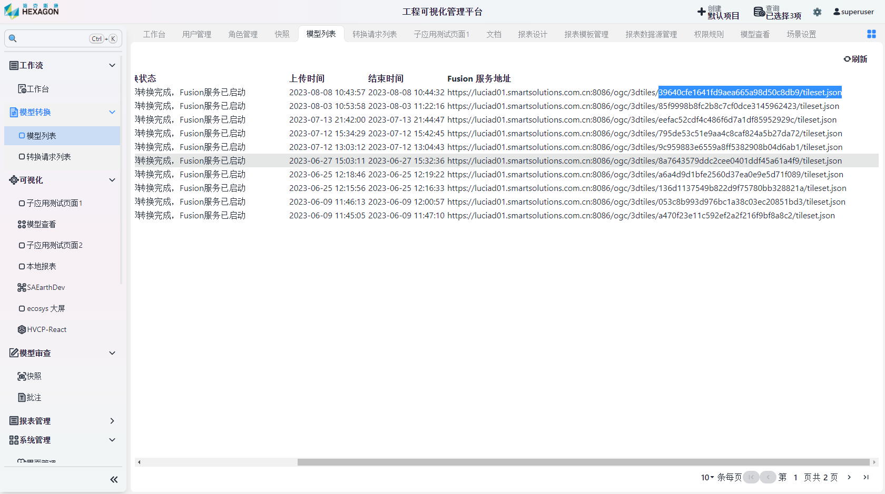

<h1 align="center" style="margin: 30px 0 30px; font-weight: bold;">模型转换用户手册</h1>
<h4 align="center">基于 Vue/Element UI 和 Spring Boot/Spring Cloud & Alibaba 前后端分离的分布式微服务架构</h4>

    
    	

[TOC]

## 模型上传

点击`模型转换`-`转换请求列表`，点击右上角`模型上传`，选择文件上传后模型会自动进行转换

转换完成后，可获取模型的服务地址

