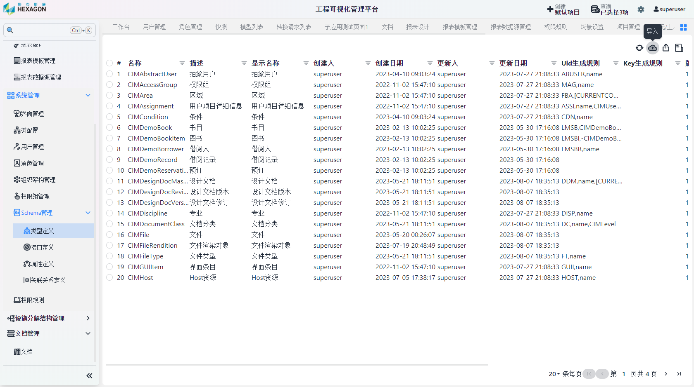

<h1 align="center" style="margin: 30px 0 30px; font-weight: bold;">SCHEMA管理服务用户手册</h1>
<h4 align="center">基于 Vue/Element UI 和 Spring Boot/Spring Cloud & Alibaba 前后端分离的分布式微服务架构</h4>

    
    	

## Schema功能

IMC的组件是动态渲染的，可以通过实时的Schema配置快速实现业务对象的更新和管理，免去了繁杂的代码修改过程，方便业务人员进行操作

## Schema导入

点击`Schema管理`下的子选项，点击右上角`导入`，选择需要导入的条目即可