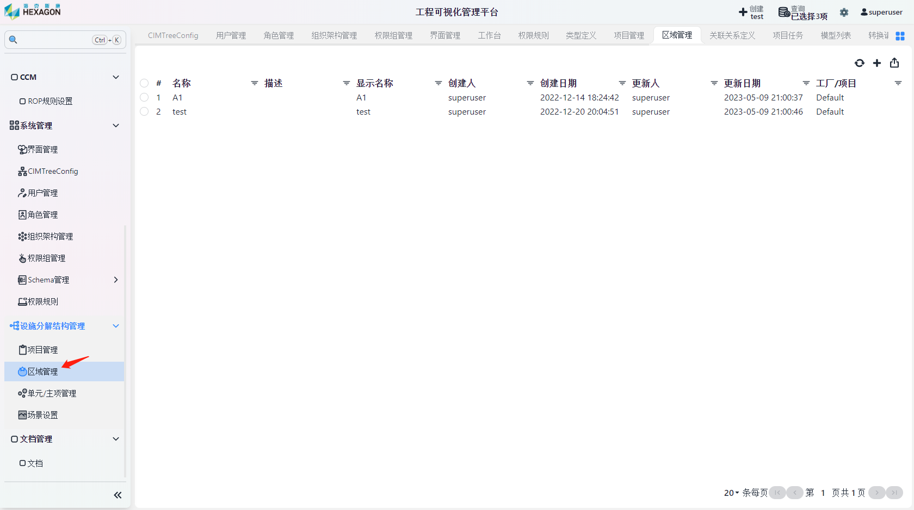

IMC：http://imc.smartsolutions.com.cn  

QMS:3.0:http://qms01.smartsolutions.com.cn/login

账号密码：superuser/1234

1.IMC登录

2.工作流引擎各模块操作和界面说明：模板创建，附加对象，实例

3.报表模块各模块操作和界面说明：详询对应负

4.QMS3.0各模块操作和界面说明：详询找对应负

5.基座引擎各模块操作和界面说明：详询找对应负

6.分析引擎各模块操作和界面说明：详询找对应负

用户

IMC登录模

工作流各模块操作和界面说

登录海克斯康工程可视化管理平

点击上图箭头所指位置流程模板来到流程模板界

点击流程模板界面左上方蓝色按钮新建分类以新建流程

填写名称、描述、显示名称、排序值、父级对象之后保存，结果如下

点击右上角+图标新建流程进入流程编辑界

点击上图中左侧蓝色图标唤出流程图组件，可通过鼠标拖曳的方式添加到图

将指针移动到流程上方，唤出四个连接点，可以通过鼠标将连接点有向连接以表示流程之间的次

双击连线可修改连线代表流程执行是成功或失

双击流程以编辑该流程的信息，如上图所

正确连接流程之后点击左上角保存按钮以保存流程到指定模

系统管理

权限模型关系图

管理权限

点击系统管理-权限组

点击右上角新增按钮，填写 名称、描述、显示名称 后

左键点击待分配的权限组，点击右上角分配界面按

为权限组分配可访问的模块，之后确认即可。tips:点击左侧箭头可展开二级菜

管理

点击系统管理-角色

点击右上角新增按钮，填写 名称、描述、显示名称、备注、排序值 后

左键点击待分配的角色，点击右上角分配权限组按

为角色分配角色组，之后确认即可

管理组织

点击系统管理-组织架构

点击右上角新增按钮，填写对应内容后保存即

管理

有哦用户可

管理架构。

钮

保存管理角色单

钮

保存管理组

：模块板内示

败

序

中

面

图

模板面

台明块手册责人责人责人责人运行模块56

MS:3.0:http://qms01.smartsolutions.com.cn/login

账号密码：superuser/123456

1.IMC登录模块

2.工作流引擎各模块操作和界面说明：模板创建，附加对象，实例运行

3.报表模块各模块操作和界面说明：详询对应负责人

4.QMS3.0各模块操作和界面说明：详询找对应负责人

5.基座引擎各模块操作和界面说明：详询找对应负责人

6.分析引擎各模块操作和界面说明：详询找对应负责人

# 用户手册

## IMC登录模块

## 工作流各模块操作和界面说明

- 登录海克斯康工程可视化管理平台

- 点击上图箭头所指位置`流程模板`来到流程模板界面

- 点击流程模板界面左上方蓝色按钮`新建分类`以新建流程模板

- 填写`名称`、`描述`、`显示名称`、`排序值`、`父级对象`之后保存，结果如下图

- 点击右上角`+`图标新建流程进入流程编辑界面

- 点击上图中左侧蓝色图标唤出流程图组件，可通过鼠标拖曳的方式添加到图中

- 将指针移动到流程上方，唤出四个连接点，可以通过鼠标将连接点有向连接以表示流程之间的次序

- 双击连线可修改连线代表流程执行是成功或失败

- 双击流程以编辑该流程的信息，如上图所示
- 正确连接流程之后点击左上角`保存`按钮以保存流程到指定模板内

## 系统管理模块

权限模型关系图：

### 管理权限组

点击`系统管理`-`权限组管理`

点击右上角`新增`按钮，填写 `名称`、`描述`、`显示名称` 后保存

左键点击待分配的权限组，点击右上角`分配界面`按钮

为权限组分配可访问的模块，之后确认即可。tips:点击左侧箭头可展开二级菜单

### 管理角色

点击`系统管理`-`角色管理`

点击右上角`新增`按钮，填写 `名称`、`描述`、`显示名称`、`备注`、`排序值` 后保存

左键点击待分配的角色，点击右上角`分配权限组`按钮

为角色分配角色组，之后确认即可。

### 管理组织架构

点击`系统管理`-`组织架构管理`

点击右上角`新增`按钮，填写对应内容后保存即可

### 管理用户

点击`系统管理`-`用户管理`

点击右上角`新增`按钮，填写对应内容后保存

左键点击待分配的用户，点击右上角`分配角色`按钮

项目和角色呈多对多关联关系，上图即为：用户demouser在test项目下有demoRole和sauser的角色

## 设施分解结构管理模块

设施内关联关系

### 管理项目

点击`设施分解结构管理`-`项目管理`

点击右上角`新增`按钮，填写 `名称`、`描述`、`显示名称`、`经度`、`纬度` 、`高度`后保存	

### 管理区域

点击`设施分解结构管理`-`区域管理`

点击右上角`新增`按钮，填写 `名称`、`描述`、`显示名称`、`工厂/项目`后保存

### 管理单元/主项

点击`设施分解结构管理`-`单元管理`

点击右上角`新增`按钮，填写 `名称`、`描述`、`显示名称`、`区域`后保存

### 设置场景

点击`设施分解结构管理`-`场景管理`

点击右上角`新增`按钮，填写相应内容后保存

tips：点击左侧箭头可展开子选项