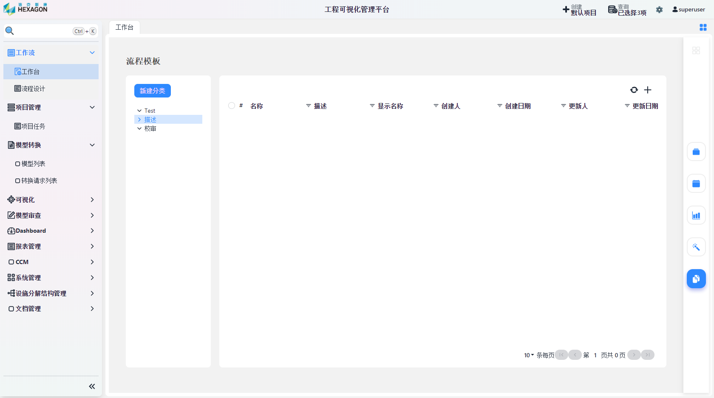

IMC：http://imc.smartsolutions.com.cn  

QMS:3.0:http://qms01.smartsolutions.com.cn/login

账号密码：superuser/123456

1.IMC登录模块

2.工作流引擎各模块操作和界面说明：模板创建，附加对象，实例运行

3.报表模块各模块操作和界面说明：详询对应负责人

4.QMS3.0各模块操作和界面说明：详询找对应负责人

5.基座引擎各模块操作和界面说明：详询找对应负责人

6.分析引擎各模块操作和界面说明：详询找对应负责人

# 用户手册

## IMC登录模块

## 工作流引擎各模块操作和界面说明

- 登录海克斯康工程可视化管理平台

- 点击上图箭头所指位置`流程模板`来到流程模板界面

- 点击流程模板界面左上方蓝色按钮`新建分类`以新建流程模板

- 填写`名称`、`描述`、`显示名称`、`排序值`、`父级对象`之后保存，结果如下图

- 点击右上角`+`图标新建流程进入流程编辑界面

- 点击上图中左侧蓝色图标唤出流程图组件，可通过鼠标拖曳的方式添加到图中

- 将指针移动到流程上方，唤出四个连接点，可以通过鼠标将连接点有向连接以表示流程之间的次序

- 双击流程以编辑该流程的信息，如上图所示
- 正确连接流程之后点击左上角`保存`按钮以保存流程到指定模板内

