<h1 align="center" style="margin: 30px 0 30px; font-weight: bold;">用户手册</h1>
<h4 align="center">基于 Vue/Element UI 和 Spring Boot/Spring Cloud & Alibaba 前后端分离的分布式微服务架构</h4>

    
    	

[TOC]

## 基座引擎

<h4 align="center" >敬请期待</h4>

## 工作流引擎

能够自动化、监控和优化业务流程的执行，提供了一种结构化的方式来管理和协调各种活动、任务和决策，并具备可视性和灵活性。

### 管理员

#### 模板创建

- 点击上图箭头所指位置`流程模板`来到流程模板界面

- 点击流程模板界面左上方蓝色按钮`新建分类`以新建流程模板

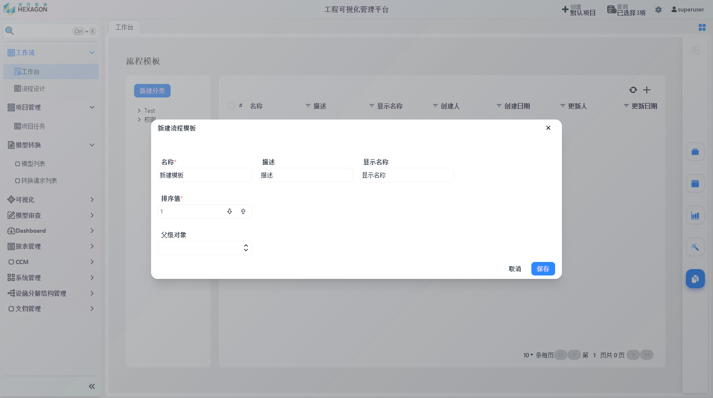

- 填写`名称`、`描述`、`显示名称`、`排序值`、`父级对象`之后保存，结果如下图

- 点击需要创建模板的分类，点击右上角`+`图标新建流程进入流程编辑界面

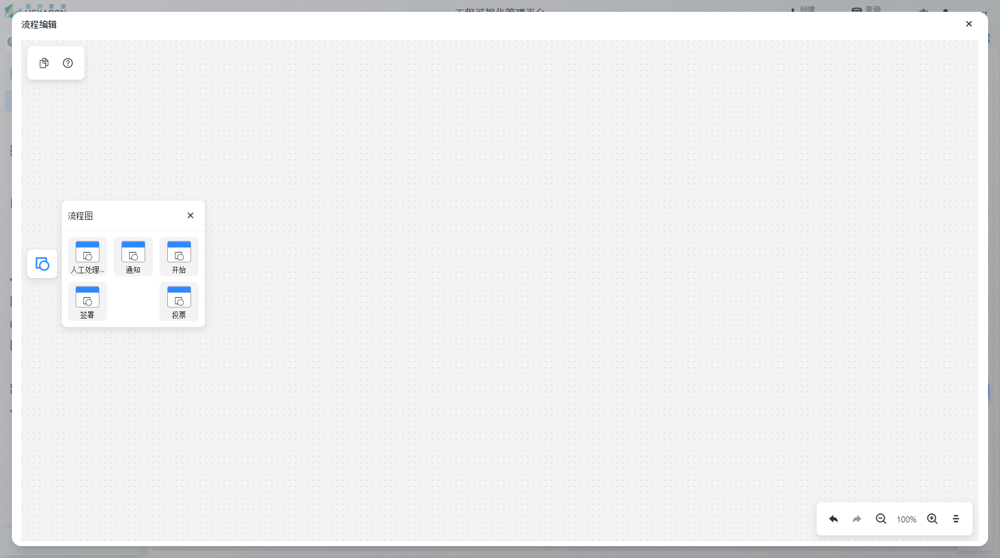

- 点击上图中左侧蓝色图标唤出流程图组件，可通过鼠标拖曳的方式添加到图中

- 将指针移动到流程上方，唤出四个连接点，可以通过鼠标将连接点有向连接以表示流程之间的次序

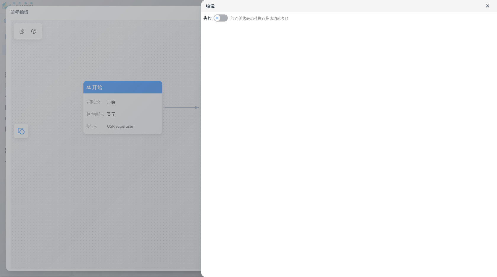

- 双击连线可修改连线代表流程执行是成功或失败

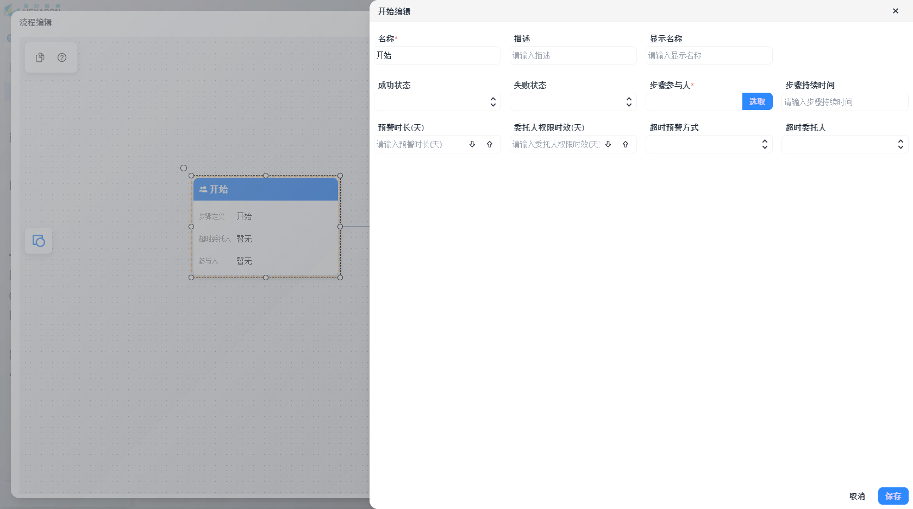

- 双击流程以编辑该流程的信息，如上图所示

* 上图为一个模板的示例，意为：发起审批后组长进行校验，如果不通过则驳回到发起审批阶段，如果通过则进行下一步经理审批；经历审批不通过则驳回到组长校验阶段，如果通过则审批完成

- 正确连接流程之后点击左上角`保存`按钮以保存流程

### 普通用户

#### 流程执行

1.对象附加工作流操作和解释

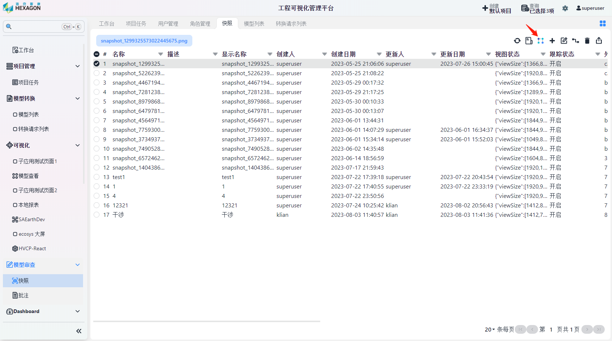

* 来到`模型审查`-`快照`页面，选中要附加工作流的快照，点击箭头所指的`加载工作流`按钮，选择工作流模板后确认即可。待处理的工作流可在步骤执行人的`工作台`界面进行查看

2.步骤执行的解释

* 待处理的工作流在每一阶段需要步骤参与人先认领

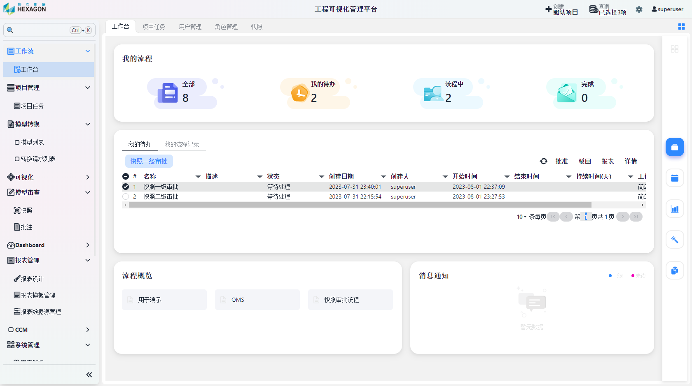

* 点击待处理的步骤，右上方有4个选项：`批准`、`驳回`、`报表`、`详情`

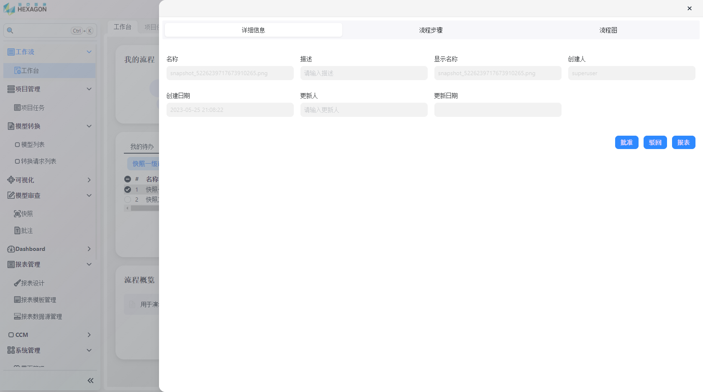

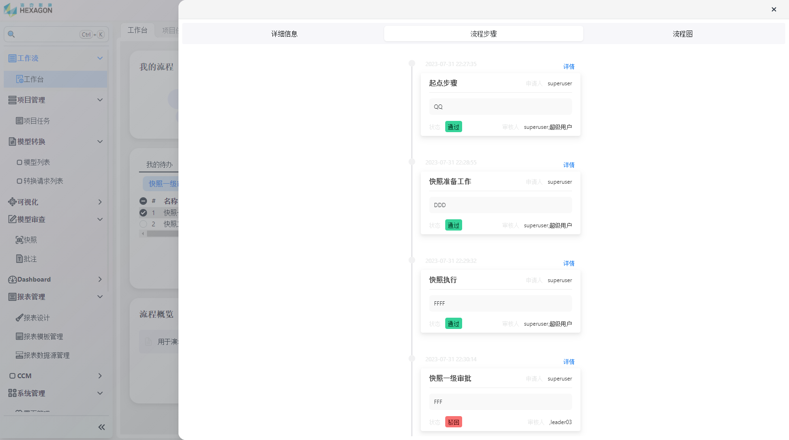

* 点击`详情`可以查看该流程每个阶段的处理结果

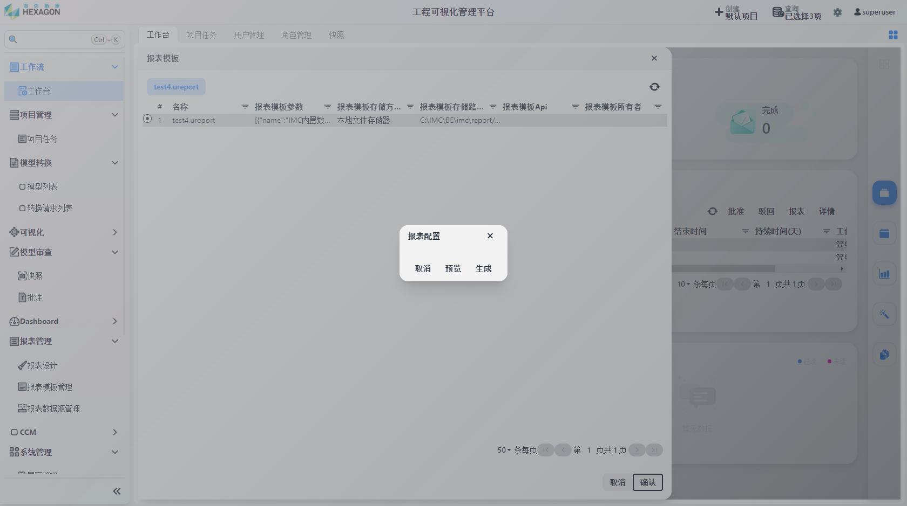

* 点击`报表`，选择报表模板后确认可生成报表

* 点击`批准`、`驳回`，填写备注后保存即可生效

## 报告/报表引擎

报表引擎是一种用于生成、管理和发布报表的工具，帮助用户从各种数据源中提取数据，并将其以易于理解和展示的形式呈现；并且具备灵活、可定制化、自动化等特性。

### 报表管理模块

#### 报表设计

点击`报表管理`-`报表设计`

点击单元格，在界面右侧可对单元格进行属性配置和数据源配置

右键可展开表格操作菜单

完成后点击左上角保存按钮，填写保存信息

#### 报表模板管理

保存的报表设计在此处进行管理，左键打开查看，右键编辑或删除

#### 报表数据源管理

共有4个数据源：外部数据源、内部数据源、引擎数据源和适配数据源。

右键数据源以新增数据集，右键数据集以新建字段或删除数据集，右键字段可选删除字段。

## 权限引擎

权限引擎是用于管理和控制系统中用户权限的重要功能，提供灵活的方式来定义和管理用户的访问权限，以确保只有经过授权的用户能够执行特定操作或访问特定资源。

### 系统管理模块

权限模型关系图：

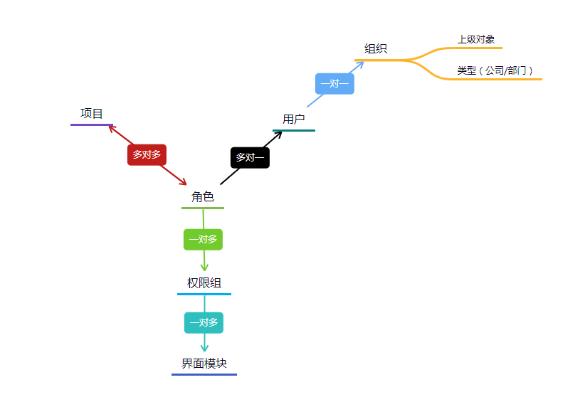

#### 管理权限组

点击`系统管理`-`权限组管理`

点击右上角`新增`按钮，填写 `名称`、`描述`、`显示名称` 后保存

左键点击待分配的权限组，点击右上角`分配界面`按钮

为权限组分配可访问的模块，之后确认即可。tips:点击左侧箭头可展开二级菜单

#### 管理角色

点击`系统管理`-`角色管理`

点击右上角`新增`按钮，填写 `名称`、`描述`、`显示名称`、`备注`、`排序值` 后保存

左键点击待分配的角色，点击右上角`分配权限组`按钮

为角色分配角色组，之后确认即可。

#### 管理组织架构

点击`系统管理`-`组织架构管理`

点击右上角`新增`按钮，填写对应内容后保存即可

#### 管理用户

点击`系统管理`-`用户管理`

点击右上角`新增`按钮，填写对应内容后保存

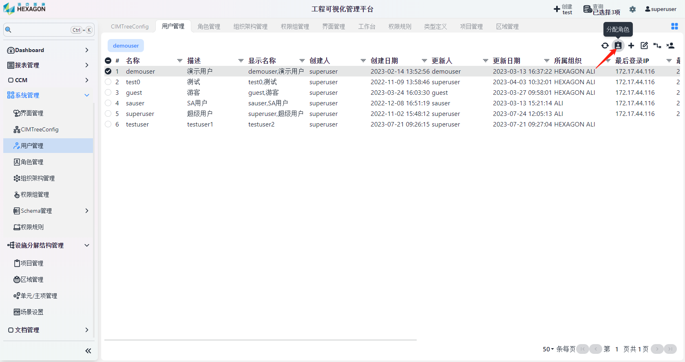

左键点击待分配的用户，点击右上角`分配角色`按钮

项目和角色呈多对多关联关系，上图即为：用户demouser在test项目下有demoRole和sauser的角色

#### 权限规则

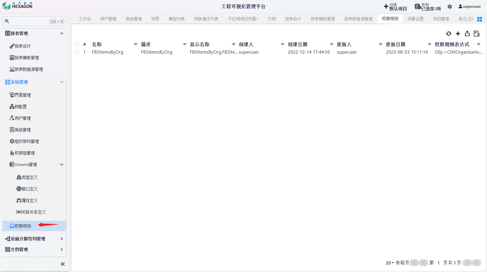

点击`系统管理`-`权限规则`，进入规则管理界面。

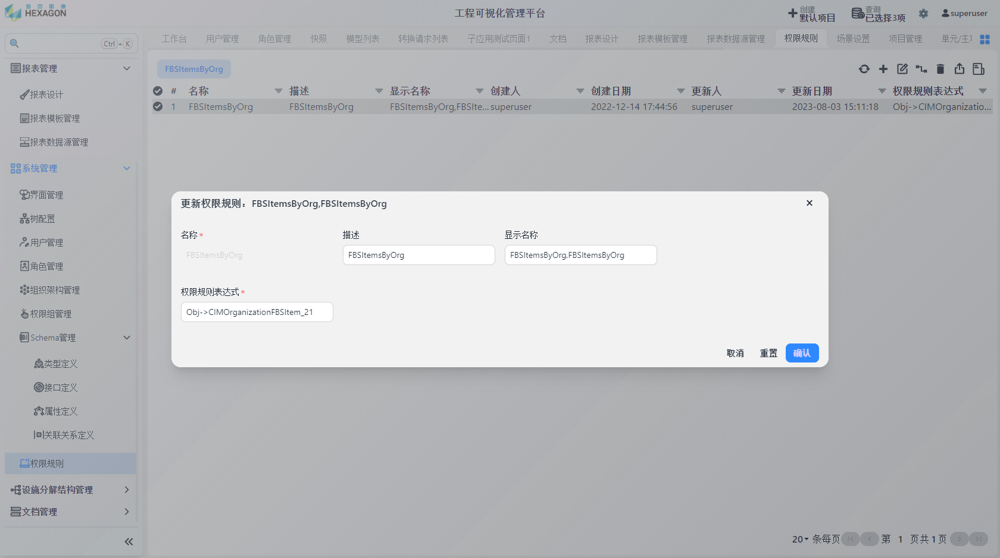

可以通过配置权限规则表达式来限制账号可以访问的数据

### 设施分解结构管理模块

设施内关联关系

#### 管理项目

点击`设施分解结构管理`-`项目管理`

点击右上角`新增`按钮，填写 `名称`、`描述`、`显示名称`、`经度`、`纬度` 、`高度`后保存    

#### 管理区域

点击`设施分解结构管理`-`区域管理`

点击右上角`新增`按钮，填写 `名称`、`描述`、`显示名称`、`工厂/项目`后保存

#### 管理单元/主项

点击`设施分解结构管理`-`单元管理`

点击右上角`新增`按钮，填写 `名称`、`描述`、`显示名称`、`区域`后保存

#### 设置场景

点击`设施分解结构管理`-`场景管理`

点击右上角`新增`按钮，填写相应内容后保存，其中`3D Tiles服务地址`填写模型转换后的服务地址。之后该模型即可在`可视化`界面进行查看

tips：点击左侧箭头可展开子选项

## 检索引擎

检索引擎是一种用于在大规模数据集检索信息的技术，通过一定的检索条件或语法，快速获取目标信息内容,保障及时有效的信息获取渠道。

<h4 align="center" >敬请期待</h4>

## 缓存引擎

缓存引擎是一种用于提高系统性能的技术，通过在内存中存储经常访问的数据，加快数据的读取速度，减轻数据库负载，提升系统的响应效率。

<h4 align="center" >敬请期待</h4>

## 核心功能

### 可视化

#### 模型查看

点击`可视化`-`模型查看`

界面右上角`设施分解结构`中点击目标模型

选中对象可查看该对象的属性，属性是分级别显示的

底部工具栏从左到右分别为：状态过滤、动态观察、测量

点击状态过滤可查看该模型的施工状态，如果正在施工则会用不同颜色来体现施工的状态

点击动态观察后，可在图中设置一个中心旋转的位置，之后鼠标拖曳将使模型围绕该位置旋转

点击测量，选择需要的测量方式后测量即可

#### 模型审查

点击右侧工具栏`快照`按钮，点击红圈所在图标

填写名称后提交

点击批注进入编辑页面

完成批注后保存即可，之后可继续对改快照进行批注

点击快照可查看批注历史

点击红圈所在按钮可讲批注历史进行导出

导出结果如上图所示

#### 模型审查管理

在此界面可进行批注的检索和快照跨模型的批量导出

#### 模型转换

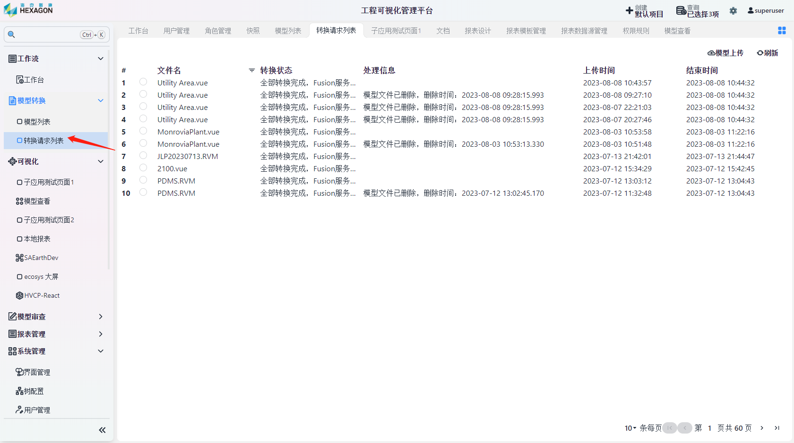

点击`模型转换`-`转换请求列表`，点击右上角`模型上传`，选择文件上传后模型会自动进行转换

转换完成后，可获取模型的服务地址

### 数据接收管理

快速数据治理、标准化、管理化

<h4 align="center" >敬请期待</h4>

### 文档管理

文件库及版本管理、文件操作基础功能集、全文检索、文档预览

<h4 align="center" >敬请期待</h4>

### 表单设计器

前端技术标准化、配置驱动、标准控件

<h4 align="center" >敬请期待</h4>

## 核心服务

### SCHEMA管理服务

配置管理、发布、版本管理、平台其他关键配置级参数设定

#### Schema功能

IMC的组件是动态渲染的，可以通过实时的Schema配置快速实现业务对象的更新和管理，免去了繁杂的代码修改过程，方便业务人员进行操作

#### Schema导入

点击`Schema管理`下的子选项，点击右上角`导入`，选择需要导入的条目即可

### 版本控制服务

版本管理、版本回溯、多版本信息浏览、版本相关配置、标准微服务

<h4 align="center" >敬请期待</h4>

### 租户管理服务

租户配置管理、按租户实现数据和应用资源的调度

<h4 align="center" >敬请期待</h4>
